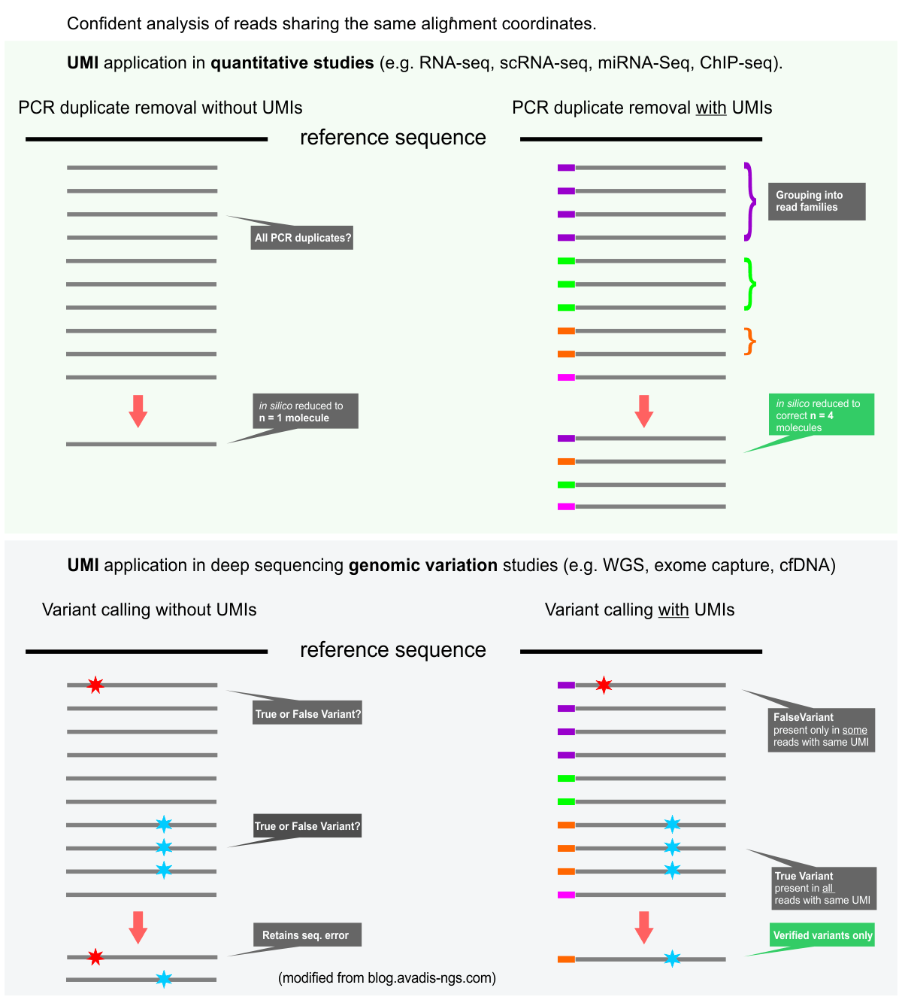

# 2022-11
<details>
<summary><b><font size="+2">Table of Contents</font></b></summary>
<!-- MarkdownTOC -->

1. [Looking into UMI-tools](#looking-into-umi-tools)
	1. [Email chains between Alison and Matt Fitzgibbon, FHCC Bioinformatician](#email-chains-between-alison-and-matt-fitzgibbon-fhcc-bioinformatician)
		1. [Chain #1](#chain-1)
			1. [Message #1](#message-1)
			1. [Message #2](#message-2)
			1. [Message #3](#message-3)
			1. [Message #4](#message-4)
			1. [Message #5](#message-5)
			1. [Message #6](#message-6)
			1. [Message #7](#message-7)
			1. [Message #8](#message-8)
			1. [Message #9](#message-9)
		1. [Chain #2](#chain-2)
			1. [Message #1](#message-1-1)
			1. [Message #2](#message-2-1)
			1. [Message #3](#message-3-1)
			1. [Message #4](#message-4-1)
			1. [Message #5](#message-5-1)
			1. [Message #6](#message-6-1)
			1. [Message #7](#message-7-1)
			1. [Message #8](#message-8-1)
			1. [Message #9](#message-9-1)
	1. [Notes, etc. on removing PCR duplicates from *bulk* RNA-seq data](#notes-etc-on-removing-pcr-duplicates-from-bulk-rna-seq-data)
		1. [Should I remove PCR duplicates from my RNA-seq data?](#should-i-remove-pcr-duplicates-from-my-rna-seq-data)
		1. [What are UMIs and why are they used in high-throughput sequencing?](#what-are-umis-and-why-are-they-used-in-high-throughput-sequencing)
			1. [Notes, questions related to the above text](#notes-questions-related-to-the-above-text)
		1. [Notes from reading the Biostars post, "Should We Remove Duplicated Reads In RNA-seq?"](#notes-from-reading-the-biostars-post-should-we-remove-duplicated-reads-in-rna-seq)
		1. [The abstract of Parekh et al., *Sci Rep* 2016](#the-abstract-of-parekh-et-al-sci-rep-2016)
			1. [Notes, questions related to the above text](#notes-questions-related-to-the-above-text-1)
		1. [On "Elimination of PCR duplicates..." \(Fu et al., *BMC Genom* 2018\)](#on-elimination-of-pcr-duplicates-fu-et-al-bmc-genom-2018)
			1. [Abstract](#abstract)
			1. [Final paragraph of Introduction](#final-paragraph-of-introduction)

<!-- /MarkdownTOC -->
</details>
<br />

<a id="looking-into-umi-tools"></a>
## Looking into UMI-tools
...especially as it pertains to the removal of PCR duplicates

- Module available on the FHCC cluster: `UMI-tools/1.0.1-foss-2019b-Python-3.7.4`
- Can be installed with conda as well: `install -c bioconda umi_tools`
- [GitHub page for UMI-tools](https://github.com/CGATOxford/UMI-tools)
- [Read the Docs for UMI-tools](https://umi-tools.readthedocs.io/en/latest/index.html)

<a id="email-chains-between-alison-and-matt-fitzgibbon-fhcc-bioinformatician"></a>
### Email chains between Alison and Matt Fitzgibbon, FHCC Bioinformatician
...regarding sequencing data and their demultiplexing, UMI information, etc.
<a id="chain-1"></a>
#### Chain #1
<a id="message-1"></a>
##### Message #1
From: [SR-Bioinformatics](no-reply@fredhutch.happyfox.com)  
Sent: Wednesday, September 28, 2022 3:46 PM  
To: [Fitzgibbon, Matthew](mfitzgib@fredhutch.org)  
Subject: \[agreenla tsukiyama_t\]: UMI question (#BI00009208)

**New ticket created #BI00009208**

Hello! 

I was wondering if UMIs were available for a run of sequencing done this April. The fastq files are in the following folder:
```txt
/shared/ngs/illumina/agreenla/220414_VH00699_101_AAAWYTFM5/Unaligned/Project_agreenla
```

I have gotten in the habit of asking genomics to sequence UMIs, but we haven't been using them computationally (though hopefully this will change soon!). I didn't see R3 .fastq files for this experiment, and I was wondering if that wasn't sequenced or if the R3 was somewhere/not normally computationally included. If R3 is no longer available, or never sequenced, that's just what it is, but if this is available and somewhere else you could direct me to, that would be great!

Thanks! 

Alison Greenlaw

<a id="message-2"></a>
##### Message #2
From: [Matt Fitzgibbon](bioinformatics@fredhutch.org)  
Sent: Wednesday, September 28, 2022 4:03 PM  
To: [Greenlaw, Alison C](agreenla@fredhutch.org)  
Cc: [Fitzgibbon, Matthew P](mfitzgib@fredhutch.org)  
Subject: Re: #BI00009208: \[agreenla tsukiyama_t\]: UMI question ()

**New reply for the ticket #BI00009208**
 
Hi Alison,

It looks like that run was configured with read 3 as an index read:

```txt
<Read Number="1" NumCycles="50" IsIndexedRead="N" IsReverseComplement="N"/>
<Read Number="2" NumCycles="16" IsIndexedRead="Y" IsReverseComplement="N"/>
<Read Number="3" NumCycles="8" IsIndexedRead="Y" IsReverseComplement="Y"/>
<Read Number="4" NumCycles="50" IsIndexedRead="N" IsReverseComplement="N"/>
```

Looks like these may be a "UDI-UMI" scheme with the i7 read consisting of 8bp index + an 8bp UMI? This would have to be demultiplexed manually. Happy to do that provided we know special handling is needed. In this case I don't have previous notes about this run (beyond seeing that the demultiplex looked successful, with ~6% undetermined barcodes).

If you can confirm the barcoding & UMI scheme, we'll set up new demux that should generate corresponding R3 files (similar to what we've done previously for Ovation Solo runs).

Note that in this case, I happen to still have the raw binary dump from the sequencer available, but in general we guarantee retaining the binary data for 30 days. If there are other previous runs where you'd like to leverage the UMIs please let me know flowcell IDs so we can retain them until demultiplexed.

Thanks,  
-Matt

<a id="message-3"></a>
##### Message #3
From: [SR-Bioinformatics](no-reply@fredhutch.happyfox.com)  
Sent: Wednesday, September 28, 2022 4:14 PM  
To: [Fitzgibbon, Matthew](mfitzgib@fredhutch.org)  
Subject: New reply: : \[agreenla tsukiyama_t\]: UMI question () #BI00009208

**New reply for ticket #BI00009208**
 
Thank you so much! That scheme seems to be correct to me! The manual (screenshot attached) says to use 16 cycles to capture the 8 bp tag. I will be sure to be more proactive about requesting this in the future.

This is a long shot, but there's some sequencing from 2020 that, if the UMI data exists, I would like to have it. The data is in this folder:
`/shared/ngs/illumina/ccucinot/200722_D00300_1007_BHGV5NBCX3/`

(Christine and I shared a lane and she submitted it. I can see a "raw" folder exists but don't have permission to access it.) This one was done using the Ovation Solo kit that we have since stopped using. 

Thanks so much for all your help!  
Alison 

<a id="message-4"></a>
##### Message #4
From: [Fitzgibbon, Matthew](mfitzgib@fredhutch.org)  
Sent: Wednesday, September 28, 2022 4:21 PM
To: [Greenlaw, Alison C](agreenla@fredhutch.org)
Cc: [Fitzgibbon, Matthew P](mfitzgib@fredhutch.org)
Subject: Re: #BI00009208: New reply: : \[agreenla tsukiyama_t\]: UMI question ()
 
**New reply for the ticket #BI00009208**
 
Ok, that sounds fortunate. I coordinated with Christine on a few UMI runs. She didn't want the UMIs at the time, but we discussed that they would be unrecoverable without the raw binary data, so I saved copies of a few specific runs for her. The `200722_D00300_1007_BHGV5NBCX3` flowcell "raw" directory is likely one of these.

I'm out of office today, but will get the `220414_VH00699_101_AAAWYTFM5` demux set up tomorrow.

Cheers,  
-Matt

<a id="message-5"></a>
##### Message #5
From: [SR-Bioinformatics](no-reply@fredhutch.happyfox.com)  
Sent: Wednesday, September 28, 2022 4:27 PM  
To: [Fitzgibbon, Matthew P](mfitzgib@fredhutch.org)  
Subject: New reply: : New reply: : \[agreenla tsukiyama_t\]: UMI question () #BI00009208
 
**New reply for ticket #BI00009208**
 
That's great to hear! Thank you so much!

Alison 

<a id="message-6"></a>
##### Message #6
From: [Fitzgibbon, Matthew P](mfitzgib@fredhutch.org)  
Sent: Thursday, September 29, 2022 1:11 AM  
To: [Bioinformatics](bioinformatics@fredhutch.org)  
Cc: [Greenlaw, Alison C](agreenla@fredhutch.org)
Subject: Re: New reply: : New reply: : \[agreenla tsukiyama_t\]: UMI question () #BI00009208
 
Ok, this should be done for the April flowcell. Since the naming of the files is different, I put it alongside the existing results under:  
`/shared/ngs/illumina/agreenla/220414_VH00699_101_AAAWYTFM5/Unaligned_UMI/Project_agreenla`

Under the new folder, we generated the UMI reads in the \_R2 files so the second read in each pair is now named \_R3 here. That is, the older file:  
`Unaligned/Project_agreenla/SAMPLE_BM10_DSp48_5781_S22_R2_001.fastq.gz`

has the same contents as the new file:  
`Unaligned_UMI/Project_agreenla/SAMPLE_BM10_DSp48_5781_S22_R3_001.fastq.gz`

The file sizes may be different because of compression differences, but the uncompressed sequence should be identical. I also generated the index reads (\_I1 & \_I2) in case needed by downstream software.

Note that the data here are largely redundant with the original demultiplexing result, so the original could be removed to save storage space. I also noticed that there are a few "archived" copies of a June 2021 flowcell, likely generated by HutchBase while someone was correcting barcodes. We can remove these "archived" folders if no one is using them.

Let me know how looks,  
-Matt

<a id="message-7"></a>
##### Message #7
From: [Greenlaw, Alison C](agreenla@fredhutch.org)  
Sent: Thursday, September 29, 2022 7:08 PM  
To: [Fitzgibbon, Matthew P](mfitzgib@fredhutch.org)  
Subject: Re: New reply: : New reply: : \[agreenla tsukiyama_t\]: UMI question () #BI00009208
 
Looks great to me! Thank you so much! I have entered barcodes incorrectly when submitting before, so I do suspect that's what those archived copies are. 

When you have a chance, I would still appreciate the UMI info from the 2020 run. I'm currently very much in wet bench mode so it's no rush. 

Thanks!  
Alison 

<a id="message-8"></a>
##### Message #8
From: [Fitzgibbon, Matthew P](mfitzgib@fredhutch.org)  
Sent: Friday, September 30, 2022 11:27 PM  
To: [Greenlaw, Alison C](agreenla@fredhutch.org)  
Subject: Re: New reply: : New reply: : [agreenla tsukiyama_t]: UMI question () #BI00009208
 
Hi Alison,

Demultiplexing for that run is done, again alongside the original since the filenames are changed (R1/R2/R3):  
`/shared/ngs/illumina/ccucinot/200722_D00300_1007_BHGV5NBCX3/Unaligned_UMI/Project_ccucinot`

This uses a newer version of the demultiplexing software than was current in 2020, so the organization is a bit different as well. The newer version also excludes the Illumina quality "failed" reads, which are generally not recommended for consideration.

Is this data related to the quiescent yeast work? I think there are two other older flowcells that may have similar UMI setup:
```txt
180816_D00300_0592_AHKHHNBCX2
200128_D00300_0897_HCHGFBCX3
```
Let me know if either of these flowcells are related to this project as well. Otherwise will close this request out for now.

Best,  
-Matt

<a id="message-9"></a>
##### Message #9
From: [Greenlaw, Alison C](agreenla@fredhutch.org)  
Sent: Friday, September 30, 2022 11:32 PM  
To: [Fitzgibbon, Matthew P](mfitzgib@fredhutch.org)  
Subject: Re: New reply: : New reply: : \[agreenla tsukiyama_t\]: UMI question () #BI00009208
 
Thank you so much! Are those folders within Christine's directory? If I had to venture a guess, that would be the RNAseq that went into her 2020 elife paper on exit from Q. I'm not looking to do anything with that sequencing for my project for the time being, and I'm not sure what, if any, plans she has for that data. You're definitely good to close this request for now!

Have a nice weekend!

Alison 

<a id="chain-2"></a>
#### Chain #2
<a id="message-1-1"></a>
##### Message #1
From: [SR-Bioinformatics](no-reply@fredhutch.happyfox.com)  
Sent: Tuesday, October 11, 2022 12:28 PM  
To: [Fitzgibbon, Matthew](mfitzgib@fredhutch.org)  
Subject: #BI00009330: \[agreenla tsukiyama_t\]: Transfer Status Failed ()

**New ticket created #BI00009330**
 
Hi Bioinformatics - 
 
I just did some sequencing and the page on hutchbase says "Transfer process appears to have failed, please contact Bioinformatics." Could you help me with this? The run folder is `221010_VH01189_10_AAC57JMM5`. 
 
Thanks so much, 
Alison Greenlaw

<a id="message-2-1"></a>
##### Message #2
From: [Matt Fitzgibbon](bioinformatics@fredhutch.org)  
Sent: Tuesday, October 11, 2022 1:00 PM  
To: [Greenlaw, Alison C](agreenla@fredhutch.org)  
Subject: Re: #BI00009330: \[agreenla tsukiyama_t\]: Transfer Status Failed ()

**New reply for the ticket #BI00009330**
 
Hi Allison,

The systems group is having trouble with the storage systems. We are aware of this and I know I need to do multiplex manually to get the UM eyes to you. Will update when we know more.

-Matt

<a id="message-3-1"></a>
##### Message #3
From: [SR-Bioinformatics](no-reply@fredhutch.happyfox.com)  
Sent: Tuesday, October 11, 2022 1:17 PM
To: [Fitzgibbon, Matthew](mfitzgib@fredhutch.org)  
Subject: New reply: : \[agreenla tsukiyama_t\]: Transfer Status Failed () #BI00009330
 
**New reply for ticket #BI00009330**

Thank you so much!
 
Alison 

<a id="message-4-1"></a>
##### Message #4
From: [Matt Fitzgibbon](bioinformatics@fredhutch.org)  
Sent: Tuesday, October 11, 2022 3:38 PM  
To: [Bioinformatics](bioinformatics@fredhutch.org)  
Subject: Re: New reply: : \[agreenla tsukiyama_t\]: Transfer Status Failed () #BI00009330
 
Hi Alison,
 
Demultiplexed output (including the UMIs as _R2) are under:
 
`/shared/ngs/illumina/agreenla/221010_VH01189_10_AAC57JMM5/Unaligned/Project_agreenla`
 
As with other UMI data, the forward & reverse read pairs are named \_R1 & \_R3 here. Overall, yield looks quite good as summarized in the table below. Let us know if you have additional questions or any trouble accessing the files.
 
Cheers,  
-Matt

| sample                              | clusters                            | pct                                 |
| :---------------------------------- | :---------------------------------- | :---------------------------------- |
| Sample_CT2_6125_pIAA_Q_Nascent      | 44,894,530                          | 7.90%                               |
| Sample_CT4_6126_pIAA_Q_Nascent      | 42,977,878                          | 7.60%                               |
| Sample_CT6_7714_pIAA_Q_Nascent      | 51,384,406                          | 9.00%                               |
| Sample_CT8_7716_pIAA_Q_Nascent      | 46,127,940                          | 8.10%                               |
| Sample_CT10_7718_pIAA_Q_Nascent     | 46,209,946                          | 8.10%                               |
| Sample_CT2_6125_pIAA_Q_SteadyState  | 42,499,841                          | 7.50%                               |
| Sample_CT4_6126_pIAA_Q_SteadyState  | 43,252,877                          | 7.60%                               |
| Sample_CT6_7714_pIAA_Q_SteadyState  | 39,023,367                          | 6.90%                               |
| Sample_CT8_7716_pIAA_Q_SteadyState  | 45,760,877                          | 8.00%                               |
| Sample_CT10_7718_pIAA_Q_SteadyState | 48,422,087                          | 8.50%                               |
| Sample_CU11_5782_Q_Nascent          | 46,984,639                          | 8.30%                               |
| Sample_CU12_5782_Q_SteadyState      | 44,791,725                          | 7.90%                               |
| Undetermined                        | 26,509,156                          | 4.70%                               |
| **Total**                           | **568,839,269**                     |                                     |
<br />
<a id="message-5-1"></a>
##### Message #5
From: [Fitzgibbon, Matthew](mfitzgib@fredhutch.org)  
Sent: Wednesday, October 12, 2022 11:18 AM
To: [Bioinformatics](bioinformatics@fredhutch.org)  
Cc: [Greenlaw, Alison C](agreenla@fredhutch.org)  
Subject: Re: New reply: : \[agreenla tsukiyama_t\]: Transfer Status Failed () #BI00009330
 
Hi Alison,

Were you able to access these data? Let us know if everything is looking as expected.

Best,  
-Matt

<a id="message-6-1"></a>
##### Message #6
From: [Greenlaw, Alison C](agreenla@fredhutch.org)  
Sent: Wednesday, October 12, 2022 12:46 PM
To: [Fitzgibbon, Matthew](mfitzgib@fredhutch.org)  
Subject: Re: New reply: : \[agreenla tsukiyama_t\]: Transfer Status Failed () #BI00009330
 
Hi Matt!

I was going to reply when everything started working but the server has been slow and my scripts have been buggy so it's taking a minute. I am pretty sure it's all good on the demultiplexing end but I will reach out if there are issues. 
 
Alison

<a id="message-7-1"></a>
##### Message #7
From: [Greenlaw, Alison C](agreenla@fredhutch.org)  
Date: Wednesday, October 26, 2022 at 3:38 PM  
To: [Alavattam, Kris](kalavatt@fredhutch.org)  
Subject: Fw: New reply: : \[agreenla tsukiyama_t\]: Transfer Status Failed () #BI00009330

Turns out the UMI information is in a place I don't have permission to access for `WTQ_G1`. I am fixing this, but it is dependent on bioinformatics core so unfortunately, I don't know when I will be able to get it to you. 

Other UMI info in these Locations:
```txt
~/tsukiyamalab/alisong/TRF4_SSRNA_April2022/UMI_information/Project_agreenla

~/tsukiyamalab/alisong/Nab3_Nrd1_Depletion/Sequencing/Project_agreenla/5782_7714/UMI
~/tsukiyamalab/alisong/Nab3_Nrd1_Depletion/Sequencing/Project_agreenla/6125_7718/UMI
~/tsukiyamalab/alisong/Nab3_Nrd1_Depletion/Sequencing/Project_agreenla/6126_7716/UMI
```

<a id="message-8-1"></a>
##### Message #8
From: [Alavattam, Kris](kalavatt@fredhutch.org)  
Sent: Wednesday, October 26, 2022 3:41 PM  
To: [Greenlaw, Alison C](agreenla@fredhutch.org)  
Subject: Re: New reply: : \[agreenla tsukiyama_t\]: Transfer Status Failed () #BI00009330
 
Thanks, sounds good.

<a id="message-9-1"></a>
##### Message #9
From: [Greenlaw, Alison C](agreenla@fredhutch.org)  
Sent: Wednesday, October 26, 2022 6:55 PM  
To: [Alavattam, Kris](kalavatt@fredhutch.org)  
Subject: Re: New reply: : \[agreenla tsukiyama_t\]: Transfer Status Failed () #BI00009330
 
Got permission and copied to the following directory:

`~/tsukiyamalab/alisong/WTQvsG1/Unaligned_UMI/Project_ccucinot`

Let me know if you have any issues. 

Alison 

<a id="notes-etc-on-removing-pcr-duplicates-from-bulk-rna-seq-data"></a>
### Notes, etc. on removing PCR duplicates from *bulk* RNA-seq data
<a id="should-i-remove-pcr-duplicates-from-my-rna-seq-data"></a>
#### [Should I remove PCR duplicates from my RNA-seq data?](https://dnatech.genomecenter.ucdavis.edu/faqs/should-i-remove-pcr-duplicates-from-my-rna-seq-data/)
The short and generalized answer to the question “Should I remove PCR duplicates from my RNA-seq data?” is in most cases **NO**. For some scenarios, de-duplification can be helpful, but **only when using UMIs**. Please see the details below.

The vast majority of RNA-seq data are analyzed *without duplicate removal*. Duplicate removal is not possible for single-read data (without UMIs). De-duplification is more likely to cause harm to the analysis than to provide benefits even for paired-end data ([Parekh et al., 2016](https://www.nature.com/articles/srep25533)). This is because *the use of simple sequence comparisons, or the typical use of alignment coordinates, to identify “duplicated reads” will lead to the removal of valid biological duplicates*. RNA-seq library preparation involves several processing steps (e.g., fragmentation, random priming, A-tailing, ligation); none of these processes is truly random or unbiased. Thus, the occurrence of "duplicated reads" in between millions of reads can be expected even in paired-end read data. Short transcripts and very highly expressed transcripts will show the majority of such “natural” duplicates. Their removal would distort the data. For example, plant RNA-seq data often seem to contain large amounts of duplicated reads. This is in part due to the fact the gene expression in many plant tissues, like leaves, is dominated by a small number of transcripts: much more so than in most animal samples. Another concern is that the fraction of reads identified as "duplicated" is correlated to the number of aligned reads. Thus, one would have to normalize any data set for equal read numbers to avoid introducing additional bias.

Several studies (among them [Parekh et al., 2016](https://www.nature.com/articles/srep25533); see below) have shown that retaining PCR and Illumina-clustering duplicates does not cause significant artifacts *as long as the library complexity is sufficient*. The library complexity is, in most cases, directly related to the amount of starting material available for the library preparation. Chemical inhibitors present in the sample could also cause low conversion efficiency and thus reduced library complexities. *PCR duplicates are thus mostly a problem for very low input or for extremely deep RNA-sequencing projects. In these cases, UMIs (Unique Molecular Identifiers) should be used to prevent the removal of natural duplicates.* UMIs are, for example, standard in almost all single-cell RNA-seq protocols.

*The usage of UMIs is recommended primarily for two scenarios: very low input samples and very deep sequencing of RNA-seq libraries* (> 80 million reads per sample). UMIs are also employed for the detection of ultra-low frequency mutations in DNA sequencing (e.g. [Duplex-Seq](https://www.ncbi.nlm.nih.gov/pmc/articles/PMC4271547/)). For other types of projects, UMIs will have a minor effect in reducing PCR amplification-induced technical noise. Our 3′-Tag-RNA-seq protocol [employs UMIs by default](https://dnatech.genomecenter.ucdavis.edu/tag-seq-gene-expression-profiling/. For other RNA-seq applications, please request UMIs on the submission form. When using UMIs for conventional RNA-seq, genomic DNA-sequencing, or ChIOP-seq, the first eleven bases of both forward and reverse reads will represent UMI and linker sequences. These are then followed by the biological insert sequences. The UMI sequences are usually trimmed off and the information transferred into the read ID header with software utilities like UMI-Tools.

Please see the [discussion here](https://www.biostars.org/p/55648/) for details and these excellent papers:
- [Parekh et al., 2016](https://www.nature.com/articles/srep25533): The impact of amplification on differential expression analyses by RNA-seq.
- [Fu et al., 2018](https://bmcgenomics.biomedcentral.com/articles/10.1186/s12864-018-4933-1): Elimination of PCR duplicates in RNA-seq and small RNA-seq using unique molecular identifiers.
- [Kennedy et al., 2015](https://www.ncbi.nlm.nih.gov/pmc/articles/PMC4271547/): Detecting ultralow-frequency mutations by Duplex Sequencing. 

*This [blog post](molecularecologist.com/2016/08/the-trouble-with-pcr-duplicates) offers a detailed analysis of the effect of increasing read numbers on the frequency of PCR duplicates as well as the occurrence of false-positive duplicate identifications on another type of Illumina sequencing data (RAD-seq). Please note that the library type studied is different from RNA-seq as are the potential effects of PCR duplicates for this type of analysis. In contrast to RNA-seq, PCR duplicates should be removed for most RAD-seq studies.*

<a id="what-are-umis-and-why-are-they-used-in-high-throughput-sequencing"></a>
#### [What are UMIs and why are they used in high-throughput sequencing?](https://dnatech.genomecenter.ucdavis.edu/faqs/what-are-umis-and-why-are-they-used-in-high-throughput-sequencing/)
**UMI** is an acronym for **U**nique **M**olecular **I**dentifier. UMIs are complex indices added to sequencing libraries **before** any PCR amplification steps, enabling the accurate bioinformatic identification of PCR duplicates. UMIs are also known as “Molecular Barcodes” or “Random Barcodes”. The idea seems to have been first implemented in an iCLIP protocol ([König et al., 2010](https://www.nature.com/articles/nsmb.1838)).

UMIs are valuable tools for both **quantitative** sequencing applications (e.g., RNA-seq, ChIP-Seq) and also for **genomic variant detection**, especially the detection of rare mutations. UMI sequence information, in conjunction with alignment coordinates, enables grouping of sequencing data into **read families** representing individual sample DNA or RNA fragments. Please see the graphic below.

**The problems UMIs are addressing:**
- **Quantitative analysis:** Many sequencing library preparation protocols enable high-throughput sequencing (HTS) from low amounts of starting material. Their preparation requires PCR amplification of the libraries. While the PCR polymerases and reagents have been improved greatly in recent years, enabling a mostly unbiased amplification of sequencing libraries, *some biases still remain against sequences with extreme GC contents and against long fragments*. When starting from ultra-low input samples, stochastic effects in the first rounds of the PCR add to the problems. These issues can potentially cause erroneous quantitation data. *Removal of PCR duplicates using alignment coordinate information is especially inefficient for low-input situations and also for deep sequencing data.* In the latter case, *alignment coordinate-based de-duplification will remove large numbers of biological duplicate reads from the data, especially for the most abundant transcripts*. *UMIs alleviate the PCR duplicate problem* by adding unique molecular tags to the sequencing library molecules before amplification. Please also see our [FAQ: “Should I remove PCR duplicates from my RNA-seq data?”](https://dnatech.genomecenter.ucdavis.edu/faqs/should-i-remove-pcr-duplicates-from-my-rna-seq-data/) for more information.
- **Rare variant analysis:** Illumina sequencing provides data with low error rates (~0.1 to 0.5%) for most applications. These low error rates nevertheless interfere with the confident identification of low abundance variants. UMI-less data can’t distinguish between these and sequencing errors. UMIs, in combination with deep sequencing yielding multiple reads for each of the sample DNA fragments, solved this problem. The approach was first described as [Duplex Sequencing](https://www.ncbi.nlm.nih.gov/pmc/articles/PMC4271547/). Hereby, single-strand consensus sequences (SSCSs) and Duplex consensus sequences (DCSs) assembly of the read families increase the accuracy of the sequencing data significantly. Please note that the DNA sample starting amounts and the library yields have to be controlled for this approach to be efficient. Applications include sequencing of heterogeneous tumor samples, cfDNA sequencing including ctDNA sequencing, and deep exome sequencing.

The usage of **UMIs** is recommended primarily for three scenarios: very low input samples, very deep sequencing of RNA-seq libraries (> 80 million reads per sample), and the detection of ultra-low frequency mutations in DNA sequencing. For many other types of projects, UMIs will yield minor increases in the accuracy of the data. In addition, *UMI analysis is an excellent QC tool for library complexity.*

**Incorporating UMIs into sequencing libraries:**
- Our **3′-Tag-RNA-seq** protocols employ [UMIs by default](https://dnatech.genomecenter.ucdavis.edu/tag-seq-gene-expression-profiling/). For **Tag-seq**, the first 6 bases of the forward read represent the UMI. These are followed by a common linker with the sequence "TATA", followed by the 12-bp random priming sequence. It is recommended to transfer the UMI sequence information to the read header and to trim the first 22 bases from each read with UMI-TOOLS or custom scripts.
- For **conventional RNA-seq and DNA sequencing applications**, you will specifically have to request UMIs on the submission form. The default library preparations will NOT use UMIs. The UMIs will be located in-line with the insert sequences for conventional RNA-seq, genomic DNA-sequencing, or ChIP-seq. *The first twelve bases of both forward and reverse reads will represent UMIs and associated linker sequences (7 nt UMI sequence followed by a 5 nt spacer "TGACT"; UMIs of forward and reverse read are independent, resulting in a combined UMI length of 14 nt)*. UMIs and spacers are then followed by the biological insert sequences (for paired-end data, a total of 22 bp will be dedicated to the UMIs instead of the inserts). The UMI and spacer sequences are usually trimmed off and the information transferred into the read ID header with software utilities like UMI-Tools or FASTP.

The figure below displays the (simplified) principles of the UMI data analysis for quantitative and variant detection studies.  


<a id="notes-questions-related-to-the-above-text"></a>
##### Notes, questions related to the above text
- `#TODO (   )` Look into how to use UMIs to detetermine the complexity of RNA-seq libraries
    + Can I do this with UMI-tools?
- What are the UMIs in Alison's libraries?
    + Are they independent for each reads as described in the second bullet under **Incorporating UMIs into sequencing libraries**?
    + Does UMI-tools automatically detect the UMIs when using, say, the `dedup` subcommand?
- The above figure makes things very clear: great figure!

<a id="notes-from-reading-the-biostars-post-should-we-remove-duplicated-reads-in-rna-seq"></a>
#### Notes from reading the Biostars post, ["Should We Remove Duplicated Reads In RNA-seq?"](https://www.biostars.org/p/55648/)
- [Top comment](https://www.biostars.org/p/55648/#55662): The general consensus seems to be to NOT remove duplicates from RNA-seq. Read the Biostar discussions:
    + [Duplicated reads in RNA-seq Experiment](https://www.biostars.org/p/14283/)
    + [Read duplicates](https://www.biostars.org/p/47229/)
    + [Duplicate reads in RNAseq](https://www.biostars.org/p/52966/)
    + and [this seqanswers thread](http://seqanswers.com/forums/showthread.php?t=6854) and the other threads it links to.
- [Most interesting comment (sub-comment to the top comment)](https://www.biostars.org/p/55648/#55882): The general consensus I see from those discussions, [rather than "no"](https://www.biostars.org/p/55648/#55662), is "it depends". The first link: Malachi Griffith writes: *"Observing high rates of read duplicates in RNA-seq libraries is common. It may not be an indication of poor library complexity caused by low sample input or over-amplification. It might be caused by such problems but it is often because of very high abundance of a small number of genes."* Second link: Istvan Albert writes: *"My personal opinion is to investigate the duplication rates and remove them if there is indication that these are artificial ones."* Third link: Ketil writes: *"I think the number of duplicates depend on many factors, so it is hard to give any general and useful rules of thumb. Usually, duplicates are correlated with too little sample material, and/or difficulties in the lab."* And the seqanswers thread goes both ways.

<a id="the-abstract-of-parekh-et-al-sci-rep-2016"></a>
#### The abstract of [Parekh et al., *Sci Rep* 2016](https://www.nature.com/articles/srep25533)
Currently, quantitative RNA-seq methods are pushed to work with increasingly small starting amounts of RNA that require amplification. However, it is unclear how much noise or bias amplification introduces and how this affects precision and accuracy of RNA quantification. To assess the effects of amplification, reads that originated from the same RNA molecule (PCR-duplicates) need to be identified. *Computationally, read duplicates are defined by their mapping position, which does not distinguish PCR from natural duplicates and hence it is unclear how to treat duplicated reads.* Here, we generate and analyse RNA-seq data sets prepared using three different protocols (Smart-Seq, TruSeq and UMI-seq). *We find that a large fraction of computationally identified read duplicates are not PCR duplicates and can be explained by sampling and fragmentation bias. Consequently, the computational removal of duplicates does *improve neither accuracy nor precision and can actually worsen the power and the False Discovery Rate (FDR) for differential gene expression.* Even when duplicates are experimentally identified by unique molecular identifiers (UMIs), power and FDR are only mildly improved. However, *the pooling of samples as made possible by the early barcoding of the UMI-protocol leads to an appreciable increase in the power to detect differentially expressed genes.*

<a id="notes-questions-related-to-the-above-text-1"></a>
##### Notes, questions related to the above text
- `#DONE` What kind of wet-lab RNA-seq protocol/kit/etc. did Alison use?
    + It will be helpful to read over and understand that
    + If there are different protocols/kits/etc. for different libraries, need to know that too
    + `#DONE` Add in the information sent by Alison in the email "RNA seq kit info," sent 2022-1102
    + See the section ["Information on the RNA-seq kits used by Alison"](#information-on-the-rna-seq-kits-used-by-alison) below

<a id="on-elimination-of-pcr-duplicates-fu-et-al-bmc-genom-2018"></a>
#### On ["Elimination of PCR duplicates..." (Fu et al., *BMC Genom* 2018)](https://bmcgenomics.biomedcentral.com/articles/10.1186/s12864-018-4933-1)
<a id="abstract"></a>
##### Abstract
**Background**  
RNA-seq and small RNA-seq are powerful, quantitative tools to study gene regulation and function. Common high-throughput sequencing methods rely on polymerase chain reaction (PCR) to expand the starting material, but not every molecule amplifies equally, causing some to be overrepresented. Unique molecular identifiers (UMIs) can be used to distinguish undesirable PCR duplicates derived from a single molecule and identical but biologically meaningful reads from different molecules.

**Results**  
We have incorporated UMIs into RNA-seq and small RNA-seq protocols and developed tools to analyze the resulting data. Our UMIs contain stretches of random nucleotides whose lengths sufficiently capture diverse molecule species in both RNA-seq and small RNA-seq libraries generated from mouse testis. Our approach yields high-quality data while allowing unique tagging of all molecules in high-depth libraries.

**Conclusions**  
Using simulated and real datasets, we demonstrate that our methods increase the reproducibility of RNA-seq and small RNA-seq data. Notably, *we find that the amount of starting material and sequencing depth, but not the number of PCR cycles, determine PCR duplicate frequency*. Finally, we show that *computational removal of PCR duplicates based only on their mapping coordinates introduces substantial bias into data analysis*.

<a id="final-paragraph-of-introduction"></a>
##### Final paragraph of Introduction
Here, we describe novel experimental protocols and computational methods to unambiguously identify PCR duplicates in RNA-seq and small RNA-seq data. We show that r*emoving PCR duplicates using UMI information is accurate, whereas removing PCR duplicates without UMIs is overly aggressive,* eliminating many biologically meaningful reads. Finally, we show that *the amount of starting materials and sequencing depth determine the level of PCR duplicates, without additional contribution from the extent of PCR amplification.*
