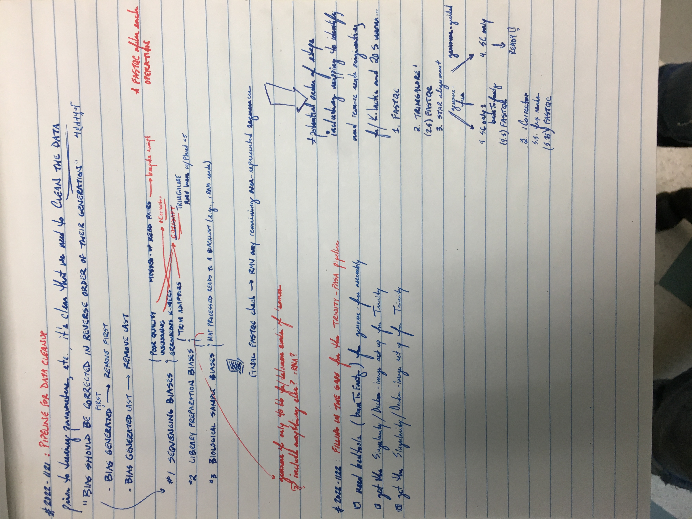
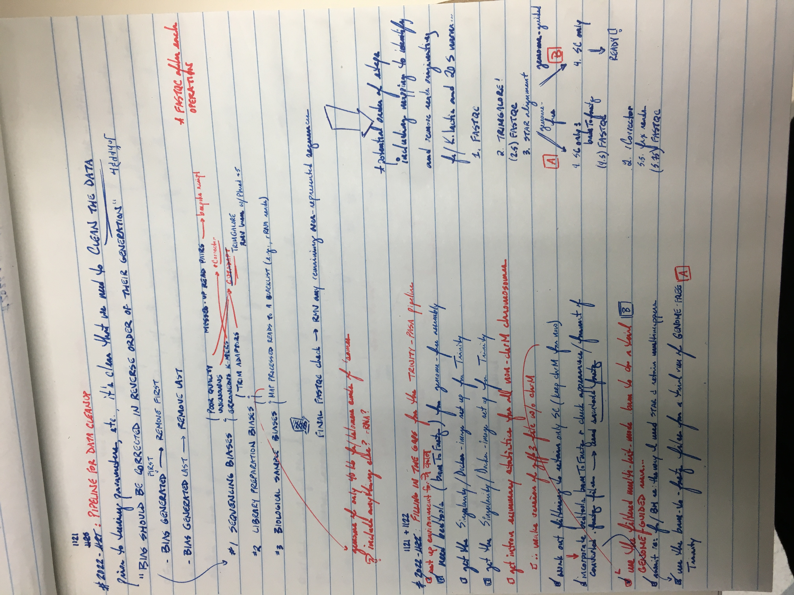
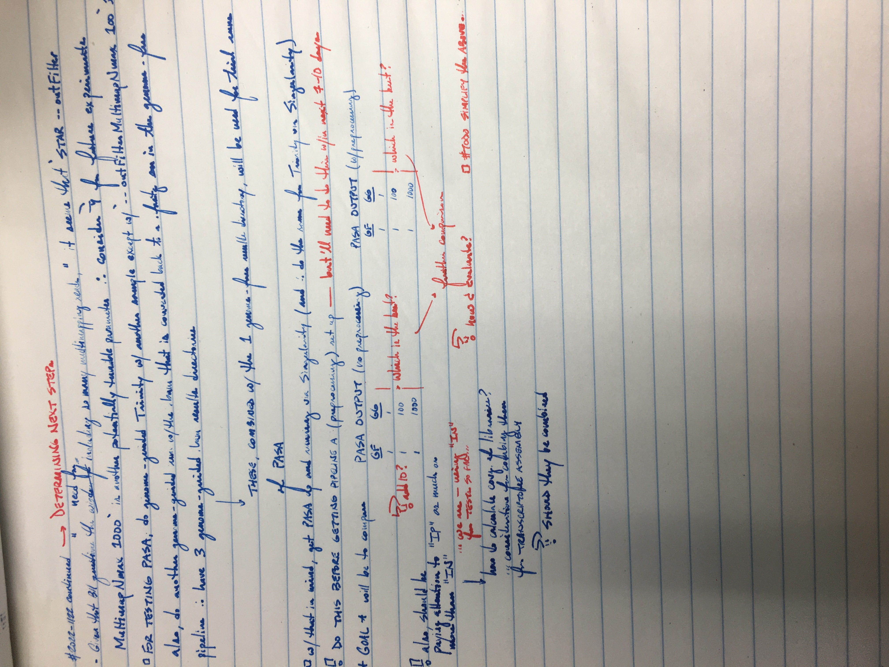

<br />
<details>
<summary><b><font size="+2"><i>Table of contents</i></font></b></summary>
<!-- MarkdownTOC -->

1. [Attempts to set up an environment for `Trinity`, etc.](#attempts-to-set-up-an-environment-for-trinity-etc)
	1. [Attempt #1 \(2022-1121\)](#attempt-1-2022-1121)
	1. [Attempt #2 \(2022-1122\)](#attempt-2-2022-1122)
1. [Filtering `.bam` files to retain only alignments to *S. cerevisiae* \(2022-1122\)](#filtering-bam-files-to-retain-only-alignments-to-s-cerevisiae-2022-1122)
1. [Do a trial run of `Trinity` genome-guided mode \(2022-1122\)](#do-a-trial-run-of-trinity-genome-guided-mode-2022-1122)
1. [Convert "rna-star" filtered `.bam` files back to `.fastq` files \(2022-1122\)](#convert-rna-star-filtered-bam-files-back-to-fastq-files-2022-1122)
1. [Do a trial run of `Trinity` genome-guided mode \(2022-1122\)](#do-a-trial-run-of-trinity-genome-guided-mode-2022-1122-1)
1. [Follow-up question to Brian Haas](#follow-up-question-to-brian-haas)
	1. [Message from me \(2022-1122\)](#message-from-me-2022-1122)
	1. [Response from Brian Haas \(2022-1122\)](#response-from-brian-haas-2022-1122)
	1. [Miscellaneous](#miscellaneous)
1. [Working out pipelines, `#TODO` lists, etc.](#working-out-pipelines-todo-lists-etc)
	1. [`#TODOLIST` written on 2022-1120](#todolist-written-on-2022-1120)
	1. [Preprocessing pipeline rough draft, 2022-1121](#preprocessing-pipeline-rough-draft-2022-1121)
	1. [Subsequent pipeline draft, 2022-1121](#subsequent-pipeline-draft-2022-1121)
	1. [Building on the pipeline draft and reflecting on next steps, etc., 2022-1122](#building-on-the-pipeline-draft-and-reflecting-on-next-steps-etc-2022-1122)
	1. [Excel file used for parameterization](#excel-file-used-for-parameterization)
1. [Miscellaneous](#miscellaneous-1)

<!-- /MarkdownTOC -->
</details>
<br />

`#TODO` Organize or delete this later

Couldn't really find much on "super-reads mode", which is something I found in the documentation for `Trinity v2.12.0`, nor did I find much on `--no_super_reads`: super-reads mode seems to be something happening by default according to the source code, at least in `Trinity v2.12.0`

Potentially interesting links/resources (from [Google search for "cerevisiae trinity assembly"](https://www.google.com/search?q=cerevisiae+trinity+assembly&oq=cerevisiae+trinity+assembly&aqs=chrome..69i57j33i160l4.353j0j7&sourceid=chrome&ie=UTF-8))
- [Compare *de novo* reconstructed transcripts to reference annotations](https://ycl6.gitbook.io/rna-seq-data-analysis/de_novo_assembly_using_trinity/compare_de_novo_reconstructed_transcripts_to_reference_annotations)
- [Assessing transcriptome assembly quality](https://southgreenplatform.github.io/trainings/trinityTrinotate/TP-trinity/#practice-3)
	+ Getting basic Assembly metrics with the trinity script TrinityStats.pl
	+ Reads mapping back rate and abundance estimation using the trinity script align_and_estimate_abundance.pl
	+ Expression matrix construction
	+ Compute N50 based on the top-most highly expressed transcripts (Ex50)
	+ Quantifying completness using BUSCO
	+ BLASTX comparison to known protein sequences database
	+ *Other sections before and after the above*
- [Assemblage de-novo de transcriptome Trinity](https://ressources.france-bioinformatique.fr/sites/default/files/A01_Galaxy_RNASeq_denovo_ITMO2016_0.pdf)
	+ Training from Ecole ITMO 2016
	+ Contains a lot of useful information; for example, info for preprocessing
	+ Interesting explanations of parameters, especially for butterfly stage  `#TODO` Study this later
- [Example of a yeast study using standard parameters for `Trinity`](https://www.sciencedirect.com/science/article/pii/S0888754321000288#ec0005)
- [An example of using StringTie with yeast](https://www.biostars.org/p/296555/)
- [On the meaning of N50](https://www.biostars.org/p/723/)

Before we even start tooling with the parameters, it is likely more important to clean the data
- See the FAS Informatics [*Best Practices* document]()
- See also the pertinent slides [here](https://ressources.france-bioinformatique.fr/sites/default/files/A01_Galaxy_RNASeq_denovo_ITMO2016_0.pdf)

~~Should I get cutadapt set up now...?~~ No, use `Trim Galore` (following the FAS Informatics [*Best Practices* document]())

`#QUESTION` Are forward reads left and reverse reads right? `#ANSWER` I don't know--probably

<a id="attempts-to-set-up-an-environment-for-trinity-etc"></a>
### Attempts to set up an environment for `Trinity`, etc.
<a id="attempt-1-2022-1121"></a>
#### Attempt #1 (2022-1121)
- Creating an environment for `Trinity`, with related work
- So many failures...
```bash
#!/bin/bash
#DONTRUN

grabnode # Lowest and default settings

d_work="${HOME}/tsukiyamalab/kalavatt/2022_transcriptome-construction/results/2022-1101"
cd "${d_work}" || echo "Error: cd'ing failed; check on this"

mamba create -n Trinity_env -c bioconda trinity
#  Success

echo 'alias Trinity_env="conda activate Trinity_env"' >> ~/.bash_aliases
alias Trinity_env="conda activate Trinity_env"
Trinity_env

mamba install -c bioconda pasa  # rcorrector cutadapt fastqc
# Encountered problems while solving:
#   - nothing provides perl 5.22.0* needed by pasa-2.3.3-pl5.22.0r3.4.1_0

mamba install -c bioconda pasa=2.5.2
# Encountered problems while solving:
#   - nothing provides libgcc-ng >=12 needed by pasa-2.5.2-h87f3376_0

mamba search -c anaconda libgcc-ng  #  No versions >=12
mamba install -c bioconda rcorrector  # cutadapt fastqc
#  Success

mamba install -c bioconda cutadapt  # fastqc
# Encountered problems while solving:
#   - nothing provides python 3.4* needed by cutadapt-1.10-py34_0

mamba search -c bioconda cutadapt
#  Success

mamba install -c bioconda cutadapt=4.1
# Encountered problems while solving:
#   - nothing provides libgcc-ng >=12 needed by cutadapt-4.1-py310h1425a21_1

mamba search -c conda-forge libgcc-ng  #  Several versions >12
mamba install -c conda-forge libgcc-ng=12.2.0  # Latest
#  Success: _openmp_mutex downgraded from 5.1 to 4.5

mamba install -c bioconda cutadapt=4.1
# Pinned packages:
#   - python 3.8.*
# 
# Encountered problems while solving:
#   - nothing provides python_abi 3.10.* *_cp310 needed by cutadapt-4.1-py310h1425a21_1

mamba install -c bioconda pasa=2.5.2
# Pinned packages:
#   - python 3.8.*
# 
# Encountered problems while solving:
#   - nothing provides libstdcxx-ng >=12 needed by pasa-2.5.2-h87f3376_0

mamba install -c bioconda fastqc
#  Success

#  Install libstdcxx-ng, python_abi 3.10.*
mamba search -c conda-forge libstdcxx-ng  #  Several versions >12
mamba install -c conda-forge libstdcxx-ng=12.2.0

mamba install -c bioconda pasa=2.5.2
# Encountered problems while solving:
#   - package pasa-2.5.2-h87f3376_0 requires lighttpd, but none of the providers can be installed

mamba install -c conda-forge lighttpd
#  Success (couple packages downgraded)

mamba install -c bioconda pasa=2.5.2
# Encountered problems while solving:
#   - package libnghttp2-1.46.0-hce63b2e_0 requires openssl >=1.1.1l,<1.1.2a, but none of the providers can be installed

mamba search -c conda-forge openssl
mamba install -c conda-forge openssl=1.1.1m

mamba install -c bioconda pasa=2.5.2  #  Weird because 1.1.1m
# Encountered problems while solving:
#   - package libnghttp2-1.47.0-h727a467_0 requires openssl >=1.1.1l,<1.1.2a, but none of the providers can be installed

mamba search -c conda-forge openssl
mamba install -c conda-forge openssl=1.1.1s

mamba install -c bioconda pasa=2.5.2  #  Weird because 1.1.1s
# Encountered problems while solving:
#   - package libnghttp2-1.47.0-h727a467_0 requires openssl >=1.1.1l,<1.1.2a, but none of the providers can be installed

mamba update -c conda-forge libnghttp2
# Encountered problems while solving:
#   - package libnghttp2-1.47.0-hdcd2b5c_1 requires openssl >=1.1.1q,<1.1.2a, but none of the providers can be installed

mamba install -c conda-forge openssl=1.1.1q

mamba install -c bioconda pasa=2.5.2  #  Weird because 1.1.1s
# Encountered problems while solving:
#   - package libnghttp2-1.47.0-hdcd2b5c_1 requires openssl >=1.1.1q,<1.1.2a, but none of the providers can be installed

mamba search -c conda-forge libnghttp2
#  ...
#+ Consider using Singularity to install PASA

mamba install -c bioconda cutadapt=4.1
# Encountered problems while solving:
#   - nothing provides python_abi 3.10.* *_cp310 needed by cutadapt-4.1-py310h1425a21_1

mamba search -c conda-forge python_abi
mamba install -c conda-forge python_abi=3.11
# Encountered problems while solving:
#   - package python_abi-3.11-2_cp311 requires python 3.11.*, but none of the providers can be installed

mamba search -c conda-forge python
mamba install -c conda-forge python=3.10.8
# Encountered problems while solving:
#   - package bowtie2-2.4.1-py38he513fc3_0 requires python >=3.8,<3.9.0a0, but none of the providers can be installed

#NOTE Cutadapt 4.1 is not possible without changing Bowtie2 and then potentially... Wait, what version of Trinity is this?

which Trinity
# /home/kalavatt/miniconda3/envs/Trinity_env/bin/Trinity

Trinity --version
# Trinity version: Trinity-v2.9.1
# ** NOTE: Latest version of Trinity is Trinity-v2.14.0, and can be obtained at:
#     https://github.com/trinityrnaseq/trinityrnaseq/releases

#  Delete the environment and try installing Trinity and PASA using Singularity
```
`#NOTE` Deleted the environment

<a id="attempt-2-2022-1122"></a>
#### Attempt #2 (2022-1122)
- Have determined to install `Trinity` and `PASA` via `Singularity` (with `.simg` files made from the `Docker` images)
- The following packages will be installed into an environment, `Trinity_env`, using `conda`
	+ `Trim Galore`
		* [`conda`](https://anaconda.org/bioconda/trim-galore)
	+ `rCorrector`
		* [`conda`](https://anaconda.org/bioconda/rcorrector)
	+ `STAR`  `#MAYBE`
		* [`conda`](https://anaconda.org/bioconda/star)
	+ `FastQC`
		* [`conda`](https://anaconda.org/bioconda/fastqc)
	+ `bedtools`
		* [`bedtools`](https://anaconda.org/bioconda/bedtools)

```bash
#!/bin/bash
#DONTRUN

grabnode # Lowest and default settings

d_work="${HOME}/tsukiyamalab/kalavatt/2022_transcriptome-construction/results/2022-1101"
cd "${d_work}" || echo "Error: cd'ing failed; check on this"

mamba search -c bioconda trim-galore
mamba search -c bioconda star
mamba search -c bioconda rcorrector
mamba search -c bioconda fastqc
mamba search -c bioconda bedtools

mamba create \
	-n Trinity_env \
	-c bioconda \
	trim-galore rcorrector star fastqc bedtools
# + _libgcc_mutex                     0.1  main            pkgs/main/linux-64     Cached
# + _openmp_mutex                     5.1  1_gnu           pkgs/main/linux-64     Cached
# + bedtools                       2.30.0  h7d7f7ad_2      bioconda/linux-64       18 MB
# + bz2file                          0.98  py37h06a4308_1  pkgs/main/linux-64     245 KB
# + bzip2                           1.0.8  h7b6447c_0      pkgs/main/linux-64     Cached
# + ca-certificates            2022.10.11  h06a4308_0      pkgs/main/linux-64     Cached
# + certifi                     2022.9.24  py37h06a4308_0  pkgs/main/linux-64     Cached
# + cutadapt                          2.6  py37h516909a_0  bioconda/linux-64      173 KB
# + dbus                          1.13.18  hb2f20db_0      pkgs/main/linux-64     Cached
# + dnaio                             0.3  py37h14c3975_1  bioconda/linux-64      129 KB
# + expat                           2.4.9  h6a678d5_0      pkgs/main/linux-64     Cached
# + fastqc                         0.11.9  hdfd78af_1      bioconda/noarch        Cached
# + font-ttf-dejavu-sans-mono        2.37  hd3eb1b0_0      pkgs/main/noarch       Cached
# + fontconfig                     2.13.1  hef1e5e3_1      pkgs/main/linux-64     Cached
# + freetype                       2.12.1  h4a9f257_0      pkgs/main/linux-64     Cached
# + gdbm                             1.18  hd4cb3f1_4      pkgs/main/linux-64     Cached
# + glib                           2.69.1  h4ff587b_1      pkgs/main/linux-64     Cached
# + icu                              58.2  he6710b0_3      pkgs/main/linux-64     Cached
# + kmer-jellyfish                  2.3.0  h9f5acd7_3      bioconda/linux-64      Cached
# + ld_impl_linux-64                 2.38  h1181459_1      pkgs/main/linux-64     Cached
# + libffi                            3.3  he6710b0_2      pkgs/main/linux-64     Cached
# + libgcc-ng                      11.2.0  h1234567_1      pkgs/main/linux-64     Cached
# + libgomp                        11.2.0  h1234567_1      pkgs/main/linux-64     Cached
# + libpng                         1.6.37  hbc83047_0      pkgs/main/linux-64     Cached
# + libstdcxx-ng                   11.2.0  h1234567_1      pkgs/main/linux-64     Cached
# + libuuid                        1.41.5  h5eee18b_0      pkgs/main/linux-64     Cached
# + libxcb                           1.15  h7f8727e_0      pkgs/main/linux-64     Cached
# + libxml2                        2.9.14  h74e7548_0      pkgs/main/linux-64     Cached
# + ncurses                           6.3  h5eee18b_3      pkgs/main/linux-64     Cached
# + openjdk                       11.0.13  h87a67e3_0      pkgs/main/linux-64     Cached
# + openssl                        1.1.1s  h7f8727e_0      pkgs/main/linux-64     Cached
# + pcre                             8.45  h295c915_0      pkgs/main/linux-64     Cached
# + perl                           5.34.0  h5eee18b_2      pkgs/main/linux-64     Cached
# + pigz                              2.6  h27cfd23_0      pkgs/main/linux-64      70 KB
# + pip                            22.2.2  py37h06a4308_0  pkgs/main/linux-64     Cached
# + python                         3.7.15  haa1d7c7_0      pkgs/main/linux-64      41 MB
# + rcorrector                      1.0.4  h2e03b76_2      bioconda/linux-64      Cached
# + readline                          8.2  h5eee18b_0      pkgs/main/linux-64     Cached
# + setuptools                     65.5.0  py37h06a4308_0  pkgs/main/linux-64       1 MB
# + sqlite                         3.39.3  h5082296_0      pkgs/main/linux-64     Cached
# + star                          2.7.10b  h9ee0642_0      bioconda/linux-64        5 MB
# + tk                             8.6.12  h1ccaba5_0      pkgs/main/linux-64     Cached
# + trim-galore                     0.6.7  hdfd78af_0      bioconda/noarch         42 KB
# + wheel                          0.37.1  pyhd3eb1b0_0    pkgs/main/noarch       Cached
# + xopen                           0.7.3  py_0            bioconda/noarch         11 KB
# + xz                              5.2.6  h5eee18b_0      pkgs/main/linux-64     Cached
# + zlib                           1.2.13  h5eee18b_0      pkgs/main/linux-64     Cached

#  Check w/r/t/mamba search results (in separate tab)
#+ - STAR is up-to-date
#+ - Trim Galore is up-to-date
#+ - rcorrector is at version 1.0.4=h2e03b76_2; the most up-to-date version is 1.0.5=h5b5514e_0
#+     - difference between 1.0.4 and 1.0.5 described here: github.com/mourisl/Rcorrector/pull/36
#+     - #OPINION Should be OK to move forward with 1.0.4
#+         - Unlikely to encounter described error
#+ - FastqQC is up-to-date
#+ - bedtools is up-to-date

#  Successfully installed everything to set up the environment
Trinity_env  # It works because already present in .bash_aliases (yesterday)


# #  Go ahead and add samtools; goal is to have a compute environment in which
# #+ nothing is loaded from FHCC Bioinformatics
# mamba search -c bioconda samtools
# mamba install -c bioconda samtools  # Cancel because...
# #   Package            Version  Build       Channel                  Size
# # ─────────────────────────────────────────────────────────────────────────
# #   Install:
# # ─────────────────────────────────────────────────────────────────────────
# #
# #   + c-ares            1.18.1  h7f8727e_0  pkgs/main/linux-64     Cached
# #   + htslib              1.13  h9093b5e_0  bioconda/linux-64      Cached
# #   + krb5              1.19.2  hac12032_0  pkgs/main/linux-64     Cached
# #   + libcurl           7.85.0  h91b91d3_0  pkgs/main/linux-64     Cached
# #   + libdeflate           1.7  h27cfd23_5  pkgs/main/linux-64     Cached
# #   + libedit     3.1.20210714  h7f8727e_0  pkgs/main/linux-64     Cached
# #   + libev               4.33  h7f8727e_1  pkgs/main/linux-64     Cached
# #   + libnghttp2        1.46.0  hce63b2e_0  pkgs/main/linux-64     Cached
# #   + libssh2           1.10.0  h8f2d780_0  pkgs/main/linux-64     Cached
# #   + samtools            1.13  h8c37831_0  bioconda/linux-64      Cached
# #
# #   Downgrade:
# # ─────────────────────────────────────────────────────────────────────────
# #
# #   - ncurses              6.3  h5eee18b_3  installed
# #   + ncurses              6.2  he6710b0_1  pkgs/main/linux-64     Cached
# #   - python            3.7.15  haa1d7c7_0  installed
# #   + python            3.7.11  h12debd9_0  pkgs/main/linux-64      45 MB
# #   - readline             8.2  h5eee18b_0  installed
# #   + readline             8.1  h27cfd23_0  pkgs/main/linux-64     Cached
#
# #  Installing an outdated version of samtools, i.e., 1.13 instead of 1.16.1
#
# mamba install -c bioconda samtools=1.16.1
# # Pinned packages:
# #   - python 3.7.*
# #
# # Encountered problems while solving:
# #   - nothing provides libgcc-ng >=12 needed by samtools-1.16.1-h6899075_0
```

<a id="filtering-bam-files-to-retain-only-alignments-to-s-cerevisiae-2022-1122"></a>
### Filtering `.bam` files to retain only alignments to *S. cerevisiae* (2022-1122)
`#QUESTION` Haven't I done this yet? I wrote `split_bam_by_species.sh`, but have I run it with respect to the "rna-star" and "multi-hit-mode" `.bam` files yet?
`#ANSWER` I have run a few tests in which most of the outfiles were `rm`'d
    - One outfile for a `.bam` composed of only *S. cerevisiae* chromosomes is present in `"${HOME}/tsukiyamalab/kalavatt/2022_transcriptome-construction/results/2022-1101/exp_alignment_STAR/files_bams"`
    - There are no such `.bam` files in the subdirectories of `"${HOME}/tsukiyamalab/kalavatt/2022_transcriptome-construction/results/2022-1101/exp_alignment_STAR_tags"`
    - ∴ Do this work for the two `{multi-hit-mode,rna-star}/files_bams/*.exclude-unmapped.bam` files in `/home/kalavatt/tsukiyamalab/kalavatt/2022_transcriptome-construction/results/2022-1101/exp_alignment_STAR_tags`

```bash
#!/bin/bash
#DONTRUN

grabnode # Take two cores; otherwise, use default settings

d_work="${HOME}/tsukiyamalab/kalavatt/2022_transcriptome-construction/results/2022-1101"
cd "${d_work}" || echo "Error: cd'ing failed; check on this"

module load SAMtools/1.16.1-GCC-11.2.0


#  .bam from "multi-hit-mode" (separate tab) ----------------------------------
threads=2
d_multi="exp_alignment_STAR_tags/multi-hit-mode/files_bams/5781_G1_IN_mergedAligned.sortedByCoord.out.exclude-unmapped.bam"

samtools index -@ 2 "${d_multi}"

#  Doing the following based on work fixing split_bam_by_species.sh below in
#+ the section for "rna-star"
if [[ -f "$(dirname "${d_multi}")/5781_G1_IN_mergedAligned.sortedByCoord.out.exclude-unmapped.split_SC_all.bam" ]]; then
	# ls -lhaFG "$(dirname "${d_multi}")/5781_G1_IN_mergedAligned.sortedByCoord.out.exclude-unmapped.split_SC_all.bam"
	rm "$(dirname "${d_multi}")/5781_G1_IN_mergedAligned.sortedByCoord.out.exclude-unmapped.split_SC_all.bam"
fi

ls -lhaFG "$(dirname "${d_multi}")"
# total 9.2G
# drwxrws--- 3 kalavatt  847 Nov 22 08:45 ./
# drwxrws--- 3 kalavatt   28 Nov 21 12:22 ../
# -rw-rw---- 1 kalavatt 4.3G Nov 18 14:58 5781_G1_IN_mergedAligned.sortedByCoord.out.bam
# -rw-rw---- 1 kalavatt  82K Nov 18 15:02 5781_G1_IN_mergedAligned.sortedByCoord.out.bam.bai
# -rw-rw---- 1 kalavatt 3.4G Nov 18 15:19 5781_G1_IN_mergedAligned.sortedByCoord.out.exclude-unmapped.bam
# -rw-rw---- 1 kalavatt  79K Nov 22 08:09 5781_G1_IN_mergedAligned.sortedByCoord.out.exclude-unmapped.bam.bai
# -rw-rw---- 1 kalavatt  595 Nov 18 15:20 5781_G1_IN_mergedAligned.sortedByCoord.out.exclude-unmapped.flagstat.txt
# -rw-rw---- 1 kalavatt  194 Nov 18 15:32 5781_G1_IN_mergedAligned.sortedByCoord.out.exclude-unmapped.flags.txt
# -rw-rw---- 1 kalavatt  589 Nov 18 15:49 5781_G1_IN_mergedAligned.sortedByCoord.out.flagstat.txt
# -rw-rw---- 1 kalavatt  241 Nov 18 15:27 5781_G1_IN_mergedAligned.sortedByCoord.out.flags.txt
# -rw-rw---- 1 kalavatt 2.0K Nov 18 14:58 5781_G1_IN_mergedLog.final.out
# -rw-rw---- 1 kalavatt 8.3K Nov 18 14:58 5781_G1_IN_mergedLog.out
# -rw-rw---- 1 kalavatt  836 Nov 18 14:58 5781_G1_IN_mergedLog.progress.out
# -rw-rw---- 1 kalavatt 129K Nov 18 14:57 5781_G1_IN_mergedSJ.out.tab
# drwx--S--- 3 kalavatt   25 Nov 18 14:58 5781_G1_IN_merged_STARtmp/

unset filters
filters=(
	"SC_all"
	"KL_all"
	"virus_20S"
)
for i in "${filters[@]}"; do
	bash ../../bin/split_bam_by_species.sh \
	-u FALSE \
	-i "${d_multi}" \
	-o "$(dirname "${d_multi}")" \
	-s "${i}" \
	-t "${threads}"
done
#NOTES Took more than 10 minutes to run for 'SC_all'...

#  Index the filtered .bam files
for i in "${filters[@]}"; do
	samtools index -@ "${threads}" \
		"$(dirname "${d_multi}")/5781_G1_IN_mergedAligned.sortedByCoord.out.exclude-unmapped.${i}.bam"
done

ls -lhaFG "$(dirname "${d_multi}")"
# total 14G
# drwxrws--- 3 kalavatt 1.4K Nov 22 09:05 ./
# drwxrws--- 3 kalavatt   28 Nov 21 12:22 ../
# -rw-rw---- 1 kalavatt 4.3G Nov 18 14:58 5781_G1_IN_mergedAligned.sortedByCoord.out.bam
# -rw-rw---- 1 kalavatt  82K Nov 18 15:02 5781_G1_IN_mergedAligned.sortedByCoord.out.bam.bai
# -rw-rw---- 1 kalavatt 3.4G Nov 18 15:19 5781_G1_IN_mergedAligned.sortedByCoord.out.exclude-unmapped.bam
# -rw-rw---- 1 kalavatt  79K Nov 22 08:09 5781_G1_IN_mergedAligned.sortedByCoord.out.exclude-unmapped.bam.bai
# -rw-rw---- 1 kalavatt  595 Nov 18 15:20 5781_G1_IN_mergedAligned.sortedByCoord.out.exclude-unmapped.flagstat.txt
# -rw-rw---- 1 kalavatt  194 Nov 18 15:32 5781_G1_IN_mergedAligned.sortedByCoord.out.exclude-unmapped.flags.txt
# -rw-rw---- 1 kalavatt 207M Nov 22 09:03 5781_G1_IN_mergedAligned.sortedByCoord.out.exclude-unmapped.KL_all.bam
# -rw-rw---- 1 kalavatt  16K Nov 22 09:05 5781_G1_IN_mergedAligned.sortedByCoord.out.exclude-unmapped.KL_all.bam.bai
# -rw-rw---- 1 kalavatt 3.1G Nov 22 09:02 5781_G1_IN_mergedAligned.sortedByCoord.out.exclude-unmapped.SC_all.bam
# -rw-rw---- 1 kalavatt  64K Nov 22 09:05 5781_G1_IN_mergedAligned.sortedByCoord.out.exclude-unmapped.SC_all.bam.bai
# -rw-rw---- 1 kalavatt 778K Nov 22 09:03 5781_G1_IN_mergedAligned.sortedByCoord.out.exclude-unmapped.virus_20S.bam
# -rw-rw---- 1 kalavatt  280 Nov 22 09:05 5781_G1_IN_mergedAligned.sortedByCoord.out.exclude-unmapped.virus_20S.bam.bai
# -rw-rw---- 1 kalavatt  589 Nov 18 15:49 5781_G1_IN_mergedAligned.sortedByCoord.out.flagstat.txt
# -rw-rw---- 1 kalavatt  241 Nov 18 15:27 5781_G1_IN_mergedAligned.sortedByCoord.out.flags.txt
# -rw-rw---- 1 kalavatt 2.0K Nov 18 14:58 5781_G1_IN_mergedLog.final.out
# -rw-rw---- 1 kalavatt 8.3K Nov 18 14:58 5781_G1_IN_mergedLog.out
# -rw-rw---- 1 kalavatt  836 Nov 18 14:58 5781_G1_IN_mergedLog.progress.out
# -rw-rw---- 1 kalavatt 129K Nov 18 14:57 5781_G1_IN_mergedSJ.out.tab
# drwx--S--- 3 kalavatt   25 Nov 18 14:58 5781_G1_IN_merged_STARtmp/


#  .bam from "rna-star" (separate tab) ----------------------------------------
threads=2
d_normal="exp_alignment_STAR_tags/rna-star/files_bams/5781_G1_IN_mergedAligned.sortedByCoord.out.exclude-unmapped.bam"

samtools index -@ 2 "${d_normal}"

if [[ -f "$(dirname "${d_normal}")/5781_G1_IN_mergedAligned.sortedByCoord.out.exclude-unmapped.split_SC_all.bam" ]]; then
	# ls -lhaFG "$(dirname "${d_normal}")/5781_G1_IN_mergedAligned.sortedByCoord.out.exclude-unmapped.split_SC_all.bam"
	rm "$(dirname "${d_normal}")/5781_G1_IN_mergedAligned.sortedByCoord.out.exclude-unmapped.split_SC_all.bam"
fi
bash ../../bin/split_bam_by_species.sh \
	-u FALSE \
	-i "${d_normal}" \
	-o "$(dirname "${d_normal}")" \
	-s SC_all \
	-t "${threads}"

bash ../../bin/split_bam_by_species.sh \
	-u FALSE \
	-i "${d_normal}" \
	-o "$(dirname "${d_normal}")" \
	-s KL_all \
	-t "${threads}"

bash ../../bin/split_bam_by_species.sh \
	-u FALSE \
	-i "${d_normal}" \
	-o "$(dirname "${d_normal}")" \
	-s virus_20S \
	-t "${threads}"

ls -lhaFG "$(dirname "${d_normal}")"
# total 2.5G
# drwxrws--- 3 kalavatt  941 Nov 22 08:13 ./
# drwxrws--- 3 kalavatt   28 Nov 21 12:22 ../
# -rw-rw---- 1 kalavatt 1.2G Nov 18 14:39 5781_G1_IN_mergedAligned.sortedByCoord.out.bam
# -rw-rw---- 1 kalavatt  59K Nov 18 15:01 5781_G1_IN_mergedAligned.sortedByCoord.out.bam.bai
# -rw-rw---- 1 kalavatt 608M Nov 18 15:06 5781_G1_IN_mergedAligned.sortedByCoord.out.exclude-unmapped.bam
# -rw-rw---- 1 kalavatt  56K Nov 22 08:10 5781_G1_IN_mergedAligned.sortedByCoord.out.exclude-unmapped.bam.bai
# -rw-rw---- 1 kalavatt  577 Nov 18 15:06 5781_G1_IN_mergedAligned.sortedByCoord.out.exclude-unmapped.flagstat.txt
# -rw-rw---- 1 kalavatt   94 Nov 18 15:27 5781_G1_IN_mergedAligned.sortedByCoord.out.exclude-unmapped.flags.txt
# -rw-rw---- 1 kalavatt 815K Nov 22 08:17 5781_G1_IN_mergedAligned.sortedByCoord.out.exclude-unmapped.split_SC_all.bam
# -rw-rw---- 1 kalavatt  573 Nov 18 15:49 5781_G1_IN_mergedAligned.sortedByCoord.out.flagstat.txt
# -rw-rw---- 1 kalavatt  141 Nov 18 15:22 5781_G1_IN_mergedAligned.sortedByCoord.out.flags.txt
# -rw-rw---- 1 kalavatt 2.0K Nov 18 14:39 5781_G1_IN_mergedLog.final.out
# -rw-rw---- 1 kalavatt 7.9K Nov 18 14:39 5781_G1_IN_mergedLog.out
# -rw-rw---- 1 kalavatt  364 Nov 18 14:39 5781_G1_IN_mergedLog.progress.out
# -rw-rw---- 1 kalavatt  46K Nov 18 14:39 5781_G1_IN_mergedSJ.out.tab
# drwx--S--- 3 kalavatt   25 Nov 18 14:39 5781_G1_IN_merged_STARtmp/

#FIXME 1/4 The output of the above three commands seems to be all be saved as
#FIXME 2/4 *.split_SC_all.bam; for example, from the SC_all command, size of
#FIXME 3/4 the .bam file was 568M and, from the virus_20S command, the .bam
#FIXME 4/4 file size is 815K; ∴, need to fix split_bam_by_species.sh
#DONE Try again

filters=(
	"SC_all"
	"KL_all"
	"virus_20S"
)
for i in "${filters[@]}"; do
	bash ../../bin/split_bam_by_species.sh \
	-u FALSE \
	-i "${d_normal}" \
	-o "$(dirname "${d_normal}")" \
	-s "${i}" \
	-t "${threads}"
done
#NOTE Runs very quickly

ls -lhaFG "$(dirname "${d_normal}")"
# total 3.2G
# drwxrws--- 3 kalavatt 1.3K Nov 22 08:27  ./
# drwxrws--- 3 kalavatt   28 Nov 21 12:22  ../
# -rw-rw---- 1 kalavatt 1.2G Nov 18 14:39  5781_G1_IN_mergedAligned.sortedByCoord.out.bam
# -rw-rw---- 1 kalavatt  59K Nov 18 15:01  5781_G1_IN_mergedAligned.sortedByCoord.out.bam.bai
# -rw-rw---- 1 kalavatt 815K Nov 22 08:27  5781_G1_IN_mergedAligned.sortedByCoord.out.exclude-unmapped.20S.bam
# -rw-rw---- 1 kalavatt  40M Nov 22 08:27 '5781_G1_IN_mergedAligned.sortedByCoord.out.exclude-unmapped.A B C D E F.bam'
# -rw-rw---- 1 kalavatt 608M Nov 18 15:06  5781_G1_IN_mergedAligned.sortedByCoord.out.exclude-unmapped.bam
# -rw-rw---- 1 kalavatt  56K Nov 22 08:10  5781_G1_IN_mergedAligned.sortedByCoord.out.exclude-unmapped.bam.bai
# -rw-rw---- 1 kalavatt  577 Nov 18 15:06  5781_G1_IN_mergedAligned.sortedByCoord.out.exclude-unmapped.flagstat.txt
# -rw-rw---- 1 kalavatt   94 Nov 18 15:27  5781_G1_IN_mergedAligned.sortedByCoord.out.exclude-unmapped.flags.txt
# -rw-rw---- 1 kalavatt 568M Nov 22 08:27 '5781_G1_IN_mergedAligned.sortedByCoord.out.exclude-unmapped.I II III IV V VI VII VIII IX X XI XII XIII XIV XV XVI Mito.bam'
# -rw-rw---- 1 kalavatt 815K Nov 22 08:17  5781_G1_IN_mergedAligned.sortedByCoord.out.exclude-unmapped.split_SC_all.bam
# -rw-rw---- 1 kalavatt  573 Nov 18 15:49  5781_G1_IN_mergedAligned.sortedByCoord.out.flagstat.txt
# -rw-rw---- 1 kalavatt  141 Nov 18 15:22  5781_G1_IN_mergedAligned.sortedByCoord.out.flags.txt
# -rw-rw---- 1 kalavatt 2.0K Nov 18 14:39  5781_G1_IN_mergedLog.final.out
# -rw-rw---- 1 kalavatt 7.9K Nov 18 14:39  5781_G1_IN_mergedLog.out
# -rw-rw---- 1 kalavatt  364 Nov 18 14:39  5781_G1_IN_mergedLog.progress.out
# -rw-rw---- 1 kalavatt  46K Nov 18 14:39  5781_G1_IN_mergedSJ.out.tab
# drwx--S--- 3 kalavatt   25 Nov 18 14:39  5781_G1_IN_merged_STARtmp/

#FIXME The "fix" to split_bam_by_species.sh is not quite right...
#DONE Try again...

rm "$(dirname "${d_normal}")/5781_G1_IN_mergedAligned.sortedByCoord.out.exclude-unmapped.split_SC_all.bam"

for i in "${filters[@]}"; do
	bash ../../bin/split_bam_by_species.sh \
	-u FALSE \
	-i "${d_normal}" \
	-o "$(dirname "${d_normal}")" \
	-s "${i}" \
	-t "${threads}"
done
#NOTE Runs very quickly

ls -lhaFG "$(dirname "${d_normal}")"
# total 3.9G
# drwxrws--- 3 kalavatt 1.4K Nov 22 08:31  ./
# drwxrws--- 3 kalavatt   28 Nov 21 12:22  ../
# -rw-rw---- 1 kalavatt 1.2G Nov 18 14:39  5781_G1_IN_mergedAligned.sortedByCoord.out.bam
# -rw-rw---- 1 kalavatt  59K Nov 18 15:01  5781_G1_IN_mergedAligned.sortedByCoord.out.bam.bai
# -rw-rw---- 1 kalavatt 815K Nov 22 08:27  5781_G1_IN_mergedAligned.sortedByCoord.out.exclude-unmapped.20S.bam
# -rw-rw---- 1 kalavatt  40M Nov 22 08:27 '5781_G1_IN_mergedAligned.sortedByCoord.out.exclude-unmapped.A B C D E F.bam'
# -rw-rw---- 1 kalavatt 608M Nov 18 15:06  5781_G1_IN_mergedAligned.sortedByCoord.out.exclude-unmapped.bam
# -rw-rw---- 1 kalavatt  56K Nov 22 08:10  5781_G1_IN_mergedAligned.sortedByCoord.out.exclude-unmapped.bam.bai
# -rw-rw---- 1 kalavatt  577 Nov 18 15:06  5781_G1_IN_mergedAligned.sortedByCoord.out.exclude-unmapped.flagstat.txt
# -rw-rw---- 1 kalavatt   94 Nov 18 15:27  5781_G1_IN_mergedAligned.sortedByCoord.out.exclude-unmapped.flags.txt
# -rw-rw---- 1 kalavatt 568M Nov 22 08:27 '5781_G1_IN_mergedAligned.sortedByCoord.out.exclude-unmapped.I II III IV V VI VII VIII IX X XI XII XIII XIV XV XVI Mito.bam'
# -rw-rw---- 1 kalavatt  40M Nov 22 08:31  5781_G1_IN_mergedAligned.sortedByCoord.out.exclude-unmapped.KL_all.bam
# -rw-rw---- 1 kalavatt 568M Nov 22 08:31  5781_G1_IN_mergedAligned.sortedByCoord.out.exclude-unmapped.SC_all.bam
# -rw-rw---- 1 kalavatt 815K Nov 22 08:31  5781_G1_IN_mergedAligned.sortedByCoord.out.exclude-unmapped.virus_20S.bam
# -rw-rw---- 1 kalavatt  573 Nov 18 15:49  5781_G1_IN_mergedAligned.sortedByCoord.out.flagstat.txt
# -rw-rw---- 1 kalavatt  141 Nov 18 15:22  5781_G1_IN_mergedAligned.sortedByCoord.out.flags.txt
# -rw-rw---- 1 kalavatt 2.0K Nov 18 14:39  5781_G1_IN_mergedLog.final.out
# -rw-rw---- 1 kalavatt 7.9K Nov 18 14:39  5781_G1_IN_mergedLog.out
# -rw-rw---- 1 kalavatt  364 Nov 18 14:39  5781_G1_IN_mergedLog.progress.out
# -rw-rw---- 1 kalavatt  46K Nov 18 14:39  5781_G1_IN_mergedSJ.out.tab
# drwx--S--- 3 kalavatt   25 Nov 18 14:39  5781_G1_IN_merged_STARtmp/

#NOTE split_bam_by_species.sh is fixed now; remove the files with weird names
rm "$(dirname "${d_normal}")/5781_G1_IN_mergedAligned.sortedByCoord.out.exclude-unmapped.I II III IV V VI VII VIII IX X XI XII XIII XIV XV XVI Mito.bam"
rm "$(dirname "${d_normal}")/5781_G1_IN_mergedAligned.sortedByCoord.out.exclude-unmapped.A B C D E F.bam"
rm "$(dirname "${d_normal}")/5781_G1_IN_mergedAligned.sortedByCoord.out.exclude-unmapped.20S.bam"

#  Index the filtered .bam files
for i in "${filters[@]}"; do
	samtools index -@ "${threads}" \
		"$(dirname "${d_normal}")/5781_G1_IN_mergedAligned.sortedByCoord.out.exclude-unmapped.${i}.bam"
done

ls -lhaFG "$(dirname "${d_normal}")"
# total 3.2G
# drwxrws--- 3 kalavatt 1.4K Nov 22 08:53 ./
# drwxrws--- 3 kalavatt   28 Nov 21 12:22 ../
# -rw-rw---- 1 kalavatt 1.2G Nov 18 14:39 5781_G1_IN_mergedAligned.sortedByCoord.out.bam
# -rw-rw---- 1 kalavatt  59K Nov 18 15:01 5781_G1_IN_mergedAligned.sortedByCoord.out.bam.bai
# -rw-rw---- 1 kalavatt 608M Nov 18 15:06 5781_G1_IN_mergedAligned.sortedByCoord.out.exclude-unmapped.bam
# -rw-rw---- 1 kalavatt  56K Nov 22 08:10 5781_G1_IN_mergedAligned.sortedByCoord.out.exclude-unmapped.bam.bai
# -rw-rw---- 1 kalavatt  577 Nov 18 15:06 5781_G1_IN_mergedAligned.sortedByCoord.out.exclude-unmapped.flagstat.txt
# -rw-rw---- 1 kalavatt   94 Nov 18 15:27 5781_G1_IN_mergedAligned.sortedByCoord.out.exclude-unmapped.flags.txt
# -rw-rw---- 1 kalavatt  40M Nov 22 08:31 5781_G1_IN_mergedAligned.sortedByCoord.out.exclude-unmapped.KL_all.bam
# -rw-rw---- 1 kalavatt  16K Nov 22 08:53 5781_G1_IN_mergedAligned.sortedByCoord.out.exclude-unmapped.KL_all.bam.bai
# -rw-rw---- 1 kalavatt 568M Nov 22 08:31 5781_G1_IN_mergedAligned.sortedByCoord.out.exclude-unmapped.SC_all.bam
# -rw-rw---- 1 kalavatt  41K Nov 22 08:53 5781_G1_IN_mergedAligned.sortedByCoord.out.exclude-unmapped.SC_all.bam.bai
# -rw-rw---- 1 kalavatt 815K Nov 22 08:31 5781_G1_IN_mergedAligned.sortedByCoord.out.exclude-unmapped.virus_20S.bam
# -rw-rw---- 1 kalavatt  280 Nov 22 08:53 5781_G1_IN_mergedAligned.sortedByCoord.out.exclude-unmapped.virus_20S.bam.bai
# -rw-rw---- 1 kalavatt  573 Nov 18 15:49 5781_G1_IN_mergedAligned.sortedByCoord.out.flagstat.txt
# -rw-rw---- 1 kalavatt  141 Nov 18 15:22 5781_G1_IN_mergedAligned.sortedByCoord.out.flags.txt
# -rw-rw---- 1 kalavatt 2.0K Nov 18 14:39 5781_G1_IN_mergedLog.final.out
# -rw-rw---- 1 kalavatt 7.9K Nov 18 14:39 5781_G1_IN_mergedLog.out
# -rw-rw---- 1 kalavatt  364 Nov 18 14:39 5781_G1_IN_mergedLog.progress.out
# -rw-rw---- 1 kalavatt  46K Nov 18 14:39 5781_G1_IN_mergedSJ.out.tab
# drwx--S--- 3 kalavatt   25 Nov 18 14:39 5781_G1_IN_merged_STARtmp/

#TODO #LATER 1/2 Get *.flags.txt, *.flagstat.txt, and FastQC output for the
#TODO #LATER 2/2 filtered .bam files
```

<a id="do-a-trial-run-of-trinity-genome-guided-mode-2022-1122"></a>
### Do a trial run of `Trinity` genome-guided mode (2022-1122)
...use the "multi-hit-mode" *S. cerevisiae*-only `.bam`
```bash
#!/bin/bash
#DONTRUN

grabnode # Lowest and default settings

#  Define variables
d_work="${HOME}/tsukiyamalab/kalavatt/2022_transcriptome-construction/results/2022-1101"
d_guided="${d_work}/exp_alignment_STAR_tags/multi-hit-mode/files_bams"
f_guided="${d_guided}/5781_G1_IN_mergedAligned.sortedByCoord.out.exclude-unmapped.SC_all.bam"
prefix_0="Trinity_trial"
prefix_1="genome-guided"
prefix_2="$(echo $(basename "${f_guided}") | cut -d . -f 5)"
prefix="${prefix_0}_${prefix_1}_${prefix_2}"
intron=1002
script="submit-Trinity-trial-genome-guided.sh"
d_master="${d_work}/exp_${prefix_0}"
d_exp="${d_master}/exp_${prefix}"

#  Change and set up directories
cd "${d_work}" || echo "Error: cd'ing failed; check on this"
[[ -d "${d_exp}" ]] || mkdir -p "${d_exp}"

#  For now, use the latest version of Trinity available via FHCC Bioinformatics
ml Trinity/2.12.0-foss-2020b

#  Generate the job-submission script
if [[ -f "${script}" ]]; then rm "${script}"; fi
cat << script > "${script}"
#!/bin/bash

#SBATCH --nodes=1
#SBATCH --cpus-per-task=6
#SBATCH --error=./%J.err.txt
#SBATCH --output=./%J.out.txt

infile="\${1}"
intron="\${2}"
outdir="\${3}"
prefix="\${4}"

echo "echo test:"
echo -e "Trinity \\ \n\
    --max_memory 50G \\ \n\
    --CPU "\${SLURM_CPUS_ON_NODE}" \\ \n\
    --SS_lib_type FR \\ \n\
    --genome_guided_bam "\${infile}" \\ \n\
    --genome_guided_max_intron "\${intron}" \\ \n\
    --jaccard_clip \\ \n\
    --output "\${outdir}/\${prefix}" \\ \n\
    --full_cleanup \\ \n\
    --min_kmer_cov 1 \\ \n\
    --min_iso_ratio 0.05 \\ \n\
    --min_glue 2 \\ \n\
    --glue_factor 0.05 \\ \n\
    --max_reads_per_graph 2000 \\ \n\
    --normalize_max_read_cov 200 \\ \n\
    --group_pairs_distance 700 \\ \n\
    --min_contig_length 200"

Trinity \\
    --max_memory 50G \\
    --CPU "\${SLURM_CPUS_ON_NODE}" \\
    --SS_lib_type FR \\
    --genome_guided_bam "\${infile}" \\
    --genome_guided_max_intron "\${intron}" \\
    --jaccard_clip \\
    --output "\${outdir}/\${prefix}" \\
    --full_cleanup \\
    --min_kmer_cov 1 \\
    --min_iso_ratio 0.05 \\
    --min_glue 2 \\
    --glue_factor 0.05 \\
    --max_reads_per_graph 2000 \\
    --normalize_max_read_cov 200 \\
    --group_pairs_distance 700 \\
    --min_contig_length 200
script
# vi "${script}"

# bash "${script}" "${f_guided}" "${intron}" "${d_exp}" "${prefix}"
#  After running, tweaking, and rerunning, here's how the "echo test" looks
# echo test:
# Trinity \
#     --max_memory 50G \
#     --CPU  \
#     --SS_lib_type FR \
#     --genome_guided_bam /home/kalavatt/tsukiyamalab/kalavatt/2022_transcriptome-construction/results/2022-1101/exp_alignment_STAR_tags/multi-hit-mode/files_bams/5781_G1_IN_mergedAligned.sortedByCoord.out.exclude-unmapped.SC_all.bam \
#     --genome_guided_max_intron 1002 \
#     --jaccard_clip \
#     --output /home/kalavatt/tsukiyamalab/kalavatt/2022_transcriptome-construction/results/2022-1101/exp_Trinity_trial/exp_Trinity_trial_genome-guided_SC_all/Trinity_trial_genome-guided_SC_all \
#     --full_cleanup \
#     --min_kmer_cov 1 \
#     --min_iso_ratio 0.05 \
#     --min_glue 2 \
#     --glue_factor 0.05 \
#     --max_reads_per_graph 2000 \
#     --normalize_max_read_cov 200 \
#     --group_pairs_distance 700 \
#     --min_contig_length 200

#  Now, in the HEREDOC, uncomment the call to Trinity; does it start?
bash "${script}" "${f_guided}" "${intron}" "${d_exp}" "${prefix}"

#  It starts to run... ^C the job and take a look at things:
#+
#+ The directory "exp_trinity_trial_genome-guided_SC_all/" was made in "$(pwd)"
#+ and not in "exp_Trinity_trial/" as expected, and there's a .bam outfile in
#+ "exp_Trinity_trial/exp_Trinity_trial_genome-guided_SC_all/"
#+
#+ Now, run it on SLURM
sbatch "${script}" "${f_guided}" "${intron}" "${d_exp}" "${prefix}"
#  It seems to be running successfully
```

<a id="convert-rna-star-filtered-bam-files-back-to-fastq-files-2022-1122"></a>
### Convert "rna-star" filtered `.bam` files back to `.fastq` files (2022-1122)
```bash
#!/bin/bash
#DONTRUN

grabnode # Lowest and default settings

Trinity_env

which bedtools
# /home/kalavatt/miniconda3/envs/Trinity_env/bin/bedtools

bamToFastq
# Tool:    bedtools bamtofastq (aka bamToFastq)
# Version: v2.30.0
# Summary: Convert BAM alignments to FASTQ files.
#
# Usage:   bamToFastq [OPTIONS] -i <BAM> -fq <FQ>
#
# Options:
# 	-fq2	FASTQ for second end.  Used if BAM contains paired-end data.
# 		BAM should be sorted by query name is creating paired FASTQ.
#
# 	-tags	Create FASTQ based on the mate info
# 		in the BAM R2 and Q2 tags.
#
# Tips:
# 	If you want to create a single, interleaved FASTQ file
# 	for paired-end data, you can just write both to /dev/stdout:
#
# 	bedtools bamtofastq -i x.bam -fq /dev/stdout -fq2 /dev/stdout > x.ilv.fq
#
# 	Also, the samtools fastq command has more fucntionality and is a useful alternative.

ml SAMtools/1.16.1-GCC-11.2.0
samtools fastq
# Usage: samtools fastq [options...] <in.bam>
#
# Description:
# Converts a SAM, BAM or CRAM to FASTQ format.
#
# Options:
#   -0 FILE      write reads designated READ_OTHER to FILE
#   -1 FILE      write reads designated READ1 to FILE
#   -2 FILE      write reads designated READ2 to FILE
#   -o FILE      write reads designated READ1 or READ2 to FILE
#                note: if a singleton file is specified with -s, only
#                paired reads will be written to the -1 and -2 files.
#   -f INT       only include reads with all  of the FLAGs in INT present [0]
#   -F INT       only include reads with none of the FLAGS in INT present [0x900]
#   -G INT       only EXCLUDE reads with all  of the FLAGs in INT present [0]
#   -n           don't append /1 and /2 to the read name
#   -N           always append /1 and /2 to the read name
#   -O           output quality in the OQ tag if present
#   -s FILE      write singleton reads designated READ1 or READ2 to FILE
#   -t           copy RG, BC and QT tags to the FASTQ header line
#   -T TAGLIST   copy arbitrary tags to the FASTQ header line, '*' for all
#   -v INT       default quality score if not given in file [1]
#   -i           add Illumina Casava 1.8 format entry to header (eg 1:N:0:ATCACG)
#   -c INT       compression level [0..9] to use when writing bgzf files [1]
#   --i1 FILE    write first index reads to FILE
#   --i2 FILE    write second index reads to FILE
#   --barcode-tag TAG
#                Barcode tag [BC]
#   --quality-tag TAG
#                Quality tag [QT]
#   --index-format STR
#                How to parse barcode and quality tags
#
#       --input-fmt-option OPT[=VAL]
#                Specify a single input file format option in the form
#                of OPTION or OPTION=VALUE
#       --reference FILE
#                Reference sequence FASTA FILE [null]
#   -@, --threads INT
#                Number of additional threads to use [0]
#       --verbosity INT
#                Set level of verbosity
#
# The files will be automatically compressed if the file names have a .gz
# or .bgzf extension.  The input to this program must be collated by name.
# Run 'samtools collate' or 'samtools sort -n' to achieve this.
#
# Reads are designated READ1 if FLAG READ1 is set and READ2 is not set.
# Reads are designated READ2 if FLAG READ1 is not set and READ2 is set.
# Otherwise reads are designated READ_OTHER (both flags set or both flags unset).
# Run 'samtools flags' for more information on flag codes and meanings.
#
# The index-format string describes how to parse the barcode and quality tags.
# It is made up of 'i' or 'n' followed by a length or '*'.  For example:
#    i14i8       The first 14 characters are index 1, the next 8 are index 2
#    n8i14       Ignore the first 8 characters, and use the next 14 for index 1
#
# If the tag contains a separator, then the numeric part can be replaced with
# '*' to mean 'read until the separator or end of tag', for example:
#    i*i*        Break the tag at the separator into index 1 and index 2
#    n*i*        Ignore the left part of the tag until the separator,
#                then use the second part of the tag as index 1
#
# Examples:
# To get just the paired reads in separate files, use:
#    samtools fastq -1 pair1.fq -2 pair2.fq -0 /dev/null -s /dev/null -n in.bam
#
# To get all non-supplementary/secondary reads in a single file, redirect
# the output:
#    samtools fastq in.bam > all_reads.fq
```

Rather than `bamToFastq`, move forward with `samtools fastq`, full documentation for which is found [here](http://www.htslib.org/doc/samtools-fasta.html)
	+ It appears that the `.bam` infile needs to be QNAME-sorted prior to running the program
	+ At least we can use `samtools sort -n` with parallelization to speed sorting up
	+ Additional related details and issues are discussed in [this GitHub Issues post from 2019](https://github.com/samtools/samtools/issues/1014)

```bash
#!/bin/bash
#DONTRUN

grabnode  # Lowest and default settings

d_work="${HOME}/tsukiyamalab/kalavatt/2022_transcriptome-construction/results/2022-1101"
cd "${d_work}" || echo "cd'ing into \${d_work} failed; check on this"

d_exp="exp_alignment_STAR_tags/rna-star/files_bams"
f_exp="${d_exp}/5781_G1_IN_mergedAligned.sortedByCoord.out.exclude-unmapped.SC_all.bam"
f_bam="${d_exp}/5781_G1_IN_mergedAligned.sortedByCoord.out.exclude-unmapped.SC_all.sort-n.bam"
f_pre="$(echo "$(basename "${f_bam}")" | cut -d "." -f 1-5)"
threads=1

ml SAMtools/1.16.1-GCC-11.2.0

source ../../bin/functions.sh

sort_bam_qname() {
    # Run samtools sort -n on bam infile
    #
    # :param 1: number of threads for parallelization <int >= 1>
    # :param 2: bam infile, including path <chr>
    # :param 3: bam outfile, including path <chr>
    start="$(date +%s)"

    samtools sort -n -@ "${1}" "${2}" > "${3}" &
    display_spinning_icon $! \
    "Running samtools sort -n on $(basename "${2}")... "

    end="$(date +%s)"
    calculate_run_time "${start}" "${end}" \
    "Ran samtools sort -n on $(basename "${2}")."
}


convert_bam_fastq() {
	# Run samtools fastq on QNAME-sorted paired-end bam infile
	#
	# :param 1: number of threads for parallelization <int >= 1>
	# :param 2: QNAME-sorted paired-end bam infile, including path <chr>
	# :param 3: outdirectory, including path <chr>
	# :param 4: prefix for outfiles <chr>
    start="$(date +%s)"

    samtools fastq \
    	-@ "${1}" \
    	-1 "${3}/${4}.1.fq.gz" \
    	-2 "${3}/${4}.2.fq.gz" \
    	"${2}" &
    display_spinning_icon $! \
    "Running samtools fastq on $(basename "${2}")... "

    end="$(date +%s)"
    calculate_run_time "${start}" "${end}" \
    "Ran samtools fastq on $(basename "${2}")."
}


sort_bam_qname "${threads}" "${f_exp}" "${f_bam}"
# ls -lhaFG "${f_bam}"

if [[ -f "${f_bam}" ]]; then
	convert_bam_fastq "${threads}" "${f_bam}" "${d_exp}" "${f_pre}"
fi
#  Run time: 0h:0m:46s  # Nice

ls -lhaFG "${d_exp}"
# total 5.0G
# drwxrws--- 3 kalavatt 1.7K Nov 22 13:13 ./
# drwxrws--- 3 kalavatt   28 Nov 21 12:22 ../
# -rw-rw---- 1 kalavatt 1.2G Nov 18 14:39 5781_G1_IN_mergedAligned.sortedByCoord.out.bam
# -rw-rw---- 1 kalavatt  59K Nov 18 15:01 5781_G1_IN_mergedAligned.sortedByCoord.out.bam.bai
# -rw-rw---- 1 kalavatt 608M Nov 18 15:06 5781_G1_IN_mergedAligned.sortedByCoord.out.exclude-unmapped.bam
# -rw-rw---- 1 kalavatt  56K Nov 22 08:10 5781_G1_IN_mergedAligned.sortedByCoord.out.exclude-unmapped.bam.bai
# -rw-rw---- 1 kalavatt  577 Nov 18 15:06 5781_G1_IN_mergedAligned.sortedByCoord.out.exclude-unmapped.flagstat.txt
# -rw-rw---- 1 kalavatt   94 Nov 18 15:27 5781_G1_IN_mergedAligned.sortedByCoord.out.exclude-unmapped.flags.txt
# -rw-rw---- 1 kalavatt  40M Nov 22 08:31 5781_G1_IN_mergedAligned.sortedByCoord.out.exclude-unmapped.KL_all.bam
# -rw-rw---- 1 kalavatt  16K Nov 22 08:53 5781_G1_IN_mergedAligned.sortedByCoord.out.exclude-unmapped.KL_all.bam.bai
# -rw-rw---- 1 kalavatt 309M Nov 22 13:14 5781_G1_IN_mergedAligned.sortedByCoord.out.exclude-unmapped.SC_all.1.fq.gz
# -rw-rw---- 1 kalavatt 320M Nov 22 13:14 5781_G1_IN_mergedAligned.sortedByCoord.out.exclude-unmapped.SC_all.2.fq.gz
# -rw-rw---- 1 kalavatt 568M Nov 22 08:31 5781_G1_IN_mergedAligned.sortedByCoord.out.exclude-unmapped.SC_all.bam
# -rw-rw---- 1 kalavatt  41K Nov 22 08:53 5781_G1_IN_mergedAligned.sortedByCoord.out.exclude-unmapped.SC_all.bam.bai
# -rw-rw---- 1 kalavatt 850M Nov 22 12:54 5781_G1_IN_mergedAligned.sortedByCoord.out.exclude-unmapped.SC_all.sort-n.bam
# -rw-rw---- 1 kalavatt 815K Nov 22 08:31 5781_G1_IN_mergedAligned.sortedByCoord.out.exclude-unmapped.virus_20S.bam
# -rw-rw---- 1 kalavatt  280 Nov 22 08:53 5781_G1_IN_mergedAligned.sortedByCoord.out.exclude-unmapped.virus_20S.bam.bai
# -rw-rw---- 1 kalavatt  573 Nov 18 15:49 5781_G1_IN_mergedAligned.sortedByCoord.out.flagstat.txt
# -rw-rw---- 1 kalavatt  141 Nov 18 15:22 5781_G1_IN_mergedAligned.sortedByCoord.out.flags.txt
# -rw-rw---- 1 kalavatt 2.0K Nov 18 14:39 5781_G1_IN_mergedLog.final.out
# -rw-rw---- 1 kalavatt 7.9K Nov 18 14:39 5781_G1_IN_mergedLog.out
# -rw-rw---- 1 kalavatt  364 Nov 18 14:39 5781_G1_IN_mergedLog.progress.out
# -rw-rw---- 1 kalavatt  46K Nov 18 14:39 5781_G1_IN_mergedSJ.out.tab
# drwx--S--- 3 kalavatt   25 Nov 18 14:39 5781_G1_IN_merged_STARtmp/


#  Check on the numbers of reads and alignments -------------------------------
#  Now need to check that the number of reads in the fastq files equals the
#+ number of alignments in the bam file
no_fq1="$(echo $(zcat "${d_exp}/${f_pre}.1.fq.gz" | wc -l)/4 | bc)"
echo "${no_fq1}"  # 8048121

no_fq2="$(echo $(zcat "${d_exp}/${f_pre}.2.fq.gz" | wc -l)/4 | bc)"
echo "${no_fq2}"  # 8048121

no_bam="$(samtools view -c "${f_bam}")"
echo "${no_bam}"  # 16096242

echo $(( no_fq1 + no_fq2 ))  # 16096242


#  What do the reads look like? -----------------------------------------------
zcat "${d_exp}/${f_pre}.1.fq.gz" | head -12
@HISEQ:1007:HGV5NBCX3:1:1101:1183:28197
# CTAGANCTCCAGCTAACGCNNNNNNNNNNNCTTCTNCCNNNNNNNANCAN
# +
# GGGGG#<GGGIIGIGIGII###############################
# @HISEQ:1007:HGV5NBCX3:1:1101:1183:31770
# CGCATNTTAAGTAATCCTANNNNNNNNNNNTCGTTNAGNNNNNNNTNAGN
# +
# GGGGG#<<GGGIIIIIIII###############################
# @HISEQ:1007:HGV5NBCX3:1:1101:1184:36229
# CAATCNTACTTATTCGAAGNTNNNGNNNNNGAATCNATNNNNNNNGNCTN
# +
# GGGGG#<<GGIIIGIIIII###############################

zcat "${d_exp}/${f_pre}.2.fq.gz" | head -12
# @HISEQ:1007:HGV5NBCX3:1:1101:1183:28197
# GATACCGAAAGCGGAGGTACCGGTTTCAGCAATGACAACATCACCTTCTT
# +
# GAGGGIIIIIIIIIGIIIIIIGGGIIIIGIIGIIIIIIGIIIGGGIIIGG
# @HISEQ:1007:HGV5NBCX3:1:1101:1183:31770
# GTGTGATTATCATATAAATATGTTTTATCACTATGCTTGAAAGCATATTA
# +
# GGGGGGGIGIGIIIIIGIIIIIIIIIGIIIIGGGGGGIIIIIIIIGIIIG
# @HISEQ:1007:HGV5NBCX3:1:1101:1184:36229
# GGTACAGCGTCACCACCCATCCACAAAAACAATTCGTTACCATTATCTAT
# +
# GGGGGGIIGIGIIIIIIIIIIIIIIIGGGGIIIIGGIIGIIIIIIIIIIG


#  How do the reads compare to the initial fastq files? -----------------------
head -12 files_fastq_symlinks/5781_G1_IN_merged_R1.fastq
# @HISEQ:1007:HGV5NBCX3:1:1101:1232:2133 1:Y:0:GTCGAGAA
# CNATANTGCTGGTTTGACTAAGGGTGCNTCTGCTGGTGAAGGTTTGGGTA
# +
# G#<GG#<<GGGIIIIIIIIIIIIIIII#<GGGIIIIGIIIIIIIIIIIIG
# @HISEQ:1007:HGV5NBCX3:1:1101:1203:2134 1:Y:0:NTCGAGAA
# GNAAANTCCATCTAAAGCTAAATATTGNCGAGAGACCGATAGCGAACAAG
# +
# G#<<G#<<GGGGIIIIIIIGIIGGGII#<<GGGIGGGGGGGIIIGGGGII
# @HISEQ:1007:HGV5NBCX3:1:1101:1275:2154 1:N:0:GTCGAGAA
# CAAGTACAGTGATGGAAAGATGAAAAGNACTTTGAAAAGAGAGTGAAAAA
# +
# GGGGGIGGIGGIIIIIIIIGGGIIIII#<GGGIGGIIIIGIGGGGGGGII

head -12 files_fastq_symlinks/5781_G1_IN_merged_R2.fastq
# @HISEQ:1007:HGV5NBCX3:1:1101:1232:2133 2:Y:0:GTCGAGAA
# TTGTGCGAATTCAATATCTTTCAATCTTAGTTCTTGGTTAATAATTTCTA
# +
# GGGGGIIIGIIIIIIIIIIIIIIGGIIIIIIIIIIIIIIIIIIIIIIIII
# @HISEQ:1007:HGV5NBCX3:1:1101:1203:2134 2:Y:0:NTCGAGAA
# AGCCCTTCCCTTTCAACAATTTCACGTACTTTTTCACTCTCTTTTCAAAG
# +
# GGGGGIIIGIGGGGIIIIIIIIIIIIIGGGGIIIGGIIIIIIGIIIIIGI
# @HISEQ:1007:HGV5NBCX3:1:1101:1275:2154 2:N:0:GTCGAGAA
# CCCATGTCTGATCAAATGCCCTTCCCTTTCAACAATTTCACGTACTTTTT
# +
# GGGGGIIIGIGGGIIIIIGGGIGIIIIIIIIIIIIIIIIIIIGGGIIIII

#  Look normal enough to me; let's try a trial run on Trinity genome-free mode
```

<a id="do-a-trial-run-of-trinity-genome-guided-mode-2022-1122-1"></a>
### Do a trial run of `Trinity` genome-guided mode (2022-1122)
...using the "rna-star" *S. cerevisiae*-only `.bam`-to-`.fastq` files
```bash
#!/bin/bash
#DONTRUN

grabnode # Lowest and default settings

#  Define variables
d_work="${HOME}/tsukiyamalab/kalavatt/2022_transcriptome-construction/results/2022-1101"
d_free="${d_work}/exp_alignment_STAR_tags/rna-star/files_bams"
f_free_1="${d_free}/5781_G1_IN_mergedAligned.sortedByCoord.out.exclude-unmapped.SC_all.1.fq.gz"
f_free_2="${d_free}/5781_G1_IN_mergedAligned.sortedByCoord.out.exclude-unmapped.SC_all.2.fq.gz"
prefix_0="Trinity_trial"
prefix_1="genome-free"
prefix_2="$(echo $(basename "${f_free}") | cut -d . -f 5)"
prefix="${prefix_0}_${prefix_1}_${prefix_2}"
intron=1002
script="submit-Trinity-trial-genome-free.sh"
d_master="${d_work}/exp_${prefix_0}"
d_exp="${d_master}/exp_${prefix}"

echo "${d_work}"
echo "${d_free}"
echo "${f_free_1}"
echo "${f_free_2}"
echo "${prefix_0}"
echo "${prefix_1}"
echo "${prefix_2}"
echo "${prefix}"
echo "${intron}"
echo "${script}"
echo "${d_master}"
echo "${d_exp}"

ls -lhaFG "${d_work}"
ls -lhaFG "${d_free}"
ls -lhaFG "${f_free_1}"
ls -lhaFG "${f_free_2}"
ls -lhaFG "${d_master}"

#  Change and set up directories
cd "${d_work}" || echo "Error: cd'ing failed; check on this"
[[ -d "${d_exp}" ]] || mkdir -p "${d_exp}"

#  For now, use the latest version of Trinity available via FHCC Bioinformatics
ml Trinity/2.12.0-foss-2020b

#  Generate the job-submission script
if [[ -f "${script}" ]]; then rm "${script}"; fi
cat << script > "${script}"
#!/bin/bash

#SBATCH --nodes=1
#SBATCH --cpus-per-task=6
#SBATCH --error=./%J.err.txt
#SBATCH --output=./%J.out.txt

infile_1="\${1}"
infile_2="\${2}"
outdir="\${3}"
prefix="\${4}"

echo "echo test:"
echo -e "Trinity \\ \n\
    --max_memory 50G \\ \n\
    --CPU "\${SLURM_CPUS_ON_NODE}" \\ \n\
    --SS_lib_type FR \\ \n\
    --seqType fq \\ \n\
    --left "\${infile_1}" \\ \n\
    --right "\${infile_2}" \\ \n\
    --jaccard_clip \\ \n\
    --output "\${outdir}/\${prefix}" \\ \n\
    --full_cleanup \\ \n\
    --min_kmer_cov 1 \\ \n\
    --min_iso_ratio 0.05 \\ \n\
    --min_glue 2 \\ \n\
    --glue_factor 0.05 \\ \n\
    --max_reads_per_graph 2000 \\ \n\
    --normalize_max_read_cov 200 \\ \n\
    --group_pairs_distance 700 \\ \n\
    --min_contig_length 200"

Trinity \\
    --max_memory 50G \\
    --CPU "\${SLURM_CPUS_ON_NODE}" \\
    --SS_lib_type FR \\
    --seqType fq \\
    --left "\${infile_1}" \\
	--right "\${infile_2}" \\
    --jaccard_clip \\
    --output "\${outdir}/\${prefix}" \\
    --full_cleanup \\
    --min_kmer_cov 1 \\
    --min_iso_ratio 0.05 \\
    --min_glue 2 \\
    --glue_factor 0.05 \\
    --max_reads_per_graph 2000 \\
    --normalize_max_read_cov 200 \\
    --group_pairs_distance 700 \\
    --min_contig_length 200
script
vi "${script}"

bash "${script}" "${f_free_1}" "${f_free_2}" "${d_exp}" "${prefix}"
#  After running, tweaking, and rerunning, here's how the "echo test" looks
# echo test:
# Trinity \
#     --max_memory 50G \
#     --CPU 1 \
#     --SS_lib_type FR \
#     --seqType fq \
#     --left /home/kalavatt/tsukiyamalab/kalavatt/2022_transcriptome-construction/results/2022-1101/exp_alignment_STAR_tags/rna-star/files_bams/5781_G1_IN_mergedAligned.sortedByCoord.out.exclude-unmapped.SC_all.1.fq.gz \
#     --right /home/kalavatt/tsukiyamalab/kalavatt/2022_transcriptome-construction/results/2022-1101/exp_alignment_STAR_tags/rna-star/files_bams/5781_G1_IN_mergedAligned.sortedByCoord.out.exclude-unmapped.SC_all.2.fq.gz \
#     --jaccard_clip \
#     --output /home/kalavatt/tsukiyamalab/kalavatt/2022_transcriptome-construction/results/2022-1101/exp_Trinity_trial/exp_Trinity_trial_genome-free_SC_all/Trinity_trial_genome-free_SC_all \
#     --full_cleanup \
#     --min_kmer_cov 1 \
#     --min_iso_ratio 0.05 \
#     --min_glue 2 \
#     --glue_factor 0.05 \
#     --max_reads_per_graph 2000 \
#     --normalize_max_read_cov 200 \
#     --group_pairs_distance 700 \
#     --min_contig_length 200

#  Now, in the HEREDOC, uncomment the call to Trinity; does it start?
bash "${script}" "${f_free_1}" "${f_free_2}" "${d_exp}" "${prefix}"

#  It starts to run... ^C the job and take a look at things:
#+
#+ The outdirectory contains stuff... Clean it out and then run on SLURM
sbatch "${script}" "${f_free_1}" "${f_free_2}" "${d_exp}" "${prefix}"
#  It seems to be running successfully
```

<a id="follow-up-question-to-brian-haas"></a>
### Follow-up question to Brian Haas
<a id="message-from-me-2022-1122"></a>
#### Message from me (2022-1122)
Thanks again for the advice and input. For genome-guided assembly that leverages multimapped reads, I'm using a bam file from having run STAR like this:
```bash
STAR \
    --runMode alignReads \
    --runThreadN "${SLURM_CPUS_ON_NODE}" \
    --outSAMtype BAM SortedByCoordinate \
    --outSAMattributes All \
    --genomeDir "${genome_dir}" \
    --readFilesIn "${read_1}" "${read_2}" \
    --outFileNamePrefix "${prefix}" \
    --limitBAMsortRAM 4000000000 \
    --outFilterMultimapNmax 1000 \
    --winAnchorMultimapNmax 1000 \
    --alignSJoverhangMin 8 \
    --alignSJDBoverhangMin 1 \
    --outFilterMismatchNmax 999 \
    --outMultimapperOrder Random \
    --alignEndsType EndToEnd \
    --alignIntronMin 4 \
    --alignIntronMax 5000 \
    --alignMatesGapMax 5000
```
With the parameter `--outFilterMultimapNmax 1000`, the vast majority of multimapping alignments remain in the bam outfile from STAR. I just want to make sure I'm not missing or misinterpreting anything you've communicated in this thread: is this bam suitable for genome-guided assembly that makes use of multimapped reads?

Thanks,
Kris

<a id="response-from-brian-haas-2022-1122"></a>
#### Response from Brian Haas (2022-1122)
Trinity should work with whatever coordinate-sorted bam you give it, but I question the need for including so many multimapping reads. The main use of having multimappmers included is to handle cases where you have a handful of paralogs that might benefit from having shared read content represented at each locus.

<a id="miscellaneous"></a>
#### Miscellaneous
The message and response are at [this link](https://groups.google.com/g/trinityrnaseq-users/c/DWctG7wLNYY)
`#TODO` Get these messages into a suitable location in `work-Trinity.md`

<a id="working-out-pipelines-todo-lists-etc"></a>
### Working out pipelines, `#TODO` lists, etc.
<a id="todolist-written-on-2022-1120"></a>
#### `#TODOLIST` written on 2022-1120
Has been put on hold until I get hands-on experience with preprocessing, `Trinity`-`PASA`, etc.


<a id="preprocessing-pipeline-rough-draft-2022-1121"></a>
#### Preprocessing pipeline rough draft, 2022-1121


<a id="subsequent-pipeline-draft-2022-1121"></a>
#### Subsequent pipeline draft, 2022-1121
Includes preprocessing and Trinity-PASA work


<a id="building-on-the-pipeline-draft-and-reflecting-on-next-steps-etc-2022-1122"></a>
#### Building on the pipeline draft and reflecting on next steps, etc., 2022-1122



<a id="excel-file-used-for-parameterization"></a>
#### Excel file used for parameterization
Excel file...  
[Excel file for Trinity parameters to use and potentially test](notebook/trinity-parameters.xlsx)

<a id="miscellaneous-1"></a>
### Miscellaneous
Determine what to do with these and add this to links `.md` file: https://stackoverflow.com/questions/14675913/changing-image-size-in-markdown
