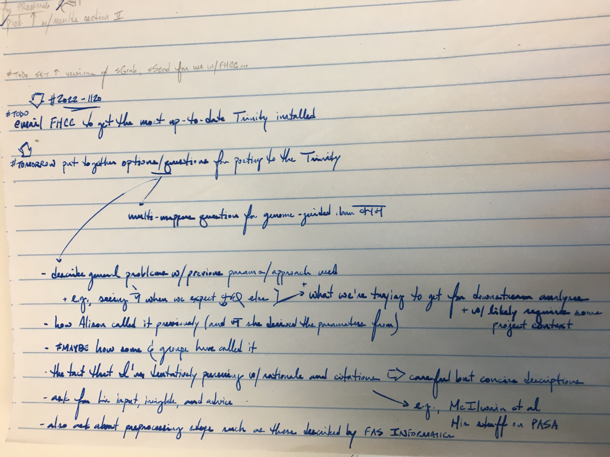
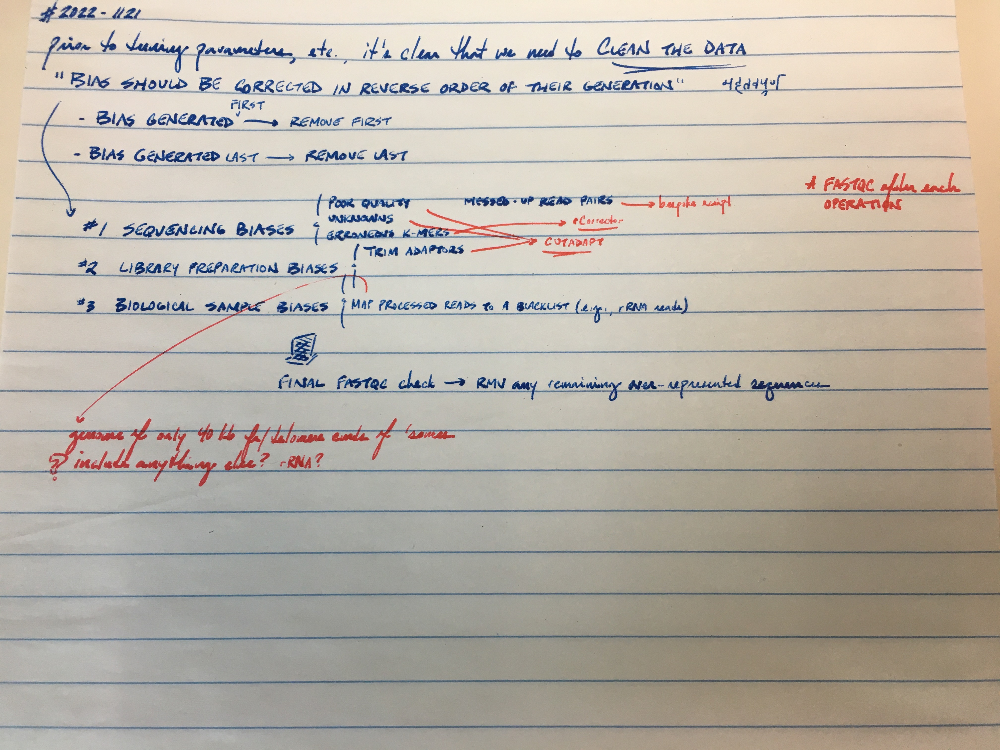

`#TODO` Organizae or delete this later

Couldn't really find much on super-reads mode and --no_super_reads: super-reads mode seems to be something happening by default according to the source code

Potentially interesting link/resource (from Google search for "cerevisiae trinity assembly")
- https://ycl6.gitbook.io/rna-seq-data-analysis/de_novo_assembly_using_trinity/compare_de_novo_reconstructed_transcripts_to_reference_annotations
- https://southgreenplatform.github.io/trainings/trinityTrinotate/TP-trinity/#practice-2
- https://academic.oup.com/dnaresearch/article/25/3/297/4838783#supplementary-data  #They don't mention params in this study; lame
- https://ressources.france-bioinformatique.fr/sites/default/files/A01_Galaxy_RNASeq_denovo_ITMO2016_0.pdf  #Training from BH, interesting explanations of parameters, especially for butterfly stage  #TODO Study this later
- This study use standard parameters for trinity: https://www.sciencedirect.com/science/article/pii/S0888754321000288#ec0005
- Using StringTie with yeast: https://www.biostars.org/p/296555/
- What does N50 mean? https://www.biostars.org/p/723/

Before we even start tooling with the parameters, it can be more important to clean the data
- see FAS Informatics document
- pertinent slide in A01_Galaxy_RNASeq_denovo_ITMO2016_0.pdf

~~Should I get cutadapt set up now...?~~

are forward reads left and reverse reads right? I don't know--probably

Create an environment for `Trinity` and related work; so many failures
```bash
#!/bin/bash
#DONTRUN

mamba create -n Trinity_env -c bioconda trinity
#  Success

echo 'alias Trinity_env="conda activate Trinity_env"' >> ~/.bash_aliases
alias Trinity_env="conda activate Trinity_env"
Trinity_env

mamba install -c bioconda pasa  # rcorrector cutadapt fastqc
# Encountered problems while solving:
#   - nothing provides perl 5.22.0* needed by pasa-2.3.3-pl5.22.0r3.4.1_0

mamba install -c bioconda pasa=2.5.2
# Encountered problems while solving:
#   - nothing provides libgcc-ng >=12 needed by pasa-2.5.2-h87f3376_0

mamba search -c anaconda libgcc-ng  #  No versions >=12
mamba install -c bioconda rcorrector  # cutadapt fastqc
#  Success

mamba install -c bioconda cutadapt  # fastqc
# Encountered problems while solving:
#   - nothing provides python 3.4* needed by cutadapt-1.10-py34_0

mamba search -c bioconda cutadapt
#  Success

mamba install -c bioconda cutadapt=4.1
# Encountered problems while solving:
#   - nothing provides libgcc-ng >=12 needed by cutadapt-4.1-py310h1425a21_1

mamba search -c conda-forge libgcc-ng  #  Several versions >12
mamba install -c conda-forge libgcc-ng=12.2.0  # Latest
#  Success: _openmp_mutex downgraded from 5.1 to 4.5

mamba install -c bioconda cutadapt=4.1
# Pinned packages:
#   - python 3.8.*
# 
# Encountered problems while solving:
#   - nothing provides python_abi 3.10.* *_cp310 needed by cutadapt-4.1-py310h1425a21_1

mamba install -c bioconda pasa=2.5.2
# Pinned packages:
#   - python 3.8.*
# 
# Encountered problems while solving:
#   - nothing provides libstdcxx-ng >=12 needed by pasa-2.5.2-h87f3376_0

mamba install -c bioconda fastqc
#  Success

#  Install libstdcxx-ng, python_abi 3.10.*
mamba search -c conda-forge libstdcxx-ng  #  Several versions >12
mamba install -c conda-forge libstdcxx-ng=12.2.0

mamba install -c bioconda pasa=2.5.2
# Encountered problems while solving:
#   - package pasa-2.5.2-h87f3376_0 requires lighttpd, but none of the providers can be installed

mamba install -c conda-forge lighttpd
#  Success (couple packages downgraded)

mamba install -c bioconda pasa=2.5.2
# Encountered problems while solving:
#   - package libnghttp2-1.46.0-hce63b2e_0 requires openssl >=1.1.1l,<1.1.2a, but none of the providers can be installed

mamba search -c conda-forge openssl
mamba install -c conda-forge openssl=1.1.1m

mamba install -c bioconda pasa=2.5.2  #  Weird because 1.1.1m
# Encountered problems while solving:
#   - package libnghttp2-1.47.0-h727a467_0 requires openssl >=1.1.1l,<1.1.2a, but none of the providers can be installed

mamba search -c conda-forge openssl
mamba install -c conda-forge openssl=1.1.1s

mamba install -c bioconda pasa=2.5.2  #  Weird because 1.1.1s
# Encountered problems while solving:
#   - package libnghttp2-1.47.0-h727a467_0 requires openssl >=1.1.1l,<1.1.2a, but none of the providers can be installed

mamba update -c conda-forge libnghttp2
# Encountered problems while solving:
#   - package libnghttp2-1.47.0-hdcd2b5c_1 requires openssl >=1.1.1q,<1.1.2a, but none of the providers can be installed

mamba install -c conda-forge openssl=1.1.1q

mamba install -c bioconda pasa=2.5.2  #  Weird because 1.1.1s
# Encountered problems while solving:
#   - package libnghttp2-1.47.0-hdcd2b5c_1 requires openssl >=1.1.1q,<1.1.2a, but none of the providers can be installed

mamba search -c conda-forge libnghttp2
#  ...
#+ Consider using Singularity to install PASA

mamba install -c bioconda cutadapt=4.1
# Encountered problems while solving:
#   - nothing provides python_abi 3.10.* *_cp310 needed by cutadapt-4.1-py310h1425a21_1

mamba search -c conda-forge python_abi
mamba install -c conda-forge python_abi=3.11
# Encountered problems while solving:
#   - package python_abi-3.11-2_cp311 requires python 3.11.*, but none of the providers can be installed

mamba search -c conda-forge python
mamba install -c conda-forge python=3.10.8
# Encountered problems while solving:
#   - package bowtie2-2.4.1-py38he513fc3_0 requires python >=3.8,<3.9.0a0, but none of the providers can be installed

#NOTE Cutadapt 4.1 is not possible without changing Bowtie2 and then potentially... Wait, what version of Trinity is this?

which Trinity
# /home/kalavatt/miniconda3/envs/Trinity_env/bin/Trinity

Trinity --version
# Trinity version: Trinity-v2.9.1
# ** NOTE: Latest version of Trinity is Trinity-v2.14.0, and can be obtained at:
#     https://github.com/trinityrnaseq/trinityrnaseq/releases

#  Delete the environment and try installing Trinity and PASA using Singularity
```

conda packages to install for environment Trinity_env, which will be used with Singularity imges for Trinity and PASA
Trim Galore
rCorrector
STAR  #MAYBE
FastQC
rCorrector
bedtools

Determine what to do with these and add this to links .md file: https://stackoverflow.com/questions/14675913/changing-image-size-in-markdown



<!--    -->
  
  

[Excel file for Trinity parameters to use and potentially test](notebook/trinity-parameters.xlsx)
