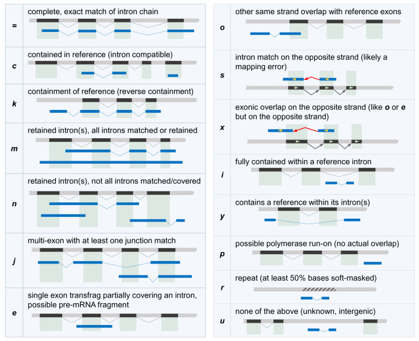

`#breakdown-bedtools.md`
<br />
<br />

<details>
<summary><b><font size="+2"><i>Table of contents</i></font></b></summary>
<!-- MarkdownTOC -->

1. [Email: *Notes on Trinity*](#email-notes-on-trinity)
	1. [Alison → me, 2022-1202, 1658](#alison-%E2%86%92-me-2022-1202-1658)
		1. [Files](#files)
	1. [me → Alison, 2022-1202, 1726](#me-%E2%86%92-alison-2022-1202-1726)
	1. [Alison → me, 2022-1202, 1749](#alison-%E2%86%92-me-2022-1202-1749)
		1. [File](#file)
	1. [me → Alison, 2022-1203, 0910](#me-%E2%86%92-alison-2022-1203-0910)
	1. [me → Alison, 2022-1228, 1012](#me-%E2%86%92-alison-2022-1228-1012)
	1. [me → Alison, 2022-1228, 1227](#me-%E2%86%92-alison-2022-1228-1227)
	1. [Alison → me, 2022-1229, 1344](#alison-%E2%86%92-me-2022-1229-1344)
1. [On `bedtools` and `gffcompare`](#on-bedtools-and-gffcompare)
	1. [`bedtools intersect -h`](#bedtools-intersect--h)
	1. [`GffCompare`](#gffcompare)
		1. [`gffcompare -h`](#gffcompare--h)
		1. [Description of `GffCompare`](#description-of-gffcompare)
			1. [Methods: Implementation, ¶5](#methods-implementation-%C2%B65)
			1. [Methods: Implementation, ¶6](#methods-implementation-%C2%B66)
			1. [Methods: Implementation, ¶7](#methods-implementation-%C2%B67)
			1. [Use cases: Basic usage examples of the `GffRead` utility](#use-cases-basic-usage-examples-of-the-gffread-utility)
			1. [Use cases: Basic usage example of the `GffCompare` utility](#use-cases-basic-usage-example-of-the-gffcompare-utility)
				1. [¶1](#%C2%B61)
			1. [Use cases: Transcript accuracy estimation with `GffCompare`](#use-cases-transcript-accuracy-estimation-with-gffcompare)
				1. [¶1](#%C2%B61-1)
				1. [¶2](#%C2%B62)
				1. [¶3](#%C2%B63)
			1. [Use cases: Merging structurally equivalent transcripts with `GffCompare`](#use-cases-merging-structurally-equivalent-transcripts-with-gffcompare)
				1. [¶1](#%C2%B61-2)
				1. [¶2: *The "super-locus" concept*](#%C2%B62-the-super-locus-concept)
			1. [Use cases: Annotating transcripts with `GffCompare`](#use-cases-annotating-transcripts-with-gffcompare)
				1. [¶1](#%C2%B61-3)
			1. [Use cases: Tracking transcripts with `GffCompare`](#use-cases-tracking-transcripts-with-gffcompare)
				1. [¶1](#%C2%B61-4)
				1. [¶2](#%C2%B62-1)
			1. [Use cases: Overlap classification for a large set of transcripts with `TrMap`](#use-cases-overlap-classification-for-a-large-set-of-transcripts-with-trmap)
	1. [`bedtools slop -h`](#bedtools-slop--h)
	1. [`bedtools subtract -h`](#bedtools-subtract--h)
1. [Breaking down the `bedtools_comparison` document](#breaking-down-the-bedtools_comparison-document)
	1. [*"...lets do a comparison between `merged_final` and `combined`..."*](#lets-do-a-comparison-between-merged_final-and-combined)
		1. [Find entries that have no overlap with known transcripts](#find-entries-that-have-no-overlap-with-known-transcripts)
		1. [Find entries that have no overlap with known transcripts, paying attention to strandedness](#find-entries-that-have-no-overlap-with-known-transcripts-paying-attention-to-strandedness)
		1. [Discard intron-redundant transcript fragments with `gffcompare`](#discard-intron-redundant-transcript-fragments-with-gffcompare)
	1. [*"Let’s compare between mRNA and annotations"*](#let%E2%80%99s-compare-between-mrna-and-annotations)
	1. [*"How many antisense transcripts?"*](#how-many-antisense-transcripts)
		1. [Using the online `bedtools intersect` documentation to understand the above call](#using-the-online-bedtools-intersect-documentation-to-understand-the-above-call)
			1. [`-s` Enforcing same strandedness](#-s-enforcing-same-strandedness)
			1. [`-S` Enforcing opposite "strandedness"](#-s-enforcing-opposite-strandedness)
			1. [`-wa` Reporting the original A feature](#-wa-reporting-the-original-a-feature)
			1. [`-f` Requiring a minimal overlap fraction](#-f-requiring-a-minimal-overlap-fraction)
	1. [Additional commands after *"How many antisense transcripts?"*](#additional-commands-after-how-many-antisense-transcripts)
	1. [*"How many transcripts are both antisense and extended?"*](#how-many-transcripts-are-both-antisense-and-extended)
	1. [*"How many transcripts are partial genes?"*](#how-many-transcripts-are-partial-genes)
	1. [*"How many transcripts are completely intergenic?"*](#how-many-transcripts-are-completely-intergenic)
	1. [*"Make a gtf to determine if extension is 3’ or 5’"*](#make-a-gtf-to-determine-if-extension-is-3%E2%80%99-or-5%E2%80%99)
	1. [*"Bedtools subtract"*](#bedtools-subtract)
		1. [Sussing things out from the online documentation for `bedtools subtract`](#sussing-things-out-from-the-online-documentation-for-bedtools-subtract)
			1. [-f Requiring a minimal overlap fraction before subtracting](#-f-requiring-a-minimal-overlap-fraction-before-subtracting)
			1. [-s Enforcing same “strandedness”](#-s-enforcing-same-%E2%80%9Cstrandedness%E2%80%9D)
			1. [-S Enforcing opposite “strandedness”](#-s-enforcing-opposite-%E2%80%9Cstrandedness%E2%80%9D)

<!-- /MarkdownTOC -->
</details>
<br />

<a id="email-notes-on-trinity"></a>
## Email: *Notes on Trinity*
*See additional entries, etc. for this email chain in [`AG_emails-notes.md`](./AG_emails-notes.md)*
<a id="alison-%E2%86%92-me-2022-1202-1658"></a>
### Alison → me, 2022-1202, 1658
Hi Kris -

Please let me know if you need more information or clarification. Hopefully I have addressed a lot of your questions and concerns with these two documents. FYI the word document needs to be in "web layout" under the view tab to look correct.

Have a great weekend!

Alison

<a id="files"></a>
#### Files
[AG.2022-1202.notes_on_trinity.1.docx](./notebook/AG.2022-1202.notes_on_trinity.1.docx)
[AG.2022-1202.notes_on_trinity.2.bedtools_comparison.pdf](./notebook/AG.2022-1202.notes_on_trinity.2.bedtools_comparison.pdf)

<a id="me-%E2%86%92-alison-2022-1202-1726"></a>
### me → Alison, 2022-1202, 1726
Thank you, Alison! I will check it soon. Have a great weekend!

-Kris

<a id="alison-%E2%86%92-me-2022-1202-1749"></a>
### Alison → me, 2022-1202, 1749
Awesome! I also went ahead and tried the right vs wrong analysis of the original annotation. Those notes are attached to this email. I saved the IGV regions for this in the shared folder within my Tsukiyama lab folder, so you can open these up for yourself if you want. All counting was rough and quick so numerical values might be inexact.

Alison

<a id="file"></a>
#### File
[AG.2022-1202.notes_on_trinity.3.right_vs_wrong_analysis.docx](./notebook/AG.2022-1202.notes_on_trinity.3.right_vs_wrong_analysis.docx)

<a id="me-%E2%86%92-alison-2022-1203-0910"></a>
### me → Alison, 2022-1203, 0910
This is great, thank you! Sometime next week, let's get you set up with a GitHub account so that you can get quick access to my work and notes for the project. No rush on this though—just sent you the GitHub invite because it had been on my mind.

-Kris

<a id="me-%E2%86%92-alison-2022-1228-1012"></a>
### me → Alison, 2022-1228, 1012
Happy holidays! Do you have screenshots I can look at for the regions in this file (`right vs wrong analysis.docx`)?

Not really finding them in `/home/kalavatt/tsukiyamalab/alisong`

No rush on this; just trying to learn things.

Thanks,  
Kris

```txt
❯ ls -lhaFGf
total 502M
-rw-rw----  1 agreenla 190M Feb  9  2013  83Q_Jan_Norm.sgr
-rw-rw----  1 agreenla 285M Feb  9  2013  81log_Jan_Norm.sgr
-rw-rw-r--  1 sswygert 3.2M Aug 22  2018  PolII_Q_rrp6_RPKM.bw
-rw-rw-r--  1 sswygert 3.1M Jun  7  2019  PolII_Q_RPKM.bw
drwxrws---  3 agreenla   88 Oct  7  2019  ChIP/
drwxrws---  2 ccucinot  379 Oct 11  2019  scripts_from_christine/
-rw-rw----  1 agreenla 714K Dec 10  2019  191209_trf4depletion.zip
drwxrws---  3 agreenla   85 Jan  3  2020 'strain pics'/
drwxrws---  6 agreenla  474 Jan  3  2020  westerns/
-rw-rw----  1 agreenla  11M Jan  8  2020 'lady is a tramp.pptx'
-rw-rw----  1 agreenla  12K Mar  4  2020 '4tU barcodes and concentration info.xlsx'
drwxrws---  4 ccucinot  202 Apr  1  2020  genomes_from_christine/
-rw-rw----  1 agreenla 2.9K Apr  1  2020 'Rna_scripts!.zip'
drwxrws---  2 agreenla  185 Apr  5  2020  Rna_scripts/
drwxrws---  2 agreenla  694 Jun 23  2020 'western quant'/
drwxrws---  3 agreenla   92 Jul 13  2020 'RNA sequencing'/
drwxrws---  2 agreenla   41 Aug  4  2020  scripts/
drwxrws---  7 agreenla  220 Oct 23  2020  jordancopy/
drwxrws---  2 agreenla  199 Dec 21  2020  RSEM_reference/
-rw-rw----  1 agreenla 7.2K Dec 22  2020  percent_noncoding.pzfx
drwxrws---  2 agreenla  478 Feb 17  2021  computational_notes/
-rw-rw----  1 agreenla  17K Feb 17  2021  ChIP-seq_Data-Processing_KCAB_AGedit.docx
drwxrws---  6 agreenla 1.2K Mar  8  2021  gmap_genome/
drwxrws---  2 agreenla   0 Apr 14  2021  combine_Q_bams_Alison_Jordan/
drwxrws---  2 agreenla  696 Apr 26  2021  scripts_to_send_matt/
-rw-rw----  1 agreenla  14K May 17  2021  Research_Summary_2021.docx
drwxrws---  2 agreenla  369 May 17  2021 'scripts I stole from christine'/
drwxrws---  2 agreenla  294 Jul  1  2021  0001144_01/
drwxrws---  2 dhunt    559 Jul 15  2021 'Alison Microscope 07142021'/
drwxrws---  3 agreenla  992 Jul 23  2021  Kit_comparison/
drwxrws---  2 agreenla  110 Jul 29  2021  23S/
drwxrws---  3 agreenla  190 Jul 29  2021  20S/
drwxrws--- 42 agreenla 2.0K Jul 29  2021  narnavirus/
drwxrws---  2 agreenla 1.7K Jul 30  2021  dead_or_alive/
drwxrws--- 19 agreenla 1.9K Aug  3  2021  20210217_RNAseq/
drwxrws---  3 agreenla  120 Aug 31  2021  tRAX/
drwxrws---  3 agreenla   40 Sep  1  2021  Nanodrop/
-rw-rw----  1 agreenla  48K Dec  1  2021  comittee_summary_fall2021_Greenlaw.docx
-rw-rw----  1 agreenla  162 Dec  1  2021 '~$Classes To-Do List.docx'
-rw-rw----  1 agreenla  16K Dec  1  2021 '3 Classes To-Do List.docx'
drwxrws---  2 agreenla   0 Dec 14  2021  fastq_dump/
-rw-rw----  1 ccucinot  23K Dec 29  2021  ExampleTimeCourseStrategy.docx
-rw-rw----  1 agreenla  13K Feb 10  2022  epic_biosketch.docx
-rw-rw----  1 agreenla  162 Feb 11  2022 '~$ic_biosketch.docx'
drwxrws---  4 agreenla  653 Mar 10  2022  Jeffdata/
-rw-rw----  1 agreenla  162 Mar 29  2022 '~$ampleTimeCourseStrategy.docx'
-rw-rw----  1 agreenla  162 May 16  2022 '~$mittee_summary_fall2021_Greenlaw.docx'
drwxrws---  4 agreenla  172 Jun 15  2022  western_analysis/
-rw-rw----  1 agreenla 2.3M Sep 15 19:56  ResearchStatement_CC5_AGedits.docx
drwxrws---  7 agreenla  703 Sep 29 18:44  TRF4_SSRNA_April2022/
drwxrws---  2 agreenla 2.5K Oct  3 17:15  excel/
drwxrws---  5 agreenla  224 Oct 20 18:50  rotation/
drwxrws--- 11 agreenla  413 Nov  1 10:50  WTQvsG1/
drwxrws---  3 agreenla 3.2K Dec  8 16:01  protocols/
drwxrws---  2 agreenla 2.1K Dec 12 14:47 'APE files + primers'/
drwxrws---  4 agreenla   56 Dec 12 14:47  20210625_RNAseq/
drwxrws---  2 agreenla 3.2K Dec 12 14:47  gel_doc_backup/
drwxrws---  3 agreenla 1.8K Dec 12 14:47 'Q entry yeild'/
drwxrws---  2 agreenla  142 Dec 12 14:47 'Rna_scripts!'/
drwxrws---  6 ccucinot   96 Dec 12 14:47  FACS/
drwxrws---  7 agreenla  154 Dec 12 14:47  old_analysis/
drwxrws---  3 agreenla  491 Dec 12 14:47  tRNA-read-mapping-master/
drwxrws---  4 agreenla 4.0K Dec 19 17:11  powerpoints/
drwxrws---  5 agreenla  811 Dec 21 12:31  Nab3_Nrd1_Depletion/
drwxrws---  4 agreenla  905 Dec 21 12:46  rtr1_rrp6_wt/
drwxrws---  9 kalavatt  320 Dec 22 12:14  assess_transcriptome_assemblies/
drwxrwsr-x 48 arepetto 1.7K Dec 28 10:03  ../
drwxrws--- 49 agreenla 2.4K Dec 28 10:03  ./
drwxrws---  4 ccucinot 1.2K Dec 28 10:04  annotation_files/
```

<a id="me-%E2%86%92-alison-2022-1228-1227"></a>
### me → Alison, 2022-1228, 1227
I'm working through `BEDTOOLS COMPARISON.pdf`: can you help me understand a few things?

What is "`Combined.gtf`" and "`Merge_downloaded_gtf`"? How were they obtained?

What does this mean: "Flattened contained isoforms..." (sixth line of the first page)?

What is "`downloadable_collapsed.gtf`"?

Where or how did you get "`mRNAonly.gtf`"?

Thanks, and no rush at all,  
Kris

<a id="alison-%E2%86%92-me-2022-1229-1344"></a>
### Alison → me, 2022-1229, 1344
Hi Kris -  
I am away from my computer today but I can hopefully send some more clarification tomorrow.

In the meantime - `combined.gtf` is a bunch of yeast annotations from different sources. Christine gave it to me and she got it from someone is her grad school lab. `mRNAonly.gtf` was made by using awk to filter only the mRNA from `combined.gtf`.

I don't know the exact documents you are referring to without being able to go back and look, but anything with the word downloaded was downloaded from google docs which is where I did all the hand curations on trinity.

Alison
<br />
<br />

<a id="on-bedtools-and-gffcompare"></a>
## On `bedtools` and `gffcompare`
<a id="bedtools-intersect--h"></a>
### `bedtools intersect -h`
```txt
❯ bedtools intersect -h

Tool:   bedtools intersect (aka intersectBed)
Version: v2.30.0
Summary: Report overlaps between two feature files.

Usage:   bedtools intersect [OPTIONS] -a <bed/gff/vcf/bam> -b <bed/gff/vcf/bam>

	Note: -b may be followed with multiple databases and/or
	wildcard (*) character(s).
Options:
	-wa	Write the original entry in A for each overlap.

	-wb	Write the original entry in B for each overlap.
		- Useful for knowing _what_ A overlaps. Restricted by -f and -r.

	-loj	Perform a "left outer join". That is, for each feature in A
		report each overlap with B.  If no overlaps are found,
		report a NULL feature for B.

	-wo	Write the original A and B entries plus the number of base
		pairs of overlap between the two features.
		- Overlaps restricted by -f and -r.
		  Only A features with overlap are reported.

	-wao	Write the original A and B entries plus the number of base
		pairs of overlap between the two features.
		- Overlapping features restricted by -f and -r.
		  However, A features w/o overlap are also reported
		  with a NULL B feature and overlap = 0.

	-u	Write the original A entry _once_ if _any_ overlaps found in B.
		- In other words, just report the fact >=1 hit was found.
		- Overlaps restricted by -f and -r.

	-c	For each entry in A, report the number of overlaps with B.
		- Reports 0 for A entries that have no overlap with B.
		- Overlaps restricted by -f, -F, -r, and -s.

	-C	For each entry in A, separately report the number of
		- overlaps with each B file on a distinct line.
		- Reports 0 for A entries that have no overlap with B.
		- Overlaps restricted by -f, -F, -r, and -s.

	-v	Only report those entries in A that have _no overlaps_ with B.
		- Similar to "grep -v" (an homage).

	-ubam	Write uncompressed BAM output. Default writes compressed BAM.

	-s	Require same strandedness.  That is, only report hits in B
		that overlap A on the _same_ strand.
		- By default, overlaps are reported without respect to strand.

	-S	Require different strandedness.  That is, only report hits in B
		that overlap A on the _opposite_ strand.
		- By default, overlaps are reported without respect to strand.

	-f	Minimum overlap required as a fraction of A.
		- Default is 1E-9 (i.e., 1bp).
		- FLOAT (e.g. 0.50)

	-F	Minimum overlap required as a fraction of B.
		- Default is 1E-9 (i.e., 1bp).
		- FLOAT (e.g. 0.50)

	-r	Require that the fraction overlap be reciprocal for A AND B.
		- In other words, if -f is 0.90 and -r is used, this requires
		  that B overlap 90% of A and A _also_ overlaps 90% of B.

	-e	Require that the minimum fraction be satisfied for A OR B.
		- In other words, if -e is used with -f 0.90 and -F 0.10 this requires
		  that either 90% of A is covered OR 10% of  B is covered.
		  Without -e, both fractions would have to be satisfied.

	-split	Treat "split" BAM or BED12 entries as distinct BED intervals.

	-g	Provide a genome file to enforce consistent chromosome sort order
		across input files. Only applies when used with -sorted option.

	-nonamecheck	For sorted data, don't throw an error if the file has different naming conventions
			for the same chromosome. ex. "chr1" vs "chr01".

	-sorted	Use the "chromsweep" algorithm for sorted (-k1,1 -k2,2n) input.

	-names	When using multiple databases, provide an alias for each that
		will appear instead of a fileId when also printing the DB record.

	-filenames	When using multiple databases, show each complete filename
			instead of a fileId when also printing the DB record.

	-sortout	When using multiple databases, sort the output DB hits
			for each record.

	-bed	If using BAM input, write output as BED.

	-header	Print the header from the A file prior to results.

	-nobuf	Disable buffered output. Using this option will cause each line
		of output to be printed as it is generated, rather than saved
		in a buffer. This will make printing large output files
		noticeably slower, but can be useful in conjunction with
		other software tools and scripts that need to process one
		line of bedtools output at a time.

	-iobuf	Specify amount of memory to use for input buffer.
		Takes an integer argument. Optional suffixes K/M/G supported.
		Note: currently has no effect with compressed files.

Notes:
	(1) When a BAM file is used for the A file, the alignment is retained if overlaps exist,
	and excluded if an overlap cannot be found.  If multiple overlaps exist, they are not
	reported, as we are only testing for one or more overlaps.
```

<a id="gffcompare"></a>
### `GffCompare`
<a id="gffcompare--h"></a>
#### `gffcompare -h`

```txt
❯ gffcompare -h
gffcompare v0.11.2
-----------------------------
Usage:
gffcompare [-r <reference_mrna.gtf> [-R]] [-T] [-V] [-s <seq_path>]
   [-o <outprefix>] [-p <cprefix>]
   {-i <input_gtf_list> | <input1.gtf> [<input2.gtf> .. <inputN.gtf>]}

 GffCompare provides classification and reference annotation mapping and
 matching statistics for RNA-Seq assemblies (transfrags) or other generic
 GFF/GTF files.
 GffCompare also clusters and tracks transcripts across multiple GFF/GTF
 files (samples), writing matching transcripts (identical intron chains) into
 <outprefix>.tracking, and a GTF file <outprefix>.combined.gtf which
 contains a nonredundant set of transcripts across all input files (with
 a single representative transfrag chosen for each clique of matching transfrags
 across samples).

 Options:
 -v display gffcompare version (also --version)
 -i provide a text file with a list of (query) GTF files to process instead
   of expecting them as command line arguments (useful when a large number
   of GTF files should be processed)

 -r reference annotation file (GTF/GFF)
 --strict-match : the match code '=' is only assigned when all exon boundaries
   match; code '~' is assigned for intron chain match or single-exon

 -R for -r option, consider only the reference transcripts that
   overlap any of the input transfrags (Sn correction)
 -Q for -r option, consider only the input transcripts that
   overlap any of the reference transcripts (Precision correction);
   (Warning: this will discard all "novel" loci!)
 -M discard (ignore) single-exon transfrags and reference transcripts
 -N discard (ignore) single-exon reference transcripts
 -D discard "duplicate" query transfrags (i.e. those with the same
   intron chain) within a single sample (disable "annotation" mode)
 -S like -D, but stricter duplicate checking: only discard matching query
   or reference transcripts (same intron chain) if their boundaries are fully
	contained within other, larger or identical transfrags; if --strict-match
   is also given, exact matching of all exon boundaries is required
 --no-merge : disable close-exon merging (default: merge exons separated by
	"introns" shorter than 5 bases

 -s path to genome sequences (optional); this can be either a multi-FASTA
   file or a directory containing single-fasta files (one for each contig);
   repeats must be soft-masked (lower case) in order to be able to classify
   transfrags as repeats

 -T do not generate .tmap and .refmap files for each input file
 -e max. distance (range) allowed from free ends of terminal exons of
   reference transcripts when assessing exon accuracy (100)
 -d max. distance (range) for grouping transcript start sites (100)
 -V verbose processing mode (also shows GFF parser warnings)
 --chr-stats: the .stats file will show summary and accuracy data
   for each reference contig/chromosome separately
 --debug : enables -V and generates additional files:
   <outprefix>.Q_discarded.lst, <outprefix>.missed_introns.gff,
   <outprefix>.R_missed.lst

Options for the combined GTF output file:
 -p the name prefix to use for consensus transcripts in the
   <outprefix>.combined.gtf file (default: 'TCONS')
 -C discard matching and "contained" transfrags in the GTF output
   (i.e. collapse intron-redundant transfrags across all query files)
 -A like -C but does not discard intron-redundant transfrags if they start
   with a different 5' exon (keep alternate TSS)
 -X like -C but also discard contained transfrags if transfrag ends stick out
   within the container's introns
 -K for -C/-A/-X, do NOT discard any redundant transfrag matching a reference
```

<a id="description-of-gffcompare"></a>
#### Description of `GffCompare`
*The below is taken from the F1000Research paper [here](https://www.ncbi.nlm.nih.gov/pmc/articles/PMC7222033/)*  
<a id="methods-implementation-%C2%B65"></a>
##### Methods: Implementation, ¶5
GffCompare is a generic, standalone tool for merging and tracking transcript structures across multiple samples and comparing them to a reference annotation. ... GffCompare has the following main functions:  
1. merge structurally equivalent transcripts and <mark>transcript fragments (transfrags)</mark> across multiple samples;
2. assess the accuracy of the assembled transcripts from an RNA-Seq sample by comparing it to known annotation; and
3. track, annotate, and report all structurally distinct transfrags across multiple samples.

<a id="methods-implementation-%C2%B66"></a>
##### Methods: Implementation, ¶6
The last two purposes require the user to provide a known reference annotation file that GffCompare then uses to classify all the transcripts in the input samples according to the reference transcript that they most closely overlap (Figure 1). To assess the accuracy of transcriptome assemblies, GffCompare reports several accuracy metrics previously employed for gene prediction evaluation (Burset, Guigó, *Genomics* 1996). <mark>These metrics include sensitivity and precision as well as the number of novel or missed features</mark>, and the metrics are computed at various levels (base, exon, intron chain, transcript, or locus). More details about how to obtain the different reports provided by GffCompare can be found in the *Use Cases* section.


<b>Figure 1. Transcript classification codes based on their relationship to reference transcripts, as generated by GffCompare.</b> <mark>Reference exons and transcripts are shown in black</mark>, <mark style="background: #00FFFF!important">transcripts to be classified are shown in blue</mark>, and hashed regions represent repeated regions in the genome. For example, the transcript in blue on the uppermost left panel is labeled "=" because all of its introns precisely match the annotation in black.

<a id="methods-implementation-%C2%B67"></a>
##### Methods: Implementation, ¶7
Some pipelines can produce a very large number of transcripts that need to be evaluated; e.g. when merging the transcript assemblies from tens or hundreds of RNA-Seq experiments. Because GffCompare always loads the entire transcript data into memory for clustering, running GffCompare on such large GTF/GFF files could be slow and memory intensive. One may be interested only in how these transcripts overlap the reference annotation, and then only wish to further analyze those transcripts that have specific types of overlaps with the reference annotation transcripts. GffCompare also only produces the best match of a transcript to a reference annotation, but for each transcript we might want to know all possible reference matches. In order to address these needs, we built TrMap ("Transcript vs. reference Mapping"), a program that we distribute along with GffCompare and that was designed to avoid using a large amount of memory by streaming the input transcript data. TrMap first loads the reference annotation into an interval tree data structure 29, and then for each query transcript it reports all the reference transcripts that overlap it, along with their overlap classification codes. These are the same classification codes described in Figure 1, with the exception of codes p, r, and u which are reserved for transcripts that do not overlap reference transcripts and represent transcripts that are single exon and nearby genes (p), repeats outside of genes (r), and intergenic (u).

<a id="use-cases-basic-usage-examples-of-the-gffread-utility"></a>
##### Use cases: Basic usage examples of the `GffRead` utility
<a id="use-cases-basic-usage-example-of-the-gffcompare-utility"></a>
##### Use cases: Basic usage example of the `GffCompare` utility
<a id="%C2%B61"></a>
###### ¶1
The program GffCompare can be used to compare, merge, annotate and estimate accuracy of one or more GTF/GFF files (the "query" files), when compared with a reference annotation (also provided as GTF/GFF). A basic command line to compare a list of GTF files to a reference annotation file is:

```bash
gffcompare -r annotation.gff transcripts.gtf
```
The reference annotation is specified in the `annotation.gff` file and `transcripts.gtf` represents the query file (more than one query file can be provided). Unless the `-o` option was provided, the output will be found in multiple files with the prefix "gffcmp.". A list of the more important options for the GffCompare utility is provided in [Table 3](https://www.ncbi.nlm.nih.gov/pmc/articles/PMC7222033/table/T3/?report=objectonly).

<a id="use-cases-transcript-accuracy-estimation-with-gffcompare"></a>
##### Use cases: Transcript accuracy estimation with `GffCompare`
<a id="%C2%B61-1"></a>
###### ¶1
GffCompare can be used to assess the accuracy of transcriptome assemblies produced by programs like StringTie with respect to a known reference annotation. To this end, GffCompare reports various statistics related to the accuracy of the input transcripts compared to the reference annotation in the `<outprefix>.stats` file. Among these statistics are sensitivity and precision values computed at various levels (base, exon, intron chain, transcript, locus), which are calculated as:

```txt
Sensitivity = TP/(TP + FN)
Precision = TP/(TP + FP)
```
<mark>where TP stands for "true positives", or query features (bases, exons, introns, transcripts, etc.) that agree with the corresponding reference annotation features</mark>; <mark style="background: #00FFFF!important">FN means "false negatives", i.e. features that are found in the reference annotation but are not present in the input data</mark>; <mark>FP ("false positives") are features present in the input data but not confirmed by any reference annotation data</mark>. Notice that FP + TP amounts to the whole input set of query features in the input file. If multiple query GTF/GFF files are given as input, these metrics are computed separately for each sample.

<a id="%C2%B62"></a>
###### ¶2
*Sensitivity* and *Precision* values are estimated at various levels, which are largely an increasingly stringent way of evaluating the accuracy/correctness of a set of predicted transcripts (*transfrags*), when compared to the reference annotation provided with the `-r` option. The six different levels that GffCompare uses are described below:

1. *Base level.* At the base level, TP represents the number of exon bases that are reported at the same coordinate on both the query transcripts and any reference transcript, FN is the number of bases in reference data exons that are not covered at all by any of the query exons, and FP is the number of bases which are covered by predicted transcripts' exons but not covered by any reference transcript exons.
2. *Exon level.* We define the TP, FN, and FP values at the exon level similar to the base level, but now the unit of comparison is the exon interval on the genome, i.e., if an exon of the predicted transcript overlaps and matches the boundaries of a reference transcript exon, then it is counted as a TP.
3. *Intron Level.* Intron intervals are the units that are matched at the intron level, therefore each intron of the predicted transcript is checked against any introns of the reference transcripts in the same region and if there is one with the same exact start-end coordinates, it is counted as a TP.
4. *Intron chain level.* At this level we count as a TP any query transcript for which all of its introns can be found, with the same exact intron coordinates as in a reference transcript that has the same number of introns. Matching all the introns at this level implies that all the internal exons also match, but this might not be true for the external boundaries of the terminal exons.
5. *Transcript level.* Note that intron chain level values are calculated only by looking at multi-exon transcripts, so it completely ignores the single-exon transcripts, which can be quite numerous in a RNA-Seq experiment (possibly due to a lot of transcriptional and alignment noise). The transcript level considers single-exons as well. A TP at this level is defined as a full exon chain match between the predicted transcript and a reference transcript, where all internal exons match and the outer boundaries of the terminal query exons can only slightly differ from the reference exons (with at most 100 bases by default). Also GffCompare considers single-exon transcripts as matching an overlapping single-exon reference transcript if there is a significant overlap between the two (more than 80% of the longer transcript by default).
6. *Locus level.* At this level GffCompare considers that an observed locus, defined as a cluster of exon-overlapping transcripts, matches a similarly built reference locus if at least one predicted transcript has a transcript level match with a reference transcript in the corresponding reference locus.

<a id="%C2%B63"></a>
###### ¶3
Other statistics reported by GffCompare are the number of missed or novel exons, missed or novel introns and missed or novel loci. Note that in order to properly evaluate precision and sensitivity when comparing two sets of transcripts, special care must be taken for duplicated (or redundant) entries within each set. GffCompare uses different levels of stringency of what to consider duplicated transcripts, depending on the option given in its input (see options `-D`, `-S`, `-C`, `-A`, `-X` in Table 3).

<a id="use-cases-merging-structurally-equivalent-transcripts-with-gffcompare"></a>
##### Use cases: Merging structurally equivalent transcripts with `GffCompare`
<a id="%C2%B61-2"></a>
###### ¶1
When multiple input GTF/GFF files are provided, GffCompare reports a GTF file named <outprefix>.combined.gtf containing the union of all transfrags in each sample. If a transfrag with the same exact intron chain is present in both samples, it is thus reported only once in the output file.

<a id="%C2%B62-the-super-locus-concept"></a>
###### ¶2: *The "super-locus" concept*
A super-locus is a region of the genome where predicted transcripts and reference transcripts get clustered together by exon overlaps. When multiple GFF files are provided as input to GffCompare, this clustering is performed across all the input files. Due to the transitive nature of this clustering, these super-loci can occasionally get very large, sometimes merging a few distinct reference gene regions together, especially if there is a lot of transcription or alignment noise around the individual gene regions. For each super-locus, GffCompare assigns a unique identifier with the *XLOC_* prefix.

<a id="use-cases-annotating-transcripts-with-gffcompare"></a>
##### Use cases: Annotating transcripts with `GffCompare`
<a id="%C2%B61-3"></a>
###### ¶1
One can run GffCompare on a single GTF/GFF input file using with the `-r` option (which provides a reference annotation), and without any specific options to remove redundant transfrags (such as the `-D`, `-S`, `-C`, `-A`, `-X` options) to produce a GTF file called `<outprefix>.annotated.gtf` that contains all the input transcripts annotated with several additional attributes: `xloc`, `tss_id`, `cmp_ref`, and `class_code`. The `xloc` attribute specifies the *super-locus* a specific transcript belongs to. The `tss_id` attribute uniquely identifies the transcription start for that transcipt, and using this value the user can quickly see which transcripts use the same transcription start, or how many different transcription starts are present in a locus. The `cmp_ref` gives the closest reference transcript (where applicable), while the relationship to this reference transcript is given by the `class_code` attribute. The possible values for the `class_code` attribute are listed in [Table 4](https://www.ncbi.nlm.nih.gov/pmc/articles/PMC7222033/table/T4/).
```txt
Code   Relationship to reference transcript
=   complete, exact intron chain match
c   contained in reference transcript (intron compatible)
k   contains reference transcript (reverse containment)
m   retained intron(s) compared to reference, full intron chain match everywhere else
n   completely overlaps intron from reference transcript, partial or no intron chain match
    everywhere else
j   multi-exon with at least one junction match
e   single exon that partially covers an intron from reference
o   other same strand overlap with reference exons
s   intron match on the opposite strand (likely a mapping error)
x   exonic overlap on the opposite strand
i   fully contained within a reference intron
y   contains a reference within its intron(s)
p   possible polymerase run-on (close to reference but no overlap)
r   repeat (at least 50% bases are soft-masked)
u   none of the above (unknown, intergenic)
```

<a id="use-cases-tracking-transcripts-with-gffcompare"></a>
##### Use cases: Tracking transcripts with `GffCompare`
<a id="%C2%B61-4"></a>
###### ¶1
GffCompare can also be used to track all transcripts that are structurally equivalent among the different input files. <mark>GffCompare considers transcripts matching (or structurally equivalent) if all their introns are identical.</mark> Note that matching transcripts are allowed to differ on the length of the first and last exons, since these lengths can usually vary across samples for the same biological transcript. A list of all matching transcripts is reported in a file called `<outprefix>.tracking` in which each row represents a transcript. The first column in this file represents a unique id assigned to that transcripts. The second file represents the super-locus that contains that transcript. If GffCompare was run with the `-r` option, the 3rd and 4th columns contain the reference annotation transcript that was found to be closest to the transcript and the classification code (as specified by [Table 4](https://www.ncbi.nlm.nih.gov/pmc/articles/PMC7222033/table/T4/)) that specifies the relationship between these two transcripts, respectively. The rest of the columns show the corresponding transcript from each input file in order. An example and a brief description for each column are given in [Table 5](https://www.ncbi.nlm.nih.gov/pmc/articles/PMC7222033/table/T5/).

<a id="%C2%B62-1"></a>
###### ¶2
In order to quickly see which reference transcripts match which transcripts from a sample file, two other files, called `<outprefix>.<input_file>. refmap` and `<outprefix>.<input_file>.tmap` are also created for each query `<input_file>`. The `<outprefix>.<input_file>.refmap` file is a tab-delimited file that has a row for each reference transcript that either fully or partially matches a transcript from the given input file. Its columns are described in [Table 6](https://www.ncbi.nlm.nih.gov/pmc/articles/PMC7222033/table/T6/). Conversely, the `<outprefix>.<input_file>.tmap` file has a row for each input transcript, while the columns in this file (as detailed in [Table 7](https://www.ncbi.nlm.nih.gov/pmc/articles/PMC7222033/table/T7/)) describe the most closely matching reference transcript for that transcript.


<a id="use-cases-overlap-classification-for-a-large-set-of-transcripts-with-trmap"></a>
##### Use cases: Overlap classification for a large set of transcripts with `TrMap`
...

<a id="bedtools-slop--h"></a>
### `bedtools slop -h`
```txt
❯ bedtools slop -h

Tool:    bedtools slop (aka slopBed)
Version: v2.30.0
Summary: Add requested base pairs of "slop" to each feature.

Usage:   bedtools slop [OPTIONS] -i <bed/gff/vcf> -g <genome> [-b <int> or (-l and -r)]

Options:
	-b	Increase the BED/GFF/VCF entry -b base pairs in each direction.
		- (Integer) or (Float, e.g. 0.1) if used with -pct.

	-l	The number of base pairs to subtract from the start coordinate.
		- (Integer) or (Float, e.g. 0.1) if used with -pct.

	-r	The number of base pairs to add to the end coordinate.
		- (Integer) or (Float, e.g. 0.1) if used with -pct.

	-s	Define -l and -r based on strand.
		E.g. if used, -l 500 for a negative-stranded feature,
		it will add 500 bp downstream.  Default = false.

	-pct	Define -l and -r as a fraction of the feature's length.
		E.g. if used on a 1000bp feature, -l 0.50,
		will add 500 bp "upstream".  Default = false.

	-header	Print the header from the input file prior to results.

Notes:
	(1)  Starts will be set to 0 if options would force it below 0.
	(2)  Ends will be set to the chromosome length if  requested slop would
	force it above the max chrom length.
	(3)  The genome file should tab delimited and structured as follows:

	<chromName><TAB><chromSize>

	For example, Human (hg19):
	chr1	249250621
	chr2	243199373
	...
	chr18_gl000207_random	4262

Tips:
	One can use the UCSC Genome Browser's MySQL database to extract
	chromosome sizes. For example, H. sapiens:

	mysql --user=genome --host=genome-mysql.cse.ucsc.edu -A -e \
	"select chrom, size from hg19.chromInfo"  > hg19.genome
```

<a id="bedtools-subtract--h"></a>
### `bedtools subtract -h`
```txt
bedtools subtract -h

Tool:    bedtools subtract (aka subtractBed)
Version: v2.30.0
Summary: Removes the portion(s) of an interval that is overlapped
	 by another feature(s).

Usage:   bedtools subtract [OPTIONS] -a <bed/gff/vcf> -b <bed/gff/vcf>

Options:
	-A	Remove entire feature if any overlap.  That is, by default,
		only subtract the portion of A that overlaps B. Here, if
		any overlap is found (or -f amount), the entire feature is removed.

	-N	Same as -A except when used with -f, the amount is the sum
		of all features (not any single feature).

	-wb	Write the original entry in B for each overlap.
		- Useful for knowing _what_ A overlaps. Restricted by -f and -r.

	-wo	Write the original A and B entries plus the number of base
		pairs of overlap between the two features.
		- Overlaps restricted by -f and -r.
		  Only A features with overlap are reported.

	-s	Require same strandedness.  That is, only report hits in B
		that overlap A on the _same_ strand.
		- By default, overlaps are reported without respect to strand.

	-S	Require different strandedness.  That is, only report hits in B
		that overlap A on the _opposite_ strand.
		- By default, overlaps are reported without respect to strand.

	-f	Minimum overlap required as a fraction of A.
		- Default is 1E-9 (i.e., 1bp).
		- FLOAT (e.g. 0.50)

	-F	Minimum overlap required as a fraction of B.
		- Default is 1E-9 (i.e., 1bp).
		- FLOAT (e.g. 0.50)

	-r	Require that the fraction overlap be reciprocal for A AND B.
		- In other words, if -f is 0.90 and -r is used, this requires
		  that B overlap 90% of A and A _also_ overlaps 90% of B.

	-e	Require that the minimum fraction be satisfied for A OR B.
		- In other words, if -e is used with -f 0.90 and -F 0.10 this requires
		  that either 90% of A is covered OR 10% of  B is covered.
		  Without -e, both fractions would have to be satisfied.

	-split	Treat "split" BAM or BED12 entries as distinct BED intervals.

	-g	Provide a genome file to enforce consistent chromosome sort order
		across input files. Only applies when used with -sorted option.

	-nonamecheck	For sorted data, don't throw an error if the file has different naming conventions
			for the same chromosome. ex. "chr1" vs "chr01".

	-sorted	Use the "chromsweep" algorithm for sorted (-k1,1 -k2,2n) input.

	-bed	If using BAM input, write output as BED.

	-header	Print the header from the A file prior to results.

	-nobuf	Disable buffered output. Using this option will cause each line
		of output to be printed as it is generated, rather than saved
		in a buffer. This will make printing large output files
		noticeably slower, but can be useful in conjunction with
		other software tools and scripts that need to process one
		line of bedtools output at a time.

	-iobuf	Specify amount of memory to use for input buffer.
		Takes an integer argument. Optional suffixes K/M/G supported.
		Note: currently has no effect with compressed files.
```
<br />
<br />

<a id="breaking-down-the-bedtools_comparison-document"></a>
## Breaking down the `bedtools_comparison` document
<a id="lets-do-a-comparison-between-merged_final-and-combined"></a>
### *"...lets do a comparison between `merged_final` and `combined`..."*
<a id="find-entries-that-have-no-overlap-with-known-transcripts"></a>
#### Find entries that have no overlap with known transcripts
```bash
bedtools intersect -v -a downloadable_collapsed.gtf -b combined.gtf \
	> totally_unique.gtf
```
- `-a <bed/gff/vcf/bam>`
	+ `downloadable_collapsed.gtf`
- `-b <bed/gff/vcf/bam>`
	+ `combined.gtf`
- `-v Only report those entries in A that have no overlaps with B.`
	+ That is, report only those entries in `downloadable_collapsed.gtf` that are not in `combined.gtf`
- `downloadable_collapsed.gtf`: Something AG did by hand? "...anything with the word downloaded was downloaded from google docs which is where I did all the hand curations on trinity."
- "`combined.gtf` is a bunch of yeast annotations from different sources. Christine gave it to me and she got it from someone is her grad school lab."

<a id="find-entries-that-have-no-overlap-with-known-transcripts-paying-attention-to-strandedness"></a>
#### Find entries that have no overlap with known transcripts, paying attention to strandedness
```bash
bedtools intersect -v -s -a downloadable_collapsed.gtf -b combined.gtf \
	> totally_unique_stranded.gtf
```
- `-a <bed/gff/vcf/bam>`
	+ `downloadable_collapsed.gtf`
- `-b <bed/gff/vcf/bam>`
	+ `combined.gtf`
- `-s Require same strandedness. That is, only report hits in B that overlap A on the same strand.`
- `-v Only report those entries in A that have no overlaps with B.`
	+ Thus, report only same-strand hits in `combined.gtf` (`-b`) that overlap `downloadable_collapsed.gtf` (`-a`)

<a id="discard-intron-redundant-transcript-fragments-with-gffcompare"></a>
#### Discard intron-redundant transcript fragments with `gffcompare`
```bash
gffcompare -C -o completely.unique totally_unique_stranded.gtf
```
- `-C discard matching and "contained" transfrags in the GTF output (i.e., collapse intron-redundant transfrags across all query files)`
- `-o <outprefix>`

<a id="let%E2%80%99s-compare-between-mrna-and-annotations"></a>
### *"Let’s compare between mRNA and annotations"*
```bash
bedtools intersect -F 1 -s -wa -a downloadable_collapsed.gtf -b mRNAonly.gtf \
	> mRNA_overlap_completely.gtf
```
- `-a <bed/gff/vcf/bam>`
	+ `downloadable_collapsed.gtf`
- `-b <bed/gff/vcf/bam>`
	+ `combined.gtf`
- `-F Minimum overlap required as a fraction of B.`
	+ `Default is 1E-9 (i.e., 1bp).`
    + `FLOAT (e.g. 0.50)`
    + `#QUESTION` What does a value of 1 mean here? 1000000000?
- `downloadable_collapsed.gtf`: "...anything with the word downloaded was downloaded from google docs which is where I did all the hand curations on trinity."
- "`mRNAonly.gtf` was made by using awk to filter only the mRNA from `combined.gtf`."
- `-wa`: force `bedtools intersect` to report the original "A" feature (`downloadable_collapsed.gtf`) when an overlap is found
- AG's notes
	+ "Must cover 100% of gene"
	+ "714 extended transcripts - but some genes double cause spliced"

<a id="how-many-antisense-transcripts"></a>
### *"How many antisense transcripts?"*
```bash
bedtools intersect -F .3 -S -wa -a downloadable_collapsed.gtf -b mRNAonly.gtf \
	> Antisense_tomRNA_overlap_30p.gtf
```
- `-a <bed/gff/vcf/bam>`
	+ `downloadable_collapsed.gtf`
- `-b <bed/gff/vcf/bam>`
	+ `combined.gtf`
- `-wa Write the original entry in A for each overlap.`
- `-F Minimum overlap required as a fraction of B.`
	+ `Default is 1E-9 (i.e., 1bp).`
    + `FLOAT (e.g. 0.50)`
    + A value of `.3`: 30%
- `-S Require different strandedness. That is, only report hits in B that overlap A on the _opposite_ strand.`
    + `By default, overlaps are reported without respect to strand.`
- So, for any entry in `downloadable_collapsed.gtf` (`a`) that overlaps an entry in `mRNAonly.gtf` (`b`) on the opposite strand (`-S`) by a minimum of 30% (`-F .3`), write out the entire `downloadable_collapsed.gtf` (`a`) entry, i.e., not just the portion that overlaps
	+ enforce that overlaps be found on opposite strands (`-S`)
	+ restrict reported overlaps between "A" and "B" to cases where the feature in "A" overlaps at least 30% of the "B" feature (`-F .3`)
	+ report the original "A" feature when an overlap is found (`-wa`; i.e., not just the portion that overlaps "B")
- AG's notes
	+ "1804 antisense transcripts"
	+ "Probably an undercount"

<a id="using-the-online-bedtools-intersect-documentation-to-understand-the-above-call"></a>
#### Using the online `bedtools intersect` documentation to understand the above call
https://bedtools.readthedocs.io/en/latest/content/tools/intersect.html

<a id="-s-enforcing-same-strandedness"></a>
##### `-s` Enforcing same strandedness
<mark>By default, bedtools intersect will report overlaps between features even if the features are on opposite strands.</mark> However, if strand information is present in both BED files and the "`-s`" option is used, overlaps will only be reported when features are on the same strand.

For example (note that the first B entry is not reported):
```bash
$ cat A.bed
chr1 100 200 a1 100 +

$ cat B.bed
chr1 130 201 b1 100 -
chr1 132 203 b2 100 +

$ bedtools intersect -a A.bed -b B.bed -wa -wb -s
chr1 100 200 a1 100 + chr1 132 203 b2 100 +
```

<a id="-s-enforcing-opposite-strandedness"></a>
##### `-S` Enforcing opposite "strandedness"
The `-s` option enforces that overlaps be on the same strand. In some cases, you may want to enforce that overlaps be found on opposite strands. In this, case use the `-S` option.

For example:
```bash
$ cat A.bed
chr1 100 200 a1 100 +

$ cat B.bed
chr1 130 201 b1 100 -
chr1 132 203 b2 100 +

$ bedtools intersect -a A.bed -b B.bed -wa -wb -S
chr1 100 200 a1 100 + chr1 130 201 b1 100 -
```

<a id="-wa-reporting-the-original-a-feature"></a>
##### `-wa` Reporting the original A feature
Instead, one can force `bedtools intersect` to report the original "A" feature when an overlap is found. As shown below, the entire "A" feature is reported, not just the portion that overlaps with the "B" feature.

For example:
```bash
$ cat A.bed
chr1  10  20
chr1  30   40

$ cat B.bed
chr1  15  20

$ bedtools intersect -a A.bed -b B.bed -wa
chr1  10   20
```

<a id="-f-requiring-a-minimal-overlap-fraction"></a>
##### `-f` Requiring a minimal overlap fraction
By default, bedtools intersect will report an overlap between A and B so long as there is at least one base pair is overlapping. Yet sometimes you may want to restrict reported overlaps between A and B to cases where the feature in B overlaps at least X% (e.g., 50%) of the A feature. The `-f` option does exactly this.

For example (note that the second B entry is not reported):
```bash
$ cat A.bed
chr1 100 200

$ cat B.bed
chr1 130 201
chr1 180 220

$ bedtools intersect -a A.bed -b B.bed -f 0.50 -wa -wb
chr1 100 200 chr1 130 201
```

*From the `bedtools intersect` command-line help*
```txt
	-f	Minimum overlap required as a fraction of A.
		- Default is 1E-9 (i.e., 1bp).
		- FLOAT (e.g. 0.50)

	-F	Minimum overlap required as a fraction of B.
		- Default is 1E-9 (i.e., 1bp).
		- FLOAT (e.g. 0.50)
```
So, `-F` does the same as `-f`, except the reported overlap is with respect to the file assigned to `-b` 

<a id="additional-commands-after-how-many-antisense-transcripts"></a>
### Additional commands after *"How many antisense transcripts?"*
Break down what is going on here

```bash
bedtools intersect -F .2 -S -wa -a downloadable_collapsed.gtf -b mRNAonly.gtf \
	> Antisense_tomRNA_overlap_20p.gtf
```
- For any entry in `downloadable_collapsed.gtf` (`a`) that overlaps an entry in `mRNAonly.gtf` (`b`) on the opposite strand (`-S`) by a minimum of 20% (`-F .2`), write out the entire `downloadable_collapsed.gtf` (`a`) entry, i.e., not just the portion that overlaps


```bash
gffcompare -C -o antisense_20 Antisense_tomRNA_overlap_20p.gtf
```
- Collapse redundant entries in `Antisense_tomRNA_overlap_20p.gtf`
	+ `-C discard matching and "contained" transfrags in the GTF output (i.e., collapse intron-redundant transfrags across all query files)`
	+ `-o <outprefix>`

```bash
bedtools intersect -F .4 -S -wa -a downloadable_collapsed.gtf -b mRNAonly.gtf \
	> Antisense_tomRNA_overlap_40p.gtf
```
- For any entry in `downloadable_collapsed.gtf` (`a`) that overlaps an entry in `mRNAonly.gtf` (`b`) on the opposite strand (`-S`) by a minimum of 40% (`-F .4`), write out the entire `downloadable_collapsed.gtf` (`a`) entry, i.e., not just the portion that overlaps

```bash
gffcompare -C -o antisense_40 Antisense_tomRNA_overlap_40p.gtf
```
- Collapse redundant entries in `Antisense_tomRNA_overlap_40p.gtf`

```bash
gffcompare -C -o antisense_30 Antisense_tomRNA_overlap_30p.gtf
```
- Collapse redundant entries in `Antisense_tomRNA_overlap_30p.gtf`

<a id="how-many-transcripts-are-both-antisense-and-extended"></a>
### *"How many transcripts are both antisense and extended?"*
```bash
bedtools intersect -F 1 -s -wa -a mRNA_overlap_completely.gtf -b Antisense_tomRNA_overlap_30p.gtf \
	> antisense_extended2.gtf
```
- `-F 1`: Per AG, "Must cover 100% of gene"
- `-s`: Per the `bedtools intersect` online documentation, "The `-s` option enforces that overlaps be on the same strand"
- AG's notes
	+ "486"
	+ "70% different from any known transcript"
		* `#QUESTION` What is this percentage? How did AG calculate it?

*`#YAAD` This is how we made `mRNA_overlap_completely.gtf`*
```bash
bedtools intersect -F 1 -s -wa -a downloadable_collapsed.gtf -b mRNAonly.gtf \
	> mRNA_overlap_completely.gtf
```

<a id="how-many-transcripts-are-partial-genes"></a>
### *"How many transcripts are partial genes?"*
Related note from AG: "short"
```bash
bedtools intersect -F .2 -s -wa -a downloadable_collapsed.gtf -b mRNAonly.gtf \
	> mRNA_overlap_20.gtf
```
- `-F .2`: To be reported, "A" features must overlap "B" features by a minimum of 20% (`-F Minimum overlap required as a fraction of B`)
- `-s`: ...and the overlaps must be on the same strand
- `-wa`: ...and for any overlaps between "A" and "B", write out the whole feature assigned to `-a` (`downloadable_collapsed.gtf`)
	+ i.e., not just the portion that overlaps

Note from AG
```bash
#  Then subtract all extended transcripts - if this works it should be small
#+ amount
```

```bash
bedtools intersect -v -s -a mRNA_overlap_20.gtf -b mRNA_overlap_1.gtf \
	> mRNA_frag1.gtf
```
- `#QUESTIONS` Where did `mRNA_overlap_1.gtf` come from?
	+ Is it the same as `mRNA_overlap_completely.gtf`?
		* I would assume so, or it seems so, since we're trying to isolate all extended transcripts
		* i.e., those that extend beyond transcripts entirely overlapping established annotated mRNA transcripts
- Notes from AG
	+ "This also pulls transcripts which are extended but with weird start site - not total overlap with gene"
	+ "~50 or fewer fragment genes"

<a id="how-many-transcripts-are-completely-intergenic"></a>
### *"How many transcripts are completely intergenic?"*
Related note from AG: "no mRNA overlap"
```bash
bedtools intersect -v -wa -a downloadable_collapsed.gtf -b mRNAonly.gtf \
	> totally_intergenic_2.gtf

gffcompare -C -o intergenic totally_intergenic_2.gtf
```
- `-v Only report those entries in A that have _no overlaps_ with B.`
    + `Similar to "grep -v" (an homage).`
- `-wa`: For any found features in "A", report the whole of them
	+ I think this may not be needed since `-v` ensures that there will be no overlap at all; it selects for the entirety of an "A" feature by its nature
- Note from AG
	+ "1275"

<a id="make-a-gtf-to-determine-if-extension-is-3%E2%80%99-or-5%E2%80%99"></a>
### *"Make a gtf to determine if extension is 3’ or 5’"*
```bash
bedtools slop -i mRNAonly.gtf -g saccer3.genome -l 100 -r 0 -s \
	> 100_3_mRNA.gtf

bedtools slop -i mRNAonly.gtf -g saccer3.genome -l 200 -r 0 -s \
	> 200_3_mRNA.gtf

bedtools slop -i mRNAonly.gtf -g saccer3.genome -l 0 -r 100 -s \
	> 100_5_mRNA.gtf

bedtools slop -i mRNAonly.gtf -g saccer3.genome -l 0 -r 200 -s \
	> 200_5_mRNA.gtf
```
- `-i`: `-i <bed/gff/vcf>`
- `-g`: `-g <genome>`
- `-l`: `-l The number of base pairs to subtract from the start coordinate.`
    + `(Integer) or (Float, e.g. 0.1) if used with -pct.`
- `-r`: `-r The number of base pairs to add to the end coordinate.`
	+ `(Integer) or (Float, e.g. 0.1) if used with -pct.`
- `-s`: `-s Define -l and -r based on strand.`
	+ `E.g., if used, -l 500 for a negative-stranded feature, it will add 500 bp downstream. Default = false.`

```bash
gffcompare -C -o extended_total_number mRNA_overlap_completely.gtf
```
- 714 extended transcripts or 10% of genes

```bash
bedtools intersect -F 1 -s -wa -a mRNA_overlap_completely.gtf -b 100_3_mRNA.gtf \
	> 3_extended_100_annos.gtf

gffcompare -C -o 3_extended_100_annos 3_extended_100_annos.gtf
```
- 489 of 789

```bash
bedtools intersect -F 1 -s -wa -a mRNA_overlap_completely.gtf -b 200_3_mRNA.gtf \
	> 3_extended_200_annos.gtf

gffcompare -C -o 3_extended_200_annos 3_extended_200_annos.gtf
```
- 489 of 714

```bash
bedtools intersect -F 1 -s -wa -a mRNA_overlap_completely.gtf -b 100_5_mRNA.gtf \
	> 5_extended_100_annos.gtf
bedtools intersect -F 1 -s -wa -a mRNA_overlap_completely.gtf -b 200_5_mRNA.gtf \
	> 5_extended_200_annos.gtf
gffcompare -C -o 5_extended_200_annos 5_extended_200_annos.gtf
```
- 490 of 714
	+ `#QUESTION` Is this for `5_extended_200_annos`?
	+ `#QUESTION` What about for `5_extended_100_annos`?

```bash
bedtools intersect -F 1 -s -wa -a  5_extended_200_annos.combined.gtf -b 3_extended_200_annos.combined.gtf \
	> extended_in_both_directions.gtf
gffcompare -C -o 5_3_extended_200_annos extended_in_both_directions.gtf
```
- 276

```bash
bedtools intersect -F 1 -s -v -wa -a downloadable_collapsed.gtf -b 3_extended_200_annos.combined.gtf \
	> unclassed.gtf
```

<a id="bedtools-subtract"></a>
### *"Bedtools subtract"*
```bash
bedtools subtract -r -f 1 -s -a downloadable_collapsed.gtf -b Antisense_tomRNA_overlap_20p.gtf \
	> no_antisense.gtf

bedtools subtract -r -f 1 -s -a no_antisense.gtf -b totally_intergenic_2.gtf \
	> no_antisense_no_intergenic.gtf

bedtools subtract -r -f 1 -s -a no_antisense_no_intergenic.gtf -b mRNA_overlap_1.gtf \
	> no_antisense_no_intergenic_no_extended.gtf
```
- `-r`: `-r Require that the fraction overlap be reciprocal for A AND B.`
    + `In other words, if -f is 0.90 and -r is used, this requires that B overlap 90% of A and A _also_ overlaps 90% of B.`
- `-f`: `-f Minimum overlap required as a fraction of A.`
    + `Default is 1E-9 (i.e., 1bp).`
    + `FLOAT (e.g. 0.50)`
- `-s`: `-s Require same strandedness. That is, only report hits in B that overlap A on the _same_ strand.`
    + `By default, overlaps are reported without respect to strand.`
- `-a`: `-a <bed/gff/vcf>`
- `-b`: `-b <bed/gff/vcf>`
- `#QUESTIONS` Where did `mRNA_overlap_1.gtf` come from? (*This is a repeat of what I wrote above.*)
	+ Is it the same as `mRNA_overlap_completely.gtf`?
		* I would assume so, or it seems so, since we're trying to isolate all extended transcripts
		* i.e., those that extend beyond transcripts entirely overlapping established annotated mRNA transcripts

<a id="sussing-things-out-from-the-online-documentation-for-bedtools-subtract"></a>
#### Sussing things out from the online documentation for `bedtools subtract`
<a id="-f-requiring-a-minimal-overlap-fraction-before-subtracting"></a>
##### -f Requiring a minimal overlap fraction before subtracting
This option behaves the same as the -f option for bedtools intersect. In this case, subtract will only subtract an overlap with B if it covers at least the fraction of A defined by -f. If an overlap is found, but it does not meet the overlap fraction, the original A feature is reported without subtraction.

```bash
$ cat A.bed
chr1  100  200

$ cat B.bed
chr1  180  300

$ bedtools subtract -a A.bed -b B.bed -f 0.10
chr1  100  180

$ bedtools subtract -a A.bed -b B.bed -f 0.80
chr1  100  200
```

<a id="-s-enforcing-same-%E2%80%9Cstrandedness%E2%80%9D"></a>
##### -s Enforcing same “strandedness”
This option behaves the same as the -s option for bedtools intersect while scanning for features in B that should be subtracted from A.

```bash
$ cat A.bed
chr1  100  200    a1  1   +

$ cat B.bed
chr1  80   120    b1  1   +
chr1  180  300    b2  1   -

$ bedtools subtract -a A.bed -b B.bed -s
chr1  120  200    a1  1   +
```

<a id="-s-enforcing-opposite-%E2%80%9Cstrandedness%E2%80%9D"></a>
##### -S Enforcing opposite “strandedness”
This option behaves the same as the -s option for bedtools intersect while scanning for features in B that should be subtracted from A.

```bash
$ cat A.bed
chr1  100  200    a1  1   +

$ cat B.bed
chr1  80   120    b1  1   +
chr1  180  300    b2  1   -

$ bedtools subtract -a A.bed -b B.bed -S
chr1  100  180    a1  1   +
```

