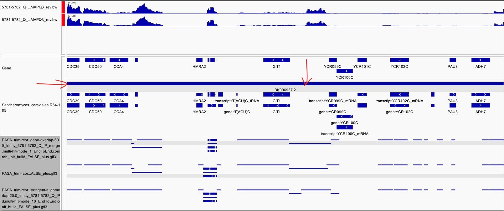
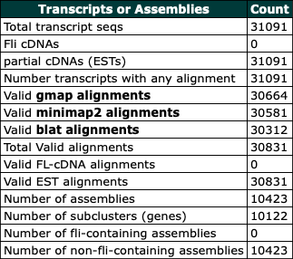

`#AG_emails-notes.md`
<br />
<br />

<details>
<summary><b><font size="+2"><i>Table of contents</i></font></b></summary>
<!-- MarkdownTOC -->

1. [Emails with Alison, etc.](#emails-with-alison-etc)
	1. [Email: *IGV Sharing*](#email-igv-sharing)
		1. [1: Alison → me `Wednesday, 2022-1123, 4:41 PM`](#1-alison-%E2%86%92-me-wednesday-2022-1123-441-pm)
	1. [Email: *Questions, etc. for transcriptome assembly*](#email-questions-etc-for-transcriptome-assembly)
		1. [1: Me → Alison `Friday, 2022-1202, 12:53`](#1-me-%E2%86%92-alison-friday-2022-1202-1253)
			1. [Files](#files)
		1. [2: Alison → Me `Thursday, 2022-1202, 13:32`](#2-alison-%E2%86%92-me-thursday-2022-1202-1332)
	1. [Email: *Notes on Trinity*](#email-notes-on-trinity)
		1. [1: Alison → Me `Friday, 2022-1202, 16:58`](#1-alison-%E2%86%92-me-friday-2022-1202-1658)
			1. [Files](#files-1)
		1. [2: Me → Alison `Friday, 2022-1202, 17:26`](#2-me-%E2%86%92-alison-friday-2022-1202-1726)
		1. [3: Alison → Me `Friday, 2022-1202, 17:49`](#3-alison-%E2%86%92-me-friday-2022-1202-1749)
			1. [Files](#files-2)
		1. [4: Me → Alison `Saturday, 2022-1203, 9:10`](#4-me-%E2%86%92-alison-saturday-2022-1203-910)
		1. [5: Me → Alison `Friday, 2022-1228, 10:12`](#5-me-%E2%86%92-alison-friday-2022-1228-1012)
		1. [6: Me → Alison `Friday, 2022-1228, 12:27`](#6-me-%E2%86%92-alison-friday-2022-1228-1227)
		1. [7: Alison → me `Monday, 2022-1228, 13:44`](#7-alison-%E2%86%92-me-monday-2022-1228-1344)
		1. [8: Alison → me `Monday, 2023-0103, 12:22`](#8-alison-%E2%86%92-me-monday-2023-0103-1222)
			1. [File](#file)
		1. [9: Me → Alison `Friday, 2023-0103, 13:18`](#9-me-%E2%86%92-alison-friday-2023-0103-1318)
		1. [10: Alison → me `Monday, 2023-0103, 13:22`](#10-alison-%E2%86%92-me-monday-2023-0103-1322)
			1. [Files](#files-3)
		1. [11: Me → Alison `Friday, 2023-0103, 13:29`](#11-me-%E2%86%92-alison-friday-2023-0103-1329)
		1. [12: Me → Alison `Friday, 2023-0103, 17:56`](#12-me-%E2%86%92-alison-friday-2023-0103-1756)
		1. [13: Alison → me `Monday, 2023-0103, 18:02`](#13-alison-%E2%86%92-me-monday-2023-0103-1802)
	1. [Email: *Blacklist file*](#email-blacklist-file)
		1. [1: Alison → me `Monday, 2022-1205, 3:45 PM`](#1-alison-%E2%86%92-me-monday-2022-1205-345-pm)
		1. [2: Me → Alison `Monday, 2022-1205, 4:05 PM`](#2-me-%E2%86%92-alison-monday-2022-1205-405-pm)
		1. [3: Me → Alison `Tuesday, 2022-1206, 11:10 AM`](#3-me-%E2%86%92-alison-tuesday-2022-1206-1110-am)
		1. [4: Me → Alison `Tuesday, 2022-1206, 11:16 AM`](#4-me-%E2%86%92-alison-tuesday-2022-1206-1116-am)
		1. [5: Alison → me `Tuesday, 2022-1206, 11:44 AM`](#5-alison-%E2%86%92-me-tuesday-2022-1206-1144-am)
			1. [*Note fr/Alison on what to blacklist and what to not*](#note-fralison-on-what-to-blacklist-and-what-to-not)
		1. [6: Me → Alison `Tuesday, 2022-1206, 11:47 AM`](#6-me-%E2%86%92-alison-tuesday-2022-1206-1147-am)
		1. [7: Me → Alison `Tuesday, 2022-1206, 3:34 PM`](#7-me-%E2%86%92-alison-tuesday-2022-1206-334-pm)
		1. [8: Alison → me `Wednesday, 2022-1207, 12:20 PM`](#8-alison-%E2%86%92-me-wednesday-2022-1207-1220-pm)
		1. [9: Me → Alison `Wednesday, 2022-1207, 12:31 PM`](#9-me-%E2%86%92-alison-wednesday-2022-1207-1231-pm)
		1. [10: Me → Alison `Wednesday, 2022-1207, 12:39 PM`](#10-me-%E2%86%92-alison-wednesday-2022-1207-1239-pm)
	1. [Email: *Bam files in directory `~/tsukiyamalab/alisong/Kris_bams/`*](#email-bam-files-in-directory-~tsukiyamalabalisongkris_bams)
		1. [1: Me → Alison `Monday, 2022-1212, 3:27 PM`](#1-me-%E2%86%92-alison-monday-2022-1212-327-pm)
		1. [2: Alison → Me `Monday, 2022-1212, 3:42 PM`](#2-alison-%E2%86%92-me-monday-2022-1212-342-pm)
	1. [Email: *Gff3 files in `~/tsukiyamalab/alisong/Kris/gtfs_2022-1214/param_gene-overlap_{FALSE,TRUE}`*](#email-gff3-files-in-~tsukiyamalabalisongkrisgtfs_2022-1214param_gene-overlap_falsetrue)
		1. [1: Me → Alison `Wednesday, 2022-1213, 3:17 PM`](#1-me-%E2%86%92-alison-wednesday-2022-1213-317-pm)
	1. [Email: *Preprocessing Thoughts*](#email-preprocessing-thoughts)
		1. [1: Alison → Me `Thursday, 2022-1215, 19:07`](#1-alison-%E2%86%92-me-thursday-2022-1215-1907)
			1. [Files](#files-4)
		1. [2: Me → Alison `Friday, 2022-1216, 12:07`](#2-me-%E2%86%92-alison-friday-2022-1216-1207)
	1. [Email: *split script*](#email-split-script)
		1. [1: Alison → Me `Friday, 2022-1216, 14:50`](#1-alison-%E2%86%92-me-friday-2022-1216-1450)
			1. [Files](#files-5)
	1. [Email: *More trinity thoughts*](#email-more-trinity-thoughts)
		1. [1: Alison → Me `Friday, 2022-1216, 18:13`](#1-alison-%E2%86%92-me-friday-2022-1216-1813)
			1. [File](#file-1)
		1. [2: Me → Alison `Monday, 2022-1219, 11:49`](#2-me-%E2%86%92-alison-monday-2022-1219-1149)
	1. [Email: *Update*](#email-update)
		1. [1: Me → Alison `Monday, 2022-1221, 12:02`](#1-me-%E2%86%92-alison-monday-2022-1221-1202)
		1. [2: Alison → Me `Monday, 2022-1221, 12:07`](#2-alison-%E2%86%92-me-monday-2022-1221-1207)
		1. [3: Me → Alison `Monday, 2022-1221, 17:50`](#3-me-%E2%86%92-alison-monday-2022-1221-1750)
		1. [4: Me → Alison `Tuesday, 2022-1222, 11:57`](#4-me-%E2%86%92-alison-tuesday-2022-1222-1157)
		1. [5: Me → Alison `Tuesday, 2022-1222, 12:00`](#5-me-%E2%86%92-alison-tuesday-2022-1222-1200)
		1. [6: Alison → Me `Tuesday, 2022-1222, 12:44`](#6-alison-%E2%86%92-me-tuesday-2022-1222-1244)
		1. [7: Alison → Me `Tuesday, 2022-1222, 14:12`](#7-alison-%E2%86%92-me-tuesday-2022-1222-1412)
	1. [Email: *Preprocessing - more thoughts!*](#email-preprocessing---more-thoughts)
		1. [1: Alison → Me `Tuesday, 2022-1222, 16:55`](#1-alison-%E2%86%92-me-tuesday-2022-1222-1655)
			1. [Files](#files-6)
	1. [Email: *Path to my genome directories and files*](#email-path-to-my-genome-directories-and-files)
		1. [1: Me to Alison `2023-0105, 13:30`](#1-me-to-alison-2023-0105-1330)
		1. [2: Alison to Me, `2023-0105, 15:00`](#2-alison-to-me-2023-0105-1500)
		1. [3: Me to Alison, `2023-0105, 16:57`](#3-me-to-alison-2023-0105-1657)
	1. [Email: *`.bam`s and `.bw`s galore available in...*](#email-bams-and-bws-galore-available-in)
		1. [1: Me to Alison, `2023-0105, 14:59`](#1-me-to-alison-2023-0105-1459)
		1. [2: Alison to me, `2022-0105, 15:00`](#2-alison-to-me-2022-0105-1500)
	1. [Email: *Update*](#email-update-1)
		1. [1: Alison to me, `2023-0105, 16:25`](#1-alison-to-me-2023-0105-1625)
		1. [2: Me to Alison, `2023-0105, 16:58`](#2-me-to-alison-2023-0105-1658)
		1. [Notes from related discussion with AG](#notes-from-related-discussion-with-ag)
			1. [Snippets](#snippets)
			1. [Posting to the PASA forum: *Questions: Running Launch_PASA_pipeline.pl in "gene_overlap mode" with a gff3 that contains whole-chromosome annotations: Effect on how --gene_overlap operates?*](#posting-to-the-pasa-forum-questions-running-launch_pasa_pipelinepl-in-gene_overlap-mode-with-a-gff3-that-contains-whole-chromosome-annotations-effect-on-how---gene_overlap-operates)
				1. [Me to Brian, `2023-0105, 17:48`](#me-to-brian-2023-0105-1748)
				1. [Brian to me, `2023-0106, 06:42`](#brian-to-me-2023-0106-0642)
	1. [Email: *ncRNA annotations*](#email-ncrna-annotations)
		1. [Alison to me, `2023-0105, 17:06`](#alison-to-me-2023-0105-1706)
		1. [Steve Hahn to Toshi Tsukiyama, `2022-0707, 12:24`](#steve-hahn-to-toshi-tsukiyama-2022-0707-1224)
		1. [*"followup from question at meeting"*, Sebastian Marquardt to Steve Hahn, `2022-0628, 9:52`](#followup-from-question-at-meeting-sebastian-marquardt-to-steve-hahn-2022-0628-952)
			1. [Downloading and link to the files, and notes, etc.](#downloading-and-link-to-the-files-and-notes-etc)
				1. [Files](#files-7)
				1. [Notes](#notes)
	1. [Email: *One more gtf*](#email-one-more-gtf)
		1. [Alison to me, `2023-0106, 17:40`](#alison-to-me-2023-0106-1740)
			1. [Set up an appropriate file location for the file](#set-up-an-appropriate-file-location-for-the-file)
			1. [File](#file-2)
	1. [Email: *Following up on PASA "gene_overlap mode"*](#email-following-up-on-pasa-gene_overlap-mode)
		1. [Me to Alison, `2023-0106, 12:13`](#me-to-alison-2023-0106-1213)
	1. [Email: *Example of the metrics offered by PasaWeb*](#email-example-of-the-metrics-offered-by-pasaweb)
		1. [Me to Alison, `2023-0106, 16:47`](#me-to-alison-2023-0106-1647)
		1. [Alison to me, `2023-0106, 17:57`](#alison-to-me-2023-0106-1757)
			1. [Files](#files-8)

<!-- /MarkdownTOC -->
</details>
<br />

<a id="emails-with-alison-etc"></a>
## Emails with Alison, etc.
<a id="email-igv-sharing"></a>
### Email: *IGV Sharing*
2022-1123
<details>
<summary><i>Click to view</i></summary>

<a id="1-alison-%E2%86%92-me-wednesday-2022-1123-441-pm"></a>
#### 1: Alison → me `Wednesday, 2022-1123, 4:41 PM`
Hi Kris - 

I have made a folder where we can easily create IGV sessions to share and compare annotation. 

It can be found at:  
`~/tsukiyamalab/alisong/Kris_IGV_Sharing`

If you go to IGV and then go file, open session, you can open the .xml file with the bigwigs and annotation files I have loaded. You could also save a new xml file with additional files, focused on a certain region or with a particular scaling. Please note all bigwigs/bams/annotation files that you want to save within a session need to be within the same folder for the .xml file to work. I made a simple one with just Q, but I imagine this folder filling up with stuff as we continue to work. Feel free to copy stuff into that folder for ease. I assume none of these files will be particularly large so duplicates should have a negligible effect on storage costs. 

Enjoy your Thanksgiving!

Alison
</details>
<br />

<a id="email-questions-etc-for-transcriptome-assembly"></a>
### Email: *Questions, etc. for transcriptome assembly*
2022-1202
<details>
<summary><i>Click to view</i></summary>

<a id="1-me-%E2%86%92-alison-friday-2022-1202-1253"></a>
#### 1: Me → Alison `Friday, 2022-1202, 12:53`
Hi Alison,

To expedite things for transcriptome assembly, I put together some questions, comments, and notes. I’ve copied them over from my lab notebook into a .txt file. I also included screen grabs that might be easier to read.

The most important thing, I think, is for me to get some kind of an itemized/categorized list of problems with the previous assembly (or assemblies) together with descriptions of the problem (i.e., what we observe), what we “want”/would expect in ideal situations, and—for each itemized/categorized problem—a visual example or two with genomic coordinates that I could reference in IGV. It’s a big ask, I know, but I think it would be immensely helpful—for my own education, for me to get on the same wavelength as you, and for my upcoming email to Brian Haas, the author/maintainer of Trinity. (Also, I checked with Toshi, and he is OK with discussing relevant aspects of the project with Brian.)

Please take your time with this—maybe you can work on it when you have non-benchwork-or-other-responsibility time.

If you don’t know the answer to any of these questions, or if the answers are simply ‘no,’ then no worries at all.

And then, of course, apologies for any spelling or grammatical errors in this stuff.

Thanks!  
Kris

<a id="files"></a>
##### Files
[File: `KA.2022-1202.questions-comments-notes.1.png`](./notebook/KA.2022-1202.questions-comments-notes.1.png)  
[File: `KA.2022-1202.questions-comments-notes.2.png`](./notebook/KA.2022-1202.questions-comments-notes.2.png)  
[File: `KA.2022-1202.questions-comments-notes.txt`](./notebook/KA.2022-1202.questions-comments-notes.txt)  

<a id="2-alison-%E2%86%92-me-thursday-2022-1202-1332"></a>
#### 2: Alison → Me `Thursday, 2022-1202, 13:32`
Hi Kris - 

I am going to focus on the "#IMPORTANT" section with the hope of getting you a decent write up by end of day. If I have time, I will also begin to address the other questions. 

That said - here are some questions I can answer very quickly. 

> Is there a reason Alison aligned her data with Bowtie 2, a non-splice-aware aligner, versus something like HISAT2 or STAR, both splice-aware aligners?
- We had the pipeline working already is the answer. Also our yeast only contain a few hundred introns (283 out of 6600 genes). Here is the database I use with specific intron information: http://intron.ucsc.edu/yeast4.1/
- If you think changing alignment will meaningfully improve data quality, then I am open to the suggestion. It may be something reviewers insist on. I can see introns in IGV at annotated sites - but I guess it's possible we have been missing novel Q introns. 

>When evaluating nascent RNA expression, do we need to consider introns, splicing, etc. at all? Like, would we expect nascent or stready-state 4tU-seq signal to run into introns or skip them?
- The Nascent 4tU contains more pre-mRNA (not yet spliced) than the steady state. By eye, splicing is much slower in Q cells than in G1 cells, as pre-mRNA makes up a larger fraction of the transcript. This is visually apparent without a splice aware aligner but might be even more dramatic with STAR or HISAT2. Annotation should not focus on splice sites.

Alison 
</details>
<br />

<a id="email-notes-on-trinity"></a>
### Email: *Notes on Trinity*
2022-1202-1203
<details>
<summary><i>Click to view</i></summary>

<a id="1-alison-%E2%86%92-me-friday-2022-1202-1658"></a>
#### 1: Alison → Me `Friday, 2022-1202, 16:58`
Hi Kris - 

Please let me know if you need more information or clarification. Hopefully I have addressed a lot of your questions and concerns with these two documents. FYI the word document needs to be in "web layout" under the view tab to look correct. 

Have a great weekend!

Alison
</details>
<br />

<a id="files-1"></a>
##### Files
[File: `AG.2022-1202.notes_on_trinity.1.docx`](./notebook/AG.2022-1202.notes_on_trinity.1.docx)  
[File: `AG.2022-1202.notes_on_trinity.2.bedtools_comparison.pdf`](./notebook/AG.2022-1202.notes_on_trinity.2.bedtools_comparison.pdf)  

<details>
<summary><i>Click to view</i></summary>

<a id="2-me-%E2%86%92-alison-friday-2022-1202-1726"></a>
#### 2: Me → Alison `Friday, 2022-1202, 17:26`
Thank you, Alison! I will check it soon. Have a great weekend!

-Kris

<a id="3-alison-%E2%86%92-me-friday-2022-1202-1749"></a>
#### 3: Alison → Me `Friday, 2022-1202, 17:49`
Awesome! I also went ahead and tried the right vs wrong analysis of the original annotation. Those notes are attached to this email. I saved the IGV regions for this in the shared folder within my Tsukiyama lab folder, so you can open these up for yourself if you want. All counting was rough and quick so numerical values might be inexact. 

Alison 
</details>
<br />

<a id="files-2"></a>
##### Files
[File: `AG.2022-1202.notes_on_trinity.3.right_vs_wrong_analysis.docx`](./notebook/AG.2022-1202.notes_on_trinity.3.right_vs_wrong_analysis.docx)  

<details>
<summary><i>Click to view</i></summary>

<a id="4-me-%E2%86%92-alison-saturday-2022-1203-910"></a>
#### 4: Me → Alison `Saturday, 2022-1203, 9:10`
This is great, thank you! Sometime next week, let's get you set up with a GitHub account so that you can get quick access to my work and notes for the project. No rush on this though; just sent you the GitHub invite because it had been on my mind.

-Kris

<a id="5-me-%E2%86%92-alison-friday-2022-1228-1012"></a>
#### 5: Me → Alison `Friday, 2022-1228, 10:12`
Happy holidays! Do you have screenshots I can look at for the regions in this file (right vs wrong analysis.docx)?

Not really finding them in /home/kalavatt/tsukiyamalab/alisong

No rush on this; just trying to learn things.

Thanks,  
Kris

```txt
❯ ls -lhaFGf
total 502M
-rw-rw----  1 agreenla 190M Feb  9  2013  83Q_Jan_Norm.sgr
-rw-rw----  1 agreenla 285M Feb  9  2013  81log_Jan_Norm.sgr
-rw-rw-r--  1 sswygert 3.2M Aug 22  2018  PolII_Q_rrp6_RPKM.bw
-rw-rw-r--  1 sswygert 3.1M Jun  7  2019  PolII_Q_RPKM.bw
drwxrws---  3 agreenla   88 Oct  7  2019  ChIP/
drwxrws---  2 ccucinot  379 Oct 11  2019  scripts_from_christine/
-rw-rw----  1 agreenla 714K Dec 10  2019  191209_trf4depletion.zip
drwxrws---  3 agreenla   85 Jan  3  2020 'strain pics'/
drwxrws---  6 agreenla  474 Jan  3  2020  westerns/
-rw-rw----  1 agreenla  11M Jan  8  2020 'lady is a tramp.pptx'
-rw-rw----  1 agreenla  12K Mar  4  2020 '4tU barcodes and concentration info.xlsx'
drwxrws---  4 ccucinot  202 Apr  1  2020  genomes_from_christine/
-rw-rw----  1 agreenla 2.9K Apr  1  2020 'Rna_scripts!.zip'
drwxrws---  2 agreenla  185 Apr  5  2020  Rna_scripts/
drwxrws---  2 agreenla  694 Jun 23  2020 'western quant'/
drwxrws---  3 agreenla   92 Jul 13  2020 'RNA sequencing'/
drwxrws---  2 agreenla   41 Aug  4  2020  scripts/
drwxrws---  7 agreenla  220 Oct 23  2020  jordancopy/
drwxrws---  2 agreenla  199 Dec 21  2020  RSEM_reference/
-rw-rw----  1 agreenla 7.2K Dec 22  2020  percent_noncoding.pzfx
drwxrws---  2 agreenla  478 Feb 17  2021  computational_notes/
-rw-rw----  1 agreenla  17K Feb 17  2021  ChIP-seq_Data-Processing_KCAB_AGedit.docx
drwxrws---  6 agreenla 1.2K Mar  8  2021  gmap_genome/
drwxrws---  2 agreenla    0 Apr 14  2021  combine_Q_bams_Alison_Jordan/
drwxrws---  2 agreenla  696 Apr 26  2021  scripts_to_send_matt/
-rw-rw----  1 agreenla  14K May 17  2021  Research_Summary_2021.docx
drwxrws---  2 agreenla  369 May 17  2021 'scripts I stole from christine'/
drwxrws---  2 agreenla  294 Jul  1  2021  0001144_01/
drwxrws---  2 dhunt     559 Jul 15  2021 'Alison Microscope 07142021'/
drwxrws---  3 agreenla  992 Jul 23  2021  Kit_comparison/
drwxrws---  2 agreenla  110 Jul 29  2021  23S/
drwxrws---  3 agreenla  190 Jul 29  2021  20S/
drwxrws--- 42 agreenla 2.0K Jul 29  2021  narnavirus/
drwxrws---  2 agreenla 1.7K Jul 30  2021  dead_or_alive/
drwxrws--- 19 agreenla 1.9K Aug  3  2021  20210217_RNAseq/
drwxrws---  3 agreenla  120 Aug 31  2021  tRAX/
drwxrws---  3 agreenla   40 Sep  1  2021  Nanodrop/
-rw-rw----  1 agreenla  48K Dec  1  2021  comittee_summary_fall2021_Greenlaw.docx
-rw-rw----  1 agreenla  162 Dec  1  2021 '~$Classes To-Do List.docx'
-rw-rw----  1 agreenla  16K Dec  1  2021 '3 Classes To-Do List.docx'
drwxrws---  2 agreenla    0 Dec 14  2021  fastq_dump/
-rw-rw----  1 ccucinot  23K Dec 29  2021  ExampleTimeCourseStrategy.docx
-rw-rw----  1 agreenla  13K Feb 10  2022  epic_biosketch.docx
-rw-rw----  1 agreenla  162 Feb 11  2022 '~$ic_biosketch.docx'
drwxrws---  4 agreenla  653 Mar 10  2022  Jeffdata/
-rw-rw----  1 agreenla  162 Mar 29  2022 '~$ampleTimeCourseStrategy.docx'
-rw-rw----  1 agreenla  162 May 16  2022 '~$mittee_summary_fall2021_Greenlaw.docx'
drwxrws---  4 agreenla  172 Jun 15  2022  western_analysis/
-rw-rw----  1 agreenla 2.3M Sep 15 19:56  ResearchStatement_CC5_AGedits.docx
drwxrws---  7 agreenla  703 Sep 29 18:44  TRF4_SSRNA_April2022/
drwxrws---  2 agreenla 2.5K Oct  3 17:15  excel/
drwxrws---  5 agreenla  224 Oct 20 18:50  rotation/
drwxrws--- 11 agreenla  413 Nov  1 10:50  WTQvsG1/
drwxrws---  3 agreenla 3.2K Dec  8 16:01  protocols/
drwxrws---  2 agreenla 2.1K Dec 12 14:47 'APE files + primers'/
drwxrws---  4 agreenla   56 Dec 12 14:47  20210625_RNAseq/
drwxrws---  2 agreenla 3.2K Dec 12 14:47  gel_doc_backup/
drwxrws---  3 agreenla 1.8K Dec 12 14:47 'Q entry yeild'/
drwxrws---  2 agreenla  142 Dec 12 14:47 'Rna_scripts!'/
drwxrws---  6 ccucinot   96 Dec 12 14:47  FACS/
drwxrws---  7 agreenla  154 Dec 12 14:47  old_analysis/
drwxrws---  3 agreenla  491 Dec 12 14:47  tRNA-read-mapping-master/
drwxrws---  4 agreenla 4.0K Dec 19 17:11  powerpoints/
drwxrws---  5 agreenla  811 Dec 21 12:31  Nab3_Nrd1_Depletion/
drwxrws---  4 agreenla  905 Dec 21 12:46  rtr1_rrp6_wt/
drwxrws---  9 kalavatt  320 Dec 22 12:14  assess_transcriptome_assemblies/
drwxrwsr-x 48 arepetto 1.7K Dec 28 10:03  ../
drwxrws--- 49 agreenla 2.4K Dec 28 10:03  ./
drwxrws---  4 ccucinot 1.2K Dec 28 10:04  annotation_files/
```

<a id="6-me-%E2%86%92-alison-friday-2022-1228-1227"></a>
#### 6: Me → Alison `Friday, 2022-1228, 12:27`
I'm working through `BEDTOOLS COMPARISON.pdf`; can you help me understand a few things?

What is "`Combined.gtf`" and "`Merge_downloaded_gtf`"? How were they obtained?

What does this mean: "Flattened contained isoforms..." (sixth line of the first page)?

What is "`downloadable_collapsed.gtf`"?

Where or how did you get "`mRNAonly.gtf`"?

Thanks; and no rush at all,  
Kris

<a id="7-alison-%E2%86%92-me-monday-2022-1228-1344"></a>
#### 7: Alison → me `Monday, 2022-1228, 13:44`
Hi Kris - 
I am away from my computer today but I can hopefully send some more clarification tomorrow.

In the meantime - combined.gtf is a bunch of yeast annotations from different sources. Christine gave it to me and she got it from someone is her grad school lab. mRNAonly.gtf was made by using awk to filter only the mRNA from combined.gtf. 

I don't know the exact documents you are referring to without being able to go back and look, but anything with the word downloaded was downloaded from google docs which is where I did all the hand curations on trinity.

Alison

<a id="8-alison-%E2%86%92-me-monday-2023-0103-1222"></a>
#### 8: Alison → me `Monday, 2023-0103, 12:22`
Hi Kris - 

Sorry for the late response. 

Flatten contained isoforms is a function of gff compare. If you give the utility only one gff, with the -C option, all fully contained transcripts will collapse. I have attached diagram. 
https://ccb.jhu.edu/software/stringtie/gffcompare.shtml


I don't have screen shots but IGV sessions for right vs wrong can be found at:  
`~/tsukiyamalab/alisong/assess_transcriptome_assemblies/IGV/2022-1123-1202`

Let me know if you have any other questions or if I missed things. The rtr1 experiment seems to have failed, so I have a bunch of time to stare at different trinity pre-processing settings. 

Alison
</details>
<br />

<a id="file"></a>
##### File
[File: `AG.2023-0103.notes_on_trinity.gffcompare.png`](./notebook/AG.2023-0103.notes_on_trinity.gffcompare.png)  

<details>
<summary><i>Click to view</i></summary>

<a id="9-me-%E2%86%92-alison-friday-2023-0103-1318"></a>
#### 9: Me → Alison `Friday, 2023-0103, 13:18`
Thanks, Alison.

If it's not too much work, could you get some rough screenshots from the IGV sessions? That'd help me out a lot, especially since I am crunched for time at the moment.

We have a huge amount of bam and PASA gff3 data now, but it'll take a bit more time for me to document, make bigwigs, and symlink everything. Will try to complete it before I stop working tonight. I'll message you if I get it done.

Thanks,  
Kris

<a id="10-alison-%E2%86%92-me-monday-2023-0103-1322"></a>
#### 10: Alison → me `Monday, 2023-0103, 13:22`
I’m currently headed to a physical therapy appointment, but can send you screenshots when I get back to lab. 

Trinity gffs are definitely the most informative to how trinity works with the data, so I would prioritize those. 

Alison
</details>
<br />

<a id="files-3"></a>
##### Files
*Alison got the screenshots and stored them in `~/tsukiyamalab/alisong/assess_transcriptome_assemblies/IGV/2022-1123-1202`; they are linked here too*  
[File: `AG.2023-0103.notes_on_trinity.screen_shot_R1.png`](./notebook/AG.2023-0103.notes_on_trinity.screen_shot_R1.png)  
[File: `AG.2023-0103.notes_on_trinity.screen_shot_R2.png`](./notebook/AG.2023-0103.notes_on_trinity.screen_shot_R2.png)  
[File: `AG.2023-0103.notes_on_trinity.screen_shot_R3.png`](./notebook/AG.2023-0103.notes_on_trinity.screen_shot_R3.png)  
[File: `AG.2023-0103.notes_on_trinity.screen_shot_R4.png`](./notebook/AG.2023-0103.notes_on_trinity.screen_shot_R4.png)  

<details>
<summary><i>Click to view</i></summary>

<a id="11-me-%E2%86%92-alison-friday-2023-0103-1329"></a>
#### 11: Me → Alison `Friday, 2023-0103, 13:29`
Thanks! Will prioritize those then.

<a id="12-me-%E2%86%92-alison-friday-2023-0103-1756"></a>
#### 12: Me → Alison `Friday, 2023-0103, 17:56`
Hi Alison,

I have 399 gff3s for you in ~/tsukiyamalab/alisong/assess_transcriptome_assemblies/gff3s_2023-0103.

The first part of filenames gives info about the processing of a given file:
- PASA_rcor-only_
- PASA_trim-only_
- PASA_trim-rcor_
- PASA_unprocessed_

The next part of filenames gives info on the PASA parameters used and, if applicable, the minimum percent overlap needed for clustering (more info in a previous email):
- gene-overlap-?0.0_
- minimal-overlap_
- stringent-alignment-overlap-?0.0_

The next part gives info on the numbers of multimappers allowed when running Trinity GG mode:
- trinity_5781-5782_Q_IP_merged.multi-hit-mode_*_

The final part of the file gives info on the STAR alignment type:
- EndToEnd.compreh_init_build.gff3
- Local.compreh_init_build.gff3

So far, PASA_rcor-only_* files are the only files with Trinity GG multimappers of 5, 15, and 50, and STAR Local alignment.

PASA_trim-rcor_* also seem promising based on your previous check of .bam files—let me know how initial comparisons between PASA_rcor-only_* and PASA_trim-rcor_* go; if you think I should generate PASA_trim-rcor_* files with Trinity GG multimappers of 5, 15, and 50, and STAR Local alignment, then let me know and I will do so.

We may want to start with analyses of gene-overlap-50.0 and stringent-alignment-overlap-30.0, and then branch out from there.

Thanks,  
Kris

<a id="13-alison-%E2%86%92-me-monday-2023-0103-1802"></a>
#### 13: Alison → me `Monday, 2023-0103, 18:02`
Wow that’s so many! I will start doing small batches of comparisons, and let you know what I find out, probably sometime tomorrow. I assume it will take me most of the week to get through everything - though could be more or less depending on how many variables matter and how much. Hope your travel day is stress free!

Alison
</details>
<br />

<a id="email-blacklist-file"></a>
### Email: *Blacklist file*
2022-1205-1207
<details>
<summary><i>Click to view</i></summary>

<a id="1-alison-%E2%86%92-me-monday-2022-1205-345-pm"></a>
#### 1: Alison → me `Monday, 2022-1205, 3:45 PM`
Hi Kris - 

You can find the .gff file for other genomics regions in `~/tsukiyamalab/alisong/annotation_files/other_regions` I downloaded the .fasta file from sgd, and then mapped it to the reference using gmap. The gff needs to be filtered to pick out the black list regions. We don't want to blacklist origins of replication or centromeres for example. Everything is labeled pretty clearly so I would just run a few quick awk scripts to filter, but I'm sure their are other ways too. Let know if you have any questions or issues. 

Here is the source for the fasta:  
[http://sgd-archive.yeastgenome.org/sequence/S288C_reference/other_features/](http://sgd-archive.yeastgenome.org/sequence/S288C_reference/other_features/)

Alison

<a id="2-me-%E2%86%92-alison-monday-2022-1205-405-pm"></a>
#### 2: Me → Alison `Monday, 2022-1205, 4:05 PM`
Thanks, this is great!

<a id="3-me-%E2%86%92-alison-tuesday-2022-1206-1110-am"></a>
#### 3: Me → Alison `Tuesday, 2022-1206, 11:10 AM`
Hi Alison,
 
It looks like there are 850 unique `Name=Something` features in the .gff file. Is there a quick way for me to know which to include in the blacklist and which to not? No rush at all. You can see the unique elements in `~/tsukiyamalab/alisong/annotation_files/other_regions/KA.other_features_genomic.sort-uniq-tally.txt`.
 
Also, do you think that blacklisting the telomeric repeats in this file will be enough to prevent the weird Trinity annotations we see in telomeric regions, or should we go with a complete 10-kb blacklisting of the starts and ends of chromosomes? Or perhaps both?
 
Thanks,  
Kris

<a id="4-me-%E2%86%92-alison-tuesday-2022-1206-1116-am"></a>
#### 4: Me → Alison `Tuesday, 2022-1206, 11:16 AM`
Ah—-I temporarily forgot about Christine’s telomere annotations. I think they’re from the UCSC table browser. If they look reasonable, perhaps we can just use those in place of blanket 10-kb blacklistings...

<a id="5-alison-%E2%86%92-me-tuesday-2022-1206-1144-am"></a>
#### 5: Alison → me `Tuesday, 2022-1206, 11:44 AM`
Hi Kris - 

Here are some notes on those region names. Let me know if you have any questions. 

Alison

<a id="note-fralison-on-what-to-blacklist-and-what-to-not"></a>
##### *Note fr/Alison on what to blacklist and what to not*
```txt
Region names. How I think we should deal with each category of region as based on how the name starts: 

ARS - Autonomously Replicating Sequence, aka origin of replication, don’t blacklist

CEN - centromere, don’t blacklist

HML/HMR - silent mating type cassette array, don’t blacklist

MATALPHA - mating type locus. We use mata instead of mat@ so this can be blacklisted. Maybe ask Toshi if it is worth adjusting the reference to the correct mating type. He will probably say no.

NTS - Non-transcribed region of the rDNA repeat, probably depleted by depletion probes but can blacklist

ORI - mitochondrial origin of replication, don’t need to blacklist

RE301 - recombination enhancer, don’t blacklist

TEL - telomere, use Christine’s

VDE - intein encoding region, don’t blacklist

Y - every yeast chromosome named as Y (yeast) A-P (chromosome 1-16, with 1 being A, and 16 being P) and L or R (left or right of centromere). Fairly sure these are all long terminal repeats of some kind and should be blacklisted.
```

<a id="6-me-%E2%86%92-alison-tuesday-2022-1206-1147-am"></a>
#### 6: Me → Alison `Tuesday, 2022-1206, 11:47 AM`

Very clear, thanks!

<a id="7-me-%E2%86%92-alison-tuesday-2022-1206-334-pm"></a>
#### 7: Me → Alison `Tuesday, 2022-1206, 3:34 PM`

Hi Alison,
 
This is just a rough-draft thought we can talk about when you’re back in the lab: I feel a little frightened or wary to blacklist all the LTRs since they and other REs (repetitive elements) make up parts of some genes, especially lncRNA-coding ones, and some other features like TFBS. (At least, that’s the case for mammals; I’m not up on the bio of REs in yeast, so correct me if this is incorrect.) Although I don’t know, I’m thinking that it could affect the transcripts that we build at those particular genes and features with Trinity.
 
Also, forgive my ignorance, but is Ty1 a specific RE or is it a class of REs containing a bunch of individually named REs?
 
Thanks,  
Kris

<a id="8-alison-%E2%86%92-me-wednesday-2022-1207-1220-pm"></a>
#### 8: Alison → me `Wednesday, 2022-1207, 12:20 PM`

Thinking about this more, I think it's reasonable to make the least conservative blacklist, use that and then only go more aggressive if there are still issues a more extensive blacklist could fix. 

Alison

<a id="9-me-%E2%86%92-alison-wednesday-2022-1207-1231-pm"></a>
#### 9: Me → Alison `Wednesday, 2022-1207, 12:31 PM`

By most conservative, do you mean all telomere regions in the file from Christine plus the stuff associated with “Y” as mentioned in the .rtf file you sent? (And possibly mat@ too?)

```txt
Y - every yeast chromosome named as Y (yeast) A-P (chromosome 1-16, with 1 being A, and 16 being P) and L or R (left or right of centromere). Fairly sure these are all long terminal repeats of some kind and should be blacklisted.
```

<a id="10-me-%E2%86%92-alison-wednesday-2022-1207-1239-pm"></a>
#### 10: Me → Alison `Wednesday, 2022-1207, 12:39 PM`

For a least conservative version, I think we’d be good to start with just the telomere regions in Christine’s file (also, we need to confirm the source of this file and how it was generated--my initial work suggests it’s from the UCSC table browser, but I’m not yet certain about that).
 
For a more conservative version, I think we’d be good to try the regions in Christine’s file, Ty1-* sequences, and telomeric-repeat sequences.
 
For a very conservative version, I think we’d be good to try the above plus all other LTRs (or whatever each “Y” feature is).
 
In IGV, do you see any out-of-place spikes in 4tU-seq signal that look like they could be the result of non-specific alignment?
</details>
<br />

<a id="email-bam-files-in-directory-~tsukiyamalabalisongkris_bams"></a>
### Email: *Bam files in directory `~/tsukiyamalab/alisong/Kris_bams/`*
2022-1212
<details>
<summary><i>Click to view</i></summary>

<a id="1-me-%E2%86%92-alison-monday-2022-1212-327-pm"></a>
#### 1: Me → Alison `Monday, 2022-1212, 3:27 PM`
Hi Alison,

I created a subdirectory in your directory called 'Kris_bams/' ('~/tsukiyamalab/alisong/Kris_bams/'). Inside 'Kris_bams/', you can find symlinks to all of the relevant (and less or not relevant) bams.

In 'Kris_bams/', the bams are subdivided into three subdirectories:
- unprocessed/
- preprocessed/
- preprocessed-full/

On "unprocessed" bams...
- reads adapter- and quality-trimmed by trim_galore: FALSE
- reads k-mer-corrected by rcorrector: FALSE
- STAR alignment type: "Local" (allows "soft clipping")

On "preprocessed" bams...
- reads adapter- and quality-trimmed by trim_galore: TRUE
- reads k-mer-corrected by rcorrector: FALSE
- STAR alignment type: "EndToEnd" (doesn't allow "soft clipping")

On "preprocessed (full)" bams...
- reads adapter- and quality-trimmed by trim_galore: TRUE
- reads k-mer-corrected by rcorrector: TRUE
- STAR alignment type: "EndToEnd" (doesn't allow "soft clipping")

Within each of these subdirectories, you'll find bams for...
- 5781_G1_IN
- 5781_G1_IP
- 5781_Q_IN
- 5781_Q_IP
- 5782_G1_IN
- 5782_G1_IP
- 5782_Q_IN
- 5782_Q_IP

There are four of each kind
- multi-hit-mode_1000: Up to 1000 alignments are allowed/retained for a given read
- multi-hit-mode_100: Up to 100 alignments are allowed/retained for a given read
- multi-hit-mode_10: Up to 10 alignments are allowed/retained for a given read
- multi-hit-mode_1: Only 1 alignment are allowed/retained for a given read (standard; basically, "multi-hit mode" was off)

I'd start with making bigwig, etc. files for "unprocessed", "preprocessed", and "preprocessed (full)" 5781_Q_IP multi-hit-mode_1 bams (three samples). From there, you could branch out to 5782_Q_IP multi-hit-mode_1 bams (another three samples). Then maybe the same for Q_IN (another six samples)?

From there, maybe try 5781_Q_{IP,IN} multi-hit-mode_1000 and 5782_Q_{IP,IN} multi-hit-mode_1000 bams (twelve samples) to see where all the multimappers go (e.g., are they going to Ty elements?)

Thanks,  
Kris

P.S. Symbolic links stuff:
 
General pattern: `ln -s source_file target_file`
 
For example, here’s how I quickly symlinked the files to, e.g., 'Kris_bams/preprocessed-full/'
```bash
#!/bin/bash
#DONTRUN
 
pwd
# /home/kalavatt/tsukiyamalab/alisong/Kris_bams/preprocessed-full
 
p_pf="/home/kalavatt/tsukiyamalab/kalavatt/2022_transcriptome-construction/results/2022-1201/files_processed-full/bam_trim-rcor-cor_split/EndToEnd"
for i in "${p_pf}/"*".sc_all.bam"; do
       echo "Working with ${i}"
       # echo "${i}" "$(basename "${i}")"  # Test things before actually running the command
       ln -s "${i}" "$(basename "${i}")"  # Run the command when things look reasonable
       echo ""
done
```

<a id="2-alison-%E2%86%92-me-monday-2022-1212-342-pm"></a>
#### 2: Alison → Me `Monday, 2022-1212, 3:42 PM`
Awesome! Thank you so much!

Alison
</details>
<br />

<a id="email-gff3-files-in-~tsukiyamalabalisongkrisgtfs_2022-1214param_gene-overlap_falsetrue"></a>
### Email: *Gff3 files in `~/tsukiyamalab/alisong/Kris/gtfs_2022-1214/param_gene-overlap_{FALSE,TRUE}`*
2022-1213
<details>
<summary><i>Click to view</i></summary>

<a id="1-me-%E2%86%92-alison-wednesday-2022-1213-317-pm"></a>
#### 1: Me → Alison `Wednesday, 2022-1213, 3:17 PM`
Hi Alison,
 
I created symlinks to all of the relevant (and less or not relevant) gff3s in ~/tsukiyamalab/alisong/Kris/gtfs_2022-1214/.
 
Within this directory, there are two subdirectories:
param_gene-overlap_FALSE/
param_gene-overlap_TRUE/
 
Documentation is forthcoming (for the time being, we can start with files in param_gene-overlap_FALSE/, although comparing to files in *_TRUE/ will be important).
 
There are nine kinds of files inside each subdirectory. Here’s the breakdown (GF = genome-free mode, GG = genome-guided mode):
__"unprocessed"__
+ PASA from Trinity GF + Trinity GG multi-hit-mode 1
+ PASA from Trinity GF + Trinity GG multi-hit-mode 10
+ PASA from Trinity GF + Trinity GG multi-hit-mode 100
__"processed"__
+ PASA from Trinity GF + Trinity GG multi-hit-mode 1
+ PASA from Trinity GF + Trinity GG multi-hit-mode 10
+ PASA from Trinity GF + Trinity GG multi-hit-mode 100
__"processed (full)"__
+ PASA from Trinity GF + Trinity GG multi-hit-mode 1
+ PASA from Trinity GF + Trinity GG multi-hit-mode 10
+ PASA from Trinity GF + Trinity GG multi-hit-mode 100
 
Trinity GF is always done with multi-hit-mode 1 (because GF doesn’t know how to handle multi-mappers, although Trinity GG does). I’ll be sure to send you rationale, experiment details, etc. before you come into the office tomorrow.
 
Thanks,
Kris
</details>
<br />

<a id="email-preprocessing-thoughts"></a>
### Email: *Preprocessing Thoughts*
2022-1215-1216
<details>
<summary><i>Click to view</i></summary>

<a id="1-alison-%E2%86%92-me-thursday-2022-1215-1907"></a>
#### 1: Alison → Me `Thursday, 2022-1215, 19:07`
I pulled up and looked at some of the bigwigs you made and I have pretty strong opinions almost immediately on what preprocessing is going to benefit Trinity. I made a powerpoint about it for clarity sake.

Far and away the most important variable seems to be how many hits are allowed. I only visually compared 1 and 10, but I will plan to look at 100 and 1000 tomorrow. That said, I think we want to retain multiple hits, do no MapQ filtering, and then implement our blacklist for regions of concern between alignment and Trinity. Hopefully the attached presentation can illustrate why I have come to that initial conclusion.

I submitted my library tonight so I am now full time computational for the next few weeks minimum. I am planning to check out the gffs tomorrow to see if trinity is affected in a straightforward way by the various modes of preprocessing.

Let me know if you have any questions/issues or else if you have a different idea about what will work best.

Alison
</details>
<br />

<a id="files-4"></a>
##### Files
[File: `AG.2022-1215.preprocessing-thoughts.pptx`](./notebook/AG.2022-1215.preprocessing_thoughts.pptx)  

<details>
<summary><i>Click to view</i></summary>

<a id="2-me-%E2%86%92-alison-friday-2022-1216-1207"></a>
#### 2: Me → Alison `Friday, 2022-1216, 12:07`
Wow, I’m happy to see that the retention of multi-mappers seems to better represent signal at paralogs and other features, and I agree with all your comments. I like your thinking re: keeping as many multi-mappers as is reasonable and addressing false signal at repetitive regions through blacklisting rather than filtering for multi-mappers and/or MAPQ.

I symlinked a ton of .bams and made a ton of .bws today too; now, I’m working on automating the creation of .xml files for IGV so that we don’t have to do so much drag and dropping and track set-up work.

-Kris
</details>
<br />

<a id="email-split-script"></a>
### Email: *split script*
2022-1216
<details>
<summary><i>Click to view</i></summary>

<a id="1-alison-%E2%86%92-me-friday-2022-1216-1450"></a>
#### 1: Alison → Me `Friday, 2022-1216, 14:50`
Hi Kris! 

This splits the strands of .gff3 files, but could easily be re-written for bed files or gtfs as well. It ran on 9 gff files in about 1 second, so I would not spend time optimizing this for speed, as it is already quite fast. 

Also it does look like I set up the bamcoverage tool from deeptools to split the stands wrong (I think you mentioned in a previous email, and I missed it). This can probably be fixed just by renaming filter strand forward to "minus", and reverse to "plus". We could also go back to the samtools way we used to do it. Not a huge issue today, but also not something we want to forget about. 

Alison
</details>
<br />

<a id="files-5"></a>
##### Files
[File: `AG.2022-1216.awk_split_strand.sh`](./notebook/AG.2022-1216.awk_split_strand.sh)  

<a id="email-more-trinity-thoughts"></a>
### Email: *More trinity thoughts*
2022-1216-1219
<details>
<summary><i>Click to view</i></summary>

<a id="1-alison-%E2%86%92-me-friday-2022-1216-1813"></a>
#### 1: Alison → Me `Friday, 2022-1216, 18:13`
I implemented the bedtools strategy we discussed and my intuition that rcor was more helpful than hurtful seems to be correct. Powerpoint attached with more details. There is really absolutely no reason to work on this over the weekend.

Alison
</details>
<br />

<a id="file-1"></a>
##### File
[File: `AG.2022-1216.trinity_behavior.pptx`](./notebook/AG.2022-1216.trinity_behavior.pptx)  

<details>
<summary><i>Click to view</i></summary>

<a id="2-me-%E2%86%92-alison-monday-2022-1219-1149"></a>
#### 2: Me → Alison `Monday, 2022-1219, 11:49`
Thanks, Alison. This is great info. Apologies for the very long message that follows: I took time to consolidate my thoughts and finish writing an overview of important parameters for us to consider moving forward; that, in turn, required me to finish writing a brief overview of what `PASA` does, which is also important for informing our next steps. (Both those things were on my to-do list, so I can now scratch them off.)

So, everything in your *‘Things that might help’* (slide 4 of `trinity_behavior.pptx`) bullet is reasonable and either easy or relatively easy to implement. (However, I need to study more on the UMI filtering. If I remember correctly, I was trying to get straightforward answers to questions such as, ‘What are the required infiles, which `umitools` functions do I run, do I need to explicitly specify the UMIs, etc.?’).

After writing up this message, I will begin implementing the rcor-only processing (i.e., preprocessing of reads without running `trim_galore`) and `STAR` multi-hit-modes for ‘5’ and ‘15’ (and perhaps other values).

Another thing: Sorry, I’m not understanding your `bedtools` experiments: I must be missing something. When you’re in the office, do you mind explaining them to me again?


\#  ===========================================================  
Anyway, if we think of the general, overarching process for this transcriptome-assembly work in three steps, where <u>step 1</u> is generating/preprocessing the infiles for running `Trinity` GF and GG modes, <u>step 2</u> is running `Trinity` GG and GF modes, and <u>step 3</u> is running `PASA` with the `Trinity` GG and GF outfiles, then I think we should prioritize optimizing <u>steps 1 and 3</u> prior to tuning experiments with <u>step 2</u>. In Brian’s papers, documentations, and comments in the community message boards, the default `Trinity` parameters are shown to do “well enough” under most conditions, including those for both gene-sparse and gene-dense genomes (provided we use stranded RNA-seq and invoke `--jaccard_clip`). So, in addition to that, I go over my reasoning for that assessment below and, based on your work over the last few days, I think we’re not far from achieving the goal of optimizing <u>steps 1 and 3</u>. TLDR: I think that the correct tuning of `PASA` parameters ‘`--stringent_alignment_overlap`’ and ‘`--gene_overlap`’ has strong potential to achieve the goals we want for the transcriptome assembly. Another reason to get <u>steps 1 and 3</u> reasonably “right” is that I think the parameters will hold steady regardless of the source/conditions of the infile, i.e., they won’t need to be changed if we’re using Q, G1, IP, IN, one knockout model, another knockout model, etc. I am not so sure about that for <u>step 2</u> and would want to message Brian about it.

So, we’re now on our way to determining ideal conditions for <u>step 1</u>. But regarding <u>step 3</u>, the running of `PASA`, there are two parameters to check and consider adjusting before diving into any tuning of `Trinity` parameters. One parameter is ‘`--gene_overlap`’ and the other is ‘`--stringent_alignment_overlap`’. Here’s what they do, which informs why I think they deserve our attention:

- `--stringent_alignment_overlap`
	+ “`(suggested: 30.0) overlapping transcripts must have this min % overlap to be clustered`” (from `Launch_PASA_pipeline.pl --help`)
	+ By default, `PASA` clusters alignments\* with minimal overlap (e.g., if there’s a situation in which two transcripts have only a tiny amount of overlap, they are nonetheless clustered together and become one gene/feature ~~annotation~~transcript in the assembly), but this may not be ideal for gene-dense genomes such as *S. cerevisiae*
	+ Since *S. cerevisiae* gene density is quite high, and since we expect transcripts from neighboring genes to overlap often, especially in their UTRs, I ran `Launch_PASA_pipeline.pl` with ‘`--stringent_alignment_overlap 30.0`’ (the value suggested by Brian in both the documentation and in my messages with him)
	+ However, based on what you’re seeing, it is perhaps worth testing adjustments to this value or removing this parameter altogether (and thus running `PASA` in its default mode)
		* My thinking here—and please definitely correct me if I’m wrong—is that, if we see expression that covers multiple genes/features, we want big, long `Trinity`/`PASA`-determined transcripts that reflect those and not necessarily the individual genes (I guess these kinds of `Trinity`/`PASA`-determined transcripts would appear unnecessarily fragmented to us, right?)
		* This is what, if I remember correctly when I was looking at things in `IGV` with you at your computer, we want, right?
	+ Let’s talk about the above and, in general, `--stringent_alignment_overlap` when we’re both in the office
- `--gene_overlap`
	+ From `Launch_PASA_pipeline.pl --help`: “`(suggested: 50.0) transcripts overlapping existing gene annotations [e.g., "Saccharomyces_cerevisiae.R64-1-1.108.gff3"] are clustered; intergenic alignments are clustered by default mechanism`”
	+ With the `param_gene-overlap_TRUE/` outfiles, I ran `Launch_PASA_pipeline.pl` with ‘`--stringent_alignment_overlap 30.0 --gene_overlap 50.0`’
	+ With `param_gene-overlap_FALSE/` outfiles, I ran `Launch_PASA_pipeline.pl` with ‘`--stringent_alignment_overlap 30.0`’ and no call to ‘`--gene_overlap`’
		* So, with these outfiles, `PASA` was run in such a way that it did not reference any provided annotations (in our case, "`Saccharomyces_cerevisiae.R64-1-1.108.gff3`")
		* And thus, alignments in gene-poor regions were clustered with the default mechanism of “any-percent overlap,” and alignments in gene-dense regions were clustered such that they must have a minimum overlap of 30% to be clustered (i.e., considered one gene/feature ~~annotation~~transcript and not separate gene/feature ~~annotation~~transcript)

I think it will be good if you do rough comparisons of selected data from `param_gene-overlap_TRUE` (what I think you’ve looked at already) versus `param_gene-overlap_FALSE`. For example, are we roughly seeing more of what we want with one versus the other?


\#  --------------------------  
\*A rough overview of what PASA does:  
1. *Optional step:* Identify evidence of polyadenylation in Trinity GF and GG .fasta infiles
	a. If evidence of polyadenylation is found, then strip the poly-A and discard low-quality sequences
	b. *I ran this optional step*
2. Simultaneously align Trinity GF and GG .fasta files to a reference genome using gmap and/or blat and/or minimap2
3. Identify and separate valid alignments from invalid alignments
	a. PASA uses only “near-perfect” alignments, i.e., those that align with a percent identity of ≥95% along a high percentage, ≥90%, of the transcript length
	b. *The following is not necessarily relevant for our work but is relevant to understand what PASA is doing:* Each alignment is required to have consensus splice sites at all inferred intron boundaries
4. Assemble the alignments
	a. Valid transcript alignments are clustered based on genome mapping location and assembled into gene/feature structures
	b. *The following is not necessarily relevant for our work but is relevant to understand what PASA is doing:*
    	i. Where there is evidence of alternative transcript from, e.g., splicing events, transcript alignments are assembled into gene structures that include the maximal number of compatible transcript alignments
    	ii. Here, compatible transcript alignments are defined as those with identical gene/feature structures in their regions of overlap
5. Group alternatively spliced isoforms (again, *not necessarily relevant for our work but relevant to understand what PASA is doing*)
6. Alignment assemblies that (i) map to the same genomic locus, (ii) significantly overlap, and (iii) are transcribed on the same strand are grouped into clusters of assemblies
7. Automatic genome annotation
	a. *I haven’t done this or really investigated how PASA does this yet*
	b. `#TODO` `#MAYBE`


\#  ===========================================================  
Once we’re fairly secure in our choices for <u>steps 1 and 3</u>, we can, if necessary, move on to running experiments to tune `Trinity` parameters such as `--min_glue`. As a reminder, here’s the documentation snippet for `--min_glue`:
>"`--min_glue` will increase the stringency of the `inchworm` contig clustering, and ... can result in more fragmented assemblies. Decreasing it can cause other problems, such as over-clustering."

In my notes, I wrote to myself to potentially test values of ‘1’, ‘2’, and ‘4’ for `--min_glue`; this is based on the parameter optimization work of [McIlwain et al.](https://www.ncbi.nlm.nih.gov/pmc/articles/PMC4889671/) So far, we’ve looked at results with ‘1’ (the default setting for `--min_glue`); soon, we can perhaps move on to ‘2’ and ‘4’. `--min_glue` is like PASA’s `--stringent_alignment_overlap` and `--gene_overlap` in that increasing their values can also result in “more fragmented” assemblies.


\#  --------------------------  
In addition to `--min_glue`, `Trinity` parameters to consider testing, alone or in combination, are `--min_kmer_cov`, `--min_iso_ratio`, `--glue_factor`, and `--normalize_max_read_cov`:

- `--min_kmer_cov`
	+ "...with a setting of 2, it means that singleton k-mers will not be included in initial `Inchworm` contigs (suggested by the `Trinity` team)"
	+ Values to potentially test: 1, 2, 4, 8, 16, 32, 64, 128, 256, 512, 1024
	+ Default: 1
- `--min_iso_ratio`
	+ "`--min_iso_ratio` just takes the kmer abundance into account when doing the `inchworm` contig clustering, mainly to prevent very lowly expressed contigs from being clustered together with highly expressed contigs"
	+ Values to potentially test: 0.01, 0.05, #TBD
	+ Default: 0.05
- `--min_glue`
	+ "`--min_glue` will increase the stringency of the `inchworm` contig clustering, and ... can result in more fragmented assemblies. Decreasing it can cause other problems, such as over-clustering."
	+ Values to potentially test: 1, 2, 4
	+ Default: 2
- `--glue_factor`
	+ "`--glue_factor` increases the `--min_glue` value on a per inchworm contig pair basis such that it increases the support required based on the kmer coverage of each of the contigs. That is to reflect that more highly expressed contigs (higher kmer coverage) should have more evidence (reads) when linking them together."
	+ Values to potentially test: 0.01, 0.05, #TBD
	+ Default: 0.05
- `--normalize_max_read_cov`
	+ "It means that 'poorly covered regions are unchanged, but reads are down-sampled in high-coverage regions (see slide 16 at link)"
	+ Values to potentially test: 25, 50, 100, 200
	+ Default: 200


\#  ===========================================================  
Also, I didn’t work on anything over the weekend `:D`.

-Kris
</details>
<br />

<a id="email-update"></a>
### Email: *Update*
2022-1221-1222
<details>
<summary><i>Click to view</i></summary>

<a id="1-me-%E2%86%92-alison-monday-2022-1221-1202"></a>
#### 1: Me → Alison `Monday, 2022-1221, 12:02`
Hi Alison,

Thanks for the great info on the alignments—I will generate files using local (soft-clipping) alignment as you suggested. I think it has potential to improve our downstream transcript constructions.

Yesterday, I figured out the issue for why our combined --gene_overlap/--stringent_alignment_overlap files looked the same as our --stringent_alignment_overlap files: It turns out that the arguments --gene_overlap and --stringent_alignment_overlap are mutually exclusive, and if both are called at the same time, then --stringent_alignment_overlap takes precedence. This was not really discussed in or clear from the PASA documentation; I touched base with Brian, and he will update the documentation to make this clear. 

Now, I'm setting up and running experiments for --gene_overlapalone, --stringent_alignment_overlap, and default (i.e., neither --gene_overlap nor --stringent_alignment_overlap).

Also, just want to give a heads up that our symlinks in gff3s_2022-1214/param_gene-overlap_TRUE are now (or soon will be) broken, but the ones in gff3s_2022-1214/param_gene-overlap_FALSE should still be working.

Going to try to get you some more gff3s for analysis before I'm out and about tonight and tomorrow.

Thanks,
Kris

<a id="2-alison-%E2%86%92-me-monday-2022-1221-1207"></a>
#### 2: Alison → Me `Monday, 2022-1221, 12:07`
Awesome! Enjoy your trip and holiday! If you aren't able to get me new files, it's totally okay. 

Alison 

<a id="3-me-%E2%86%92-alison-monday-2022-1221-1750"></a>
#### 3: Me → Alison `Monday, 2022-1221, 17:50`
Thank you! Each PASA job is taking about 4–6 hours to complete with 8 CPUs per job, and most are still running or are in queue status right now. I expect that the jobs will run through the night and most, if not all, of the gff3s will be ready tomorrow. So, I should have most or all of them organized and symlinked for you by the time you come into lab.

From there, I'll move on to writing/adjusting code for the other suggestions you mentioned (e.g., multi-hit modes with 5 and 15 multi-mappers, rcor with soft-clipping allowed, etc.) and the blacklist work. Then, I'll begin to dive into some of the eyeballing work that you're doing now, and I'll use your bedtools scripts to run the same calculations that you are. Between that and the need to put together a PowerPoint presentation, I suspect I'll have plenty to do during your week off.

Thanks again,
Kris

<a id="4-me-%E2%86%92-alison-tuesday-2022-1222-1157"></a>
#### 4: Me → Alison `Tuesday, 2022-1222, 11:57`
Hi Alison,

Many of the PASA jobs are taking a very long time to complete (≥22 hours). This is surprising to me. I am looking into it now; so far, everything seems OK, just slow.

Anyway, I'm sending you the gff3s from the jobs that have already completed. They're in a zip file; I didn't want to do the symlinking until all jobs have completed.

Here's how to delineate experiment conditions:
- PASA parameters
	+ stringent-alignment-overlap = PASA run with --stringent_alignment_overlap *(many of the jobs have not yet been completed)*
	+ gene-overlap = PASA run with --gene_overlap *(most of the jobs have not yet completed)*
	+ minimal-overlap = PASA run with neither of the above, i.e., the default method *(these were the last-submitted jobs, so none have completed yet)*
- read preprocessing
	+ .un_ = unprocessed data
	+ .trim.un_ = trim_galore-processed data
	+ .trim-rcor. = trim_galore- and rcor-processed data
	+ *haven't yet generated the other datasets we talked about*

For each un- or preprocessed sample, I ran PASA --stringent_alignment_overlap with 10.0 20.0 30.0 40.0 50.0 60.0 70.0 80.0 90.0. I did the same for PASA --gene_overlap. I was thinking we can start with simple comparisons and work from there, starting from, for example, 30.0 for PASA --stringent_alignment_overlap and 50.0 for PASA --gene_overlap, and then branching out as needed. No need to examine everything, I think: just as needed.

It may be useful to quickly eyeball some the datasets that are available now, despite being incomplete, and despite some perhaps being not the most useful values for --stringent_alignment_overlap and --gene_overlap.

Thanks,
Kris

<a id="5-me-%E2%86%92-alison-tuesday-2022-1222-1200"></a>
#### 5: Me → Alison `Tuesday, 2022-1222, 12:00`
Also, if you have any questions or anything, cc kalavattam@gmail.com: I'll see them sooner.

<a id="6-alison-%E2%86%92-me-tuesday-2022-1222-1244"></a>
#### 6: Alison → Me `Tuesday, 2022-1222, 12:44`
Hi Kris -

I think the server is just slow right now since so many people are remote between the holidays and snowy Seattle. I will try and take a look at the files sometime this afternoon. For future reference, could you add the relevant settings to the files themselves, not just the folder names? It makes it easier for me to know what I am looking at in IGV. 

Feel free to email me while I am out -- my work email goes to my phone, and I will monitor it in case anything comes up. I am trying not to do a ton of computation work over the holiday, but if I am tempted and learn anything interesting, I will let you know. 

Alison

<a id="7-alison-%E2%86%92-me-tuesday-2022-1222-1412"></a>
#### 7: Alison → Me `Tuesday, 2022-1222, 14:12`
I went ahead and tried to compare different PASA settings with the same alignment conditions. I was able to use multi hit mode 10, local alignment and compare stringent 60, stringent 80 and gene overlap 50 - of these gene overlap 50 seemed to do better by a wide margin using my mRNA test (1470 correct vs 1316 correct = 11% improvement). I would be curious if this pattern holds across alignment methods/PASA settings, but it seems like those jobs haven't fully run yet so it might be hard to tell. 

Alison
</details>
<br />

<a id="email-preprocessing---more-thoughts"></a>
### Email: *Preprocessing - more thoughts!*
2022-1222
<details>
<summary><i>Click to view</i></summary>

<a id="1-alison-%E2%86%92-me-tuesday-2022-1222-1655"></a>
#### 1: Alison → Me `Tuesday, 2022-1222, 16:55`
I went ahead and looked at the bams directly in IGV, and it was pretty interesting. I think there might be some additional alignment settings that matter a lot (although if they matter to trinity is another matter). Let me know what you think when you get the chance.

Enjoy your trip and no rush on this! I may or may not email you more before I am off - will depend on if I find anything else noteworthy.

Best
Alison
</details>
<br />

<a id="files-6"></a>
##### Files
[File: `AG.2022-1222.preprocessing_more_thoughts.pptx`](./notebook/AG.2022-1222.preprocessing_more_thoughts.pptx)  

<a id="email-path-to-my-genome-directories-and-files"></a>
### Email: *Path to my genome directories and files*
2023-0105
<details>
<summary><i>Click to view</i></summary>

<a id="1-me-to-alison-2023-0105-1330"></a>
#### 1: Me to Alison `2023-0105, 13:30`
I moved my '`genomes/`' directory from my `${HOME}` to '`~/tsukiyamalab/kalavatt/`'

You can find the `.gff3` that I use for `PASA --gene_overlap` here: '`~/tsukiyamalab/kalavatt/genomes/sacCer3/Ensembl/108/gff3`'

<a id="2-alison-to-me-2023-0105-1500"></a>
#### 2: Alison to Me, `2023-0105, 15:00`
Hi Kris -

I don't have permission to access that folder. gene-overlap does not appear to be throwing out intergenic transcripts, so exactly what it is doing is a bit opaque to me. If there a before and after PASA gff3? Just curious what changes are being made. 

Alison

<a id="3-me-to-alison-2023-0105-1657"></a>
#### 3: Me to Alison, `2023-0105, 16:57`
You should be able to access '`~/tsukiyamalab/kalavatt/genomes/sacCer3/Ensembl/108/gff3`' now.
 
Regarding what the function of the parameter `--gene_overlap`, I’ve copied the text from a 12/19 email, *“More trinity thoughts”*, below.
 
There are no before-`PASA` `.gff3`s/`.gtf`s *per se* since `PASA` takes as input .fasta files output by Trinity (two `.fasta`s: one for Trinity GF and one for `Trinity` GG). `PASA` uses different aligners, including `gmap`, to align the `.fasta`s. `PASA` then judges the quality of the alignments and creates `.gff3`s/`.gtf`s for valid and invalid alignments (the script in the pipeline to check this is [`validate_alignments_in_db.dbi`](https://github.com/PASApipeline/PASApipeline/blob/master/scripts/validate_alignments_in_db.dbi); based on Brian’s advice, the pipeline is configured to call this script with parameters `--MIN_PERCENT_ALIGNED=75` `--MIN_AVG_PER_ID=95` `--NUM_BP_PERFECT_SPLICE_BOUNDARY=0`; other parameters are set to defaults). Finally, another intermediate file in the pipeline is `*.pasa_assemblies.{gff3,gtf}`; this is the penultimate intermediate file, generated prior to the final `*compreh_init_build.gff3`. Perhaps you could examine this `*.pasa_assemblies.{gff3,gtf}`?
 
Regarding the tuning of `--min_glue` and/or other `Trinity` parameters: Since he knows `Trinity`/`PASA`/etc. inside and out, we need to give Brian precise descriptions of the issues we are encountering, including visual examples, and then get his take on potentially useful options for `Trinity` parameterization in the context of what we’re seeing. Can you make a `Word` document (or something like that) similar to the previous one you did for the issues, written descriptions, and examples?
 
-Kris
<br />
<br />

*Edited portion of email from 12/19:*  
\# ===========================================================  
So, we’re now on our way to determining ideal conditions for <u>step 1</u>. But regarding <u>step 3</u>, the running of `PASA`, there are two parameters to check and consider adjusting before diving into any tuning of `Trinity` parameters. One parameter is ‘`--gene_overlap`’ and the other is ‘`--stringent_alignment_overlap`’. Here’s what they do, which informs why I think they deserve our attention:
- `--stringent_alignment_overlap`
	+ “(suggested: 30.0) overlapping transcripts must have this min % overlap to be clustered” (from `Launch_PASA_pipeline.pl --help`)
	+ By default, `PASA` clusters alignments\* with minimal overlap (e.g., if there’s a situation in which two transcripts have only a tiny amount of overlap, they are nonetheless clustered together and become one gene/feature annotation in the assembly), but this may not be ideal for gene-dense genomes such as *S. cerevisiae*
	+ Since *S. cerevisiae* gene density is quite high, and since we expect transcripts from neighboring genes to overlap often, especially in their UTRs, I ran `Launch_PASA_pipeline.pl` with ‘`--stringent_alignment_overlap 30.0`’ (the value suggested by Brian in both the documentation and in my messages with him)
	+ However, based on what you’re seeing, it is perhaps worth testing adjustments to this value or removing this parameter altogether (and thus running `PASA` in its default mode)
- `--gene_overlap`
	+ From `Launch_PASA_pipeline.pl --help`: “(suggested: 50.0) transcripts overlapping existing gene annotations \[e.g., "`Saccharomyces_cerevisiae.R64-1-1.108.gff3`"\] are clustered; intergenic alignments are clustered by default mechanism”
<br />
<br />

\# --------------------------  
\*A rough overview of what `PASA` does:
1. *Optional step:* Identify evidence of polyadenylation in `Trinity` GF and GG `.fasta` infiles
    1. If evidence of polyadenylation is found, then strip the poly-A and discard low-quality sequences
    2. *I ran this optional step*
2. Simultaneously align `Trinity` GF and GG `.fasta` files to a reference genome using `gmap` and/or `blat` and/or `minimap2`
3. Identify and separate valid alignments from invalid alignments
	1. `PASA` uses only “near-perfect” alignments, i.e., those that align with a percent identity of ≥95% along a high percentage&mdash;≥90%&mdash;of the transcript length
	2. *The following is not necessarily relevant for our work but is relevant to understand what `PASA` is doing:* Each alignment is required to have consensus splice sites at all inferred intron boundaries
4. Assemble the alignments  
    1. Valid transcript alignments are clustered based on genome mapping location and assembled into gene/feature structures
    2. *The following is not necessarily relevant for our work but is relevant to understand what `PASA` is doing:*
        1. Where there is evidence of alternative transcript from, e.g., splicing events, transcript alignments are assembled into gene structures that include the maximal number of compatible transcript alignments  
        2. Here, compatible transcript alignments are defined as those with identical gene/feature structures in their regions of overlap
5. Group alternatively spliced isoforms (again, *not necessarily relevant for our work but relevant to understand what `PASA` is doing*)
6. Alignment assemblies that (i) map to the same genomic locus, (ii) significantly overlap, and (iii) are transcribed on the same strand are grouped into clusters of assemblies
7. Automatic genome annotation
    1. *I haven’t done this or really investigated how `PASA` does this yet*
    2. `#TODO` `#MAYBE`
<br />
<br />

\# ===========================================================  
Once we’re fairly secure in our choices for <u>steps 1 and 3</u>, we can&mdash;if necessary&mdash;move on to running experiments to tune `Trinity` parameters such as `--min_glue`. As a reminder, here’s the documentation snippet for `--min_glue`:
 
"`--min_glue` will increase the stringency of the inchworm contig clustering, and ... can result in more fragmented assemblies. Decreasing it can cause other problems, such as over-clustering."
 
In my notes, I wrote to myself to potentially test values of ‘1’, ‘2’, and ‘4’ for `--min_glue`; this is based on the parameter optimization work of McIlwain et al. So far, we’ve looked at results with ‘1’ (the default setting for `--min_glue`); soon, we can perhaps move on to ‘2’ and ‘4’. `--min_glue` is like PASA’s `--stringent_alignment_overlap` and `--gene_overlap` in that increasing their values can also result in “more fragmented” assemblies.
<br />
<br />

\# --------------------------  
In addition to `--min_glue`, `Trinity` parameters to consider testing&mdash;alone or in combination&mdash;are `--min_kmer_cov`, `--min_iso_ratio`, `--glue_factor`, and `--normalize_max_read_cov`:
- `--min_kmer_cov`
	+ "...with a setting of 2, it means that singleton k-mers will not be included in initial Inchworm contigs (suggested by the `Trinity` team)"
	+ Values to potentially test: 1, 2, 4, 8, 16, 32, 64, 128, 256, 512, 1024
	+ Default: 1
- `--min_iso_ratio`
	+ "`--min_iso_ratio` just takes the kmer abundance into account when doing the inchworm contig clustering, mainly to prevent very lowly expressed contigs from being clustered together with highly expressed contigs"
	+ Values to potentially test: 0.01, 0.05, #TBD
	+ Default: 0.05
- `--min_glue`
	+ "`--min_glue` will increase the stringency of the inchworm contig clustering, and ... can result in more fragmented assemblies. Decreasing it can cause other problems, such as over-clustering."
	+ Values to potentially test: 1, 2, 4
	+ Default: 2
- `--glue_factor`
	+ "`--glue_factor` increases the `--min_glue` value on a per inchworm contig pair basis such that it increases the support required based on the kmer coverage of each of the contigs. That is to reflect that more highly expressed contigs (higher kmer coverage) should have more evidence (reads) when linking them together."
	+ Values to potentially test: 0.01, 0.05, #TBD
	+ Default: 0.05
- `--normalize_max_read_cov`
	+ "It means that 'poorly covered regions are unchanged, but reads are down-sampled in high-coverage regions (see slide 16 at link)"
	+ Values to potentially test: 25, 50, 100, 200
	+ Default: 200
</details>
<br />

<a id="email-bams-and-bws-galore-available-in"></a>
### Email: *`.bam`s and `.bw`s galore available in...*
`~/assess_transcriptome_assemblies/{bams,bws}_individual_merged_2023-0105`  
2023-0105
<details>
<summary><i>Click to view</i></summary>

<a id="1-me-to-alison-2023-0105-1459"></a>
#### 1: Me to Alison, `2023-0105, 14:59`
The deepTools bam-to-bigwig generation jobs are still running, so not all .bws are available yet&mdash;and I just generated them for MAPQ0.

<a id="2-alison-to-me-2022-0105-1500"></a>
#### 2: Alison to me, `2022-0105, 15:00`
Sounds good!
</details>
<br />

<a id="email-update-1"></a>
### Email: *Update*
2023-0105
<details>
<summary><i>Click to view</i></summary>

<a id="1-alison-to-me-2023-0105-1625"></a>
#### 1: Alison to me, `2023-0105, 16:25`
I've been staring at these annotations, and I am feeling more confident that the mRNA test is OK. If I had to pick right now, the winner would be: trim_and_rcor, Gene_overlap_30, multi hit mode 10, End to End. 

If you could get the pasa read outs for: 
- trim_and_rcor, Gene_overlap_30, multi hit mode 10, End to End
- trim_and_rcor, Gene_overlap_60, multi hit mode 1, End to End
- trim_only, Gene_overlap_30, multi hit mode 10, End to End
- trim_and_rcor, stringent_overlap_20, multi hit mode 10, End to End
- trim_and_rcor, stringent_overlap_30, multi hit mode 10, End to End
- trim_and_rcor, stringent_overlap_20, multi hit mode 10, End to End
- unprocessed, min_overlap, multi hit mode 1, Local

If you could run the "trim_and_rcor, Gene_overlap_30, multi hit mode 10, End to End" settings for every available reference gtf, that would be of interest to me. 

Overall, most of the issues the gene overlap had were issues that every single gff seemed to have... I think it's time to try different min_glue settings. 

Alison

<a id="2-me-to-alison-2023-0105-1658"></a>
#### 2: Me to Alison, `2023-0105, 16:58`
Sounds good.
 
If you don’t mind, please send me examples of the mentioned issues with screenshots for when I consult Brian Haas about `--min_glue` parameterization (see my other email).
 
When you say “every available reference gtf”, do you mean the four we touched on earlier: Ensembl, SGD, “combined”, and the 3’/5’ sequencing one you mentioned? If so, can you point me to this last one?
 
-Kris

<a id="notes-from-related-discussion-with-ag"></a>
#### Notes from related discussion with AG
<a id="snippets"></a>
##### Snippets
- "low expression → seeing more fragmentation where expect larger..." ← *What was I writing here?*
- "throw out below..." ← *What was I writing here?*
- "PASA ± 10..." ← *What was I writing here?*
- "names then metrics" ← *Is this in reference to the dataframe AG showed?*
- Try `PASA` "gene_overlap mode" with the following `gtf`s/`gff`s
	+ Ensemble `gff3`
	+ SGD `gff3`
	+ `combined.gtf` "→ can open the file to see the documentation on how it was made"
	+ annotations fr/3'/5'/etc. sequencing (see [here](#downloading-and-link-to-the-files-and-notes-etc))
	+ Steinmetz et al., 2013 (see [here](#alison-to-me-2023-0106-1740))
- AG requested a ___"definitive bigwig"___ ← Need to think more about this
- AG mentioned that, because `Trinity` defines boundaries with a k-mer based approach, it does a less-than-ideal job defining transcript boundaries ← Interesting, is this correct? *Need to follow up on this*
- AG thinks we are near the time when we need to tune `Trinity` parameter `--min_glue`
- We discussed the possibility that the presence of chromosome annotation was disrupting the `PASA` "gene_overlap mode" method
	+ I sought clarification from Brian Haas (see below)
	+ `#ANSWER` It's not
		* Intergenic transcripts are built (clustered) using the default ("minimal overlap") method
		* Genic transcripts are built (clustered) using the default ("gene_overlap mode") method

<a id="posting-to-the-pasa-forum-questions-running-launch_pasa_pipelinepl-in-gene_overlap-mode-with-a-gff3-that-contains-whole-chromosome-annotations-effect-on-how---gene_overlap-operates"></a>
##### Posting to the PASA forum: *Questions: Running Launch_PASA_pipeline.pl in "gene_overlap mode" with a gff3 that contains whole-chromosome annotations: Effect on how --gene_overlap operates?*
<a id="me-to-brian-2023-0105-1748"></a>
###### Me to Brian, `2023-0105, 17:48`
Hi Brian,

Happy New Year! When calling `Launch_PASA_pipeline.pl` in "gene_overlap mode", I used "`Saccharomyces_cerevisiae.R64-1-1.108.gff3`" as the corresponding annotation (i.e., the input to argument `--annots`).

However, we just realized that "`Saccharomyces_cerevisiae.R64-1-1.108.gff3`", an official Ensembl annotation for *S. cerevisiae*, includes annotations for whole chromosomes among its many features; these annotations for whole chromosomes appear as giant chromosome-wide blocks when viewing the gff3 in IGV and other genome browsers (please see attached screenshot). This concerned us because it raises the possibility that, when using gene_overlap mode, all transcripts would be clustered regardless of the percent value supplied to `--gene_overlap` because all transcripts overlap the chromosome annotation. Do you know if this is the case? If so, then it would appear that I need to edit the Ensembl gff3 to remove the whole-chromosome annotations&mdash;and perhaps other features. In that case, do you have any opinions on what features I should specifically retain in the gff3? I was thinking to cut everything out except mRNA annotations? Or maybe that doesn't really matter—especially in comparison to the whole&mdash;chromosome annotations.

Anyway, thank you,  
Kris

<p align="center">
    
</p>

<a id="brian-to-me-2023-0106-0642"></a>
###### Brian to me, `2023-0106, 06:42`
Hi Kris,

I'm pretty sure PASA will parse and use only the features that are annotated as genes.  The chromosome features are probably labeled as regions or some other non-gene type feature.  If you're concerned, you could just edit them out of the gff3 before importing it into pasa.

best,

~b
</details>
<br />

<a id="email-ncrna-annotations"></a>
### Email: *ncRNA annotations*
2023-0105
<details>
<summary><i>Click to view</i></summary>

<a id="alison-to-me-2023-0105-1706"></a>
#### Alison to me, `2023-0105, 17:06`
another yeast annotation

<a id="steve-hahn-to-toshi-tsukiyama-2022-0707-1224"></a>
#### Steve Hahn to Toshi Tsukiyama, `2022-0707, 12:24`
Hi Toshi,

I dont know if you already know this, but Sebastian Marquadt sent me the links below for the publication and genome data set of annotated ncRNAs in yeast and arabidopsis.  Hope this is useful!

Steve

*Begin forwarded message:*

<a id="followup-from-question-at-meeting-sebastian-marquardt-to-steve-hahn-2022-0628-952"></a>
#### *"followup from question at meeting"*, Sebastian Marquardt to Steve Hahn, `2022-0628, 9:52`
Dear Steven,

It is a great pleasure interacting with you at the meeting.

We performed a new annotation in S. cerervisiae (and the plant Arabidopsis) based on 5´, 3´, ONT and nascent transcription methods. The focus was not really on identifying ncRNAs, but for our work we often want metagene plots with accurate boundaries, also for mRNAs.

The details are in this manuscript: https://link.springer.com/article/10.1186/s12859-021-04208-2

You can find the associated genome annotations files here:
https://github.com/Maxim-Ivanov/Ivanov_et_al_2021/tree/main/Annotation/Saccharomyces_cerevisiae

My question is if adding the transcripts (and possibly also genes since the start site positions can be different) would help you to find more matches between where the factors bind and a transcription event occurs.

Hope it helps,  
Sebastian

<a id="downloading-and-link-to-the-files-and-notes-etc"></a>
##### Downloading and link to the files, and notes, etc.
```bash
#!/bin/bash

transcriptome && cd "results/2022-1201/files_features"
mkdir "Ivanov-et-al" && cd "Ivanov-et-al/"
pwd
# /Users/kalavatt/projects-etc/2022_transcriptome-construction/results/2022-1201/files_features/Ivanov-et-al

https="https://raw.githubusercontent.com/Maxim-Ivanov/Ivanov_et_al_2021/main/Annotation/Saccharomyces_cerevisiae"
curl "${https}/Called_yeast_genes.bed" -o "called_yeast_genes.bed"
curl "${https}/Called_yeast_genes_with_flanks.bed" -o "called_yeast_genes_with_flanks.bed"
curl "${https}/Called_yeast_lncRNAs.bed" -o "called_yeast_lncRNAs.bed"
curl "${https}/Called_yeast_transcripts.bed" -o "called_yeast_transcripts.bed"
curl "${https}/Fusion_yeast_genes.bed" -o "fusion_yeast_genes.bed"
curl "${https}/Fusion_yeast_transcripts.bed" -o "fusion_yeast_transcripts.bed"

transcriptome && cd "results/2022-1201/files_features"
```
</details>
<br />

<a id="files-7"></a>
###### Files
[File: `called_yeast_genes.bed`](./file_features/Ivanov-et-al/called_yeast_genes.bed)  
[File: `called_yeast_genes_with_flanks.bed`](./files_features/Ivanov-et-al/called_yeast_genes_with_flanks.bed)  
[File: `called_yeast_lncRNAs.bed`](./files_features/Ivanov-et-al/called_yeast_lncRNAs.bed)  
[File: `called_yeast_transcripts.bed`](./files_features/Ivanov-et-al/called_yeast_transcripts.bed)  
[File: `fusion_yeast_genes.bed`](./files_features/Ivanov-et-al/fusion_yeast_genes.bed)  
[File: `fusion_yeast_transcripts.bed`](./files_features/Ivanov-et-al/fusion_yeast_transcripts.bed)  

<a id="notes"></a>
###### Notes
- [`04-Download_and_remap_published_Saccharomyces_datasets.sh`](https://github.com/Maxim-Ivanov/Ivanov_et_al_2021/blob/main/04-Download_and_remap_published_Saccharomyces_datasets.sh)
	+ This file contains Bash code to download and remap the following publicly available datasets (all obtained from Saccharomyces cerevisiae wild type strain BY4741 (S288C) grown in rich medium at 30 degrees Celsius):
	+ 1) ONT Direct RNA-seq (Garalde et al., 2018 - PMID 29334379);
	+ 2) CAGE-seq (Lu et al., 2019 - PMID 31076411);
	+ 3) 3'READS (Liu et al., 2017 - PMID 28916539);
	+ 4) NET-seq (Marquardt et al., 2014 - PMID 24949978);
	+ 5) NET-seq (Topal et al., 2019 - PMID 31558720);
	+ 6) TSS-seq (Malabat et al., 2015 - PMID 25905671);
	+ 7) Lexogen QuantSeq 3' mRNA-seq (Schmid et al., 2018 - PMID 30157438);
- [`05-Run_TranscriptomeReconstructoR_on_Saccharomyces_data.R`](https://github.com/Maxim-Ivanov/Ivanov_et_al_2021/blob/main/05-Run_TranscriptomeReconstructoR_on_Saccharomyces_data.R)
	+ This is the pipeline for de novo annotation of S.cerevisiae transcriptome (without correction by SacCer3 gene annotation);
	+ Observe that adjust_exons_of_long_reads() and detect_alignment_errors() calls were skipped, because yeast have only a few intronic genes;
- More info
	+ [GitHub repo](https://github.com/Maxim-Ivanov/Ivanov_et_al_2021)
	+ [Publication: *"TrancriptomeReconstructoR: data-driven annotation of complex transcriptomes"*](https://link.springer.com/article/10.1186/s12859-021-04208-2)

In my attempts to see if `TranscriptomeReconstructoR` is available on conda, I uncovered the program `Ryuto` and its publication
- [GitHub repo for `Ryuto`](https://github.com/studla/RYUTO/)
- [Publication](https://bmcbioinformatics.biomedcentral.com/articles/10.1186/s12859-019-2786-5)

Found this review as well, which appears to be helpful
- [A simple guide to *de novo* transcriptome assembly and annotation](https://academic.oup.com/bib/article/23/2/bbab563/6514404)
- `#TODO` Read it in preparation for the presentation you will give on __Wednesday, January 11__
- [File for "Raghavan, Kraft, Mesny, Rigerte, Simple guide to de novo transcriptome assembly and annotation, *Briefings Bioinf* 2022"](./notebook/Raghavan-et-al.review.pdf)

This led me to Google "trinity versus stringtie", which resulted [this informative post](https://bioinformatics.stackexchange.com/questions/3201/difference-between-de-novo-transcriptome-assembly-methods#:~:text=stringTie%20is%20just%20looking%20at,them%20together%20into%20longer%20sequences.)
- [File](./notebook/)

<a id="email-one-more-gtf"></a>
### Email: *One more gtf*
2023-0105
<details>
<summary><i>Click to view</i></summary>

<a id="alison-to-me-2023-0106-1740"></a>
#### Alison to me, `2023-0106, 17:40`
Steinmetz 2013

<a id="set-up-an-appropriate-file-location-for-the-file"></a>
##### Set up an appropriate file location for the file
```bash
#!/bin/bash

transcriptome && cd "results/2022-1201/files_features"
mkdir "Steinmetz-et-al" && cd "Steinmetz-et-al/"

#  Save the file at this $(pwd)
pwd
# /Users/kalavatt/projects-etc/2022_transcriptome-construction/results/2022-1201/files_features/Steinmetz-et-al

transcriptome && cd "results/2022-1201/files_features"
```
</details>
<br />

<a id="file-2"></a>
##### File
[File: `GSE95556_Sc.cerevisiae.feature.anno_Steinmetz_2013.gtf`](./notebook/GSE95556_Sc.cerevisiae.feature.anno_Steinmetz_2013.gtf)  

<a id="email-following-up-on-pasa-gene_overlap-mode"></a>
### Email: *Following up on PASA "gene_overlap mode"*
2023-0106
<details>
<summary><i>Click to view</i></summary>

<a id="me-to-alison-2023-0106-1213"></a>
#### Me to Alison, `2023-0106, 12:13`
Hi Alison,
 
Following up on our discussion yesterday, I heard back from Brian, who wrote, “PASA will parse and use only the features that are annotated as genes.” So, “gene_overlap mode” is not considering the chromosome annotation in the Ensembl gff3.
 
In reviewing the PASA documentation, I was reminded that, when running PASA in “gene_overlap mode,” intergenic transcripts are clustered with the default “minimal overlap”/“any-percent overlap” method. This was in my notes in several places, but I had nevertheless forgotten about it, so sorry about that.
 
Taking those two things together, I think that explains why we saw non-gene-overlapping transcripts in gene-poor regions (and it’s good that it’s not due to the chromosome annotations in the Ensembl gff3). Maybe we should focus on the “stringent_alignment_overlap method”?
 
-Kris
</details>
<br />

<a id="email-example-of-the-metrics-offered-by-pasaweb"></a>
### Email: *Example of the metrics offered by PasaWeb*
2023-0106
<details>
<summary><i>Click to view</i></summary>

<a id="me-to-alison-2023-0106-1647"></a>
#### Me to Alison, `2023-0106, 16:47`
Hi Alison,
 
Please see below for an example of the metrics that are output by PASA. This is from PASAweb, which I decided to stay and try to get up and running.
 
For __trinity_5781-5782_Q_IP_merged.trim-rcor.multi-hit-mode_10_EndToEnd__ (an example of something you have judged to be pretty good (but not without problems))
<p align="center">
    
</p>

For __trinity_5781-5782_Q_IP_merged.rcor.multi-hit-mode_100_Local__ (an example of something you have judged to be not so great)
<p align="center">
    
</p>

I am not so sure how useful the metrics are. One obvious thing is that there are similar numbers of starting transcript sequences in both samples, but there are less assemblies in the second sample versus the first (19.6% less). I wonder if this tells us anything? It may be something we want to calculate for all of our samples, if we can collect the numbers quickly (and not through loading PASAweb for each one, which requires a good bit of manual work).
 
Anyway, in the presentation I am working on, I will discuss various metrics that researchers use for determining the quality of the assembled transcriptomes. This is something I studied heavily at the start of my work on the project, but it was relegated to the back burner. We may incorporate some of those, in addition to the mRNA test and visual observations you are making. Many people recommend the program `DETONATE` (https://github.com/deweylab/detonate) for this purpose.
 
I’ll also reach out to Brian again and ask him questions based on your findings.
 
Have a good weekend,
Kris

<a id="alison-to-me-2023-0106-1757"></a>
#### Alison to me, `2023-0106, 17:57`
Hi Kris - 

I have attached my R table in .txt form, as well as a PowerPoint of examples/issues/some broad thoughts. I suspect this is not an exhaustive list of issues, but I think it's representative enough of some of the main things I am seeing. 

Based on this, I am not convinced that PASA web is high utility for us. It would be of some curiosity value what the range of possible alignments is, but I am not convinced that this will be particularly helpful in determining the "best" annotation. Looking through this detonate github repo, this seem like there is the potential to have decent indicators of annotation quality. Definitely looks promising and worth a try to me. 

Alison
</details>
<br />

<a id="files-8"></a>
##### Files
[File: `AG.2023-0106.Trinity_numbers.txt`](./notebook/AG.2023-0106.Trinity_numbers.txt)  
[File: `AG.2023-0106.Trinity_optimization.pptx`](./notebook/AG.2023-0106.Trinity_optimization.txt)  
